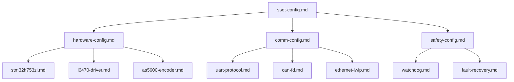

# STM32H753ZI Project - Modular Copilot Instructions

This directory contains modular instruction files that provide specific guidance for different aspects of the STM32H753ZI stepper motor control project. Each instruction module is referenced by TODO comments throughout the codebase.

## 📁 Instruction Module Index

### Core Architecture & Configuration
- [`ssot-config.instructions.md`](./ssot-config.instructions.md) - Single Source of Truth configuration management
- [`data-types.instructions.md`](./data-types.instructions.md) - Common data type definitions and usage
- [`error-handling.instructions.md`](./error-handling.instructions.md) - Error handling and code management
- [`time-handling.instructions.md`](./time-handling.instructions.md) - Time handling and timing systems
- [`units-measurements.instructions.md`](./units-measurements.instructions.md) - Physical units and measurement handling
- [`build-config.instructions.md`](./build-config.instructions.md) - Build system and version management

### Hardware Configuration
- [`hardware-pins.instructions.md`](./hardware-pins.instructions.md) - STM32H753ZI pin mappings and peripheral setup
- [`l6470-registers.instructions.md`](./l6470-registers.instructions.md) - L6470 stepper driver configuration and registers
- [`safety-systems.instructions.md`](./safety-systems.instructions.md) - Safety system architecture and fault recovery

### STM32H7 HAL Implementation (New)
- [`stm32h7-gpio-hal.instructions.md`](./stm32h7-gpio-hal.instructions.md) - STM32H7 GPIO HAL with comprehensive documentation
- [`stm32h7-spi-l6470.instructions.md`](./stm32h7-spi-l6470.instructions.md) - STM32H7 SPI HAL for L6470 daisy-chain communication
- [`stm32h7-i2c-as5600.instructions.md`](./stm32h7-i2c-as5600.instructions.md) - STM32H7 I2C HAL for AS5600 dual-encoder configuration
- [`stm32h7-uart-protocol.instructions.md`](./stm32h7-uart-protocol.instructions.md) - STM32H7 UART HAL for command interface and debugging

### Communication Protocols
- [`comm-protocols.instructions.md`](./comm-protocols.instructions.md) - Communication protocol specifications for all interfaces
- [`workspace-setup.instructions.md`](./workspace-setup.instructions.md) - Workspace-level project guidance

### Example Projects
- [encoder_read](../../examples/encoder_read/) - Encoder reading example project
- [api_demo](../../examples/api_demo/) - REST API demonstration project  
- [can_api_demo](../../examples/can_api_demo/) - CAN API demonstration project

## 🎯 Usage Guidelines

### For Developers
- Reference these instruction modules in TODO comments throughout the codebase
- Follow the SSOT principle - all configuration should be centralized
- Maintain consistency across all modules by referencing common patterns

### For GitHub Copilot
- Each instruction module provides specific context for code generation
- Follow safety-first principles outlined in safety-config.md
- Always reference SSOT configuration headers as defined in ssot-config.md
- Implement SOLID design principles as described in architecture.md

### Module Interdependencies

## 🔄 Maintenance

When adding new functionality:
1. Create appropriate instruction module if none exists
2. Update this index with the new module
3. Reference the module in relevant TODO comments
4. Ensure SSOT principles are maintained

---

**Note**: These instruction modules are designed to work together as a cohesive system. Always consider cross-module dependencies when making changes.
