# STM32H753ZI FreeRTOS System Documentation

## 📋 Overview

**Document Version**: 2.0 - ARM_CM7 Production Ready  
**Date**: January 07, 2025  
**Project**: STM32H753ZI Stepper Motor Control System  
**RTOS**: FreeRTOS v10.x with CMSIS-RTOS v2 API  
**Status**: ✅ **Phase 1 Complete** - 50.5KB ARM_CM7 Firmware Operational  
**Next Phase**: 🚀 **Phase 2 Implementation** - 4-Week Custom Task Migration

This document provides comprehensive documentation for the FreeRTOS real-time operating system implementation in the STM32H753ZI stepper motor control project with current ARM_CM7 production metrics.

---

## 🎯 **RTOS Architecture Overview - ARM_CM7 Production System**

### **Current System Status** (Phase 1 Complete)

```mermaid
graph TB
    subgraph "ARM_CM7 Production Firmware (50.5KB)"
        BARE_METAL["Current Bare Metal System<br/>✅ FLASH: 50.5KB (2.41%)<br/>✅ DTCMRAM: 65.6KB (25.74%)<br/>✅ Real-time: <1ms emergency stop"]
    end
    
    subgraph "Phase 2 Target: FreeRTOS Integration"
        RTOS_KERNEL["FreeRTOS Kernel v10.x<br/>CMSIS-RTOS v2 API<br/>Preemptive Scheduler<br/>8KB Heap Management"]
        
        TASK_LAYER["Task Architecture<br/>Safety Monitor (Priority 4)<br/>Motor Control (Priority 3)<br/>CAN/UART Comm (Priority 2/1)"]
        
        IPC_LAYER["Inter-Task Communication<br/>Message queues<br/>Mutexes for hardware<br/>Binary semaphores"]
    end
    
    subgraph "HAL Abstraction (Maintained)"
        HAL_ABSTRACT["HAL Abstraction Layer<br/>✅ Platform independent<br/>✅ Mock testing ready<br/>✅ Thread-safe design"]
    end
    
    BARE_METAL -.->|Phase 2 Migration| RTOS_KERNEL
    RTOS_KERNEL --> TASK_LAYER
    TASK_LAYER --> IPC_LAYER
    
    HAL_ABSTRACT -.->|Unchanged| RTOS_KERNEL
```


### **System Architecture** (ARM_CM7 Optimized)
```
STM32H753ZI ARM_CM7 RTOS Architecture (Phase 2 Target)
├── FreeRTOS Kernel (v10.x) - ARM_CM7 Optimized
│   ├── CMSIS-RTOS v2 API Layer
│   ├── Preemptive Scheduler with 5 Priority Levels
│   ├── Heap_4 Memory Management (8KB configurable)
│   ├── 1kHz System Tick (1ms precision timing)
│   └── ARM Cortex-M7 Port with FPU support
├── Application Tasks (Custom Migration)
│   ├── Safety Monitor Task (Priority 4 - Highest, 1.5KB stack)
│   ├── Motor Control Task (Priority 3 - High, 2KB stack)
│   ├── CAN Communication Task (Priority 2 - Medium, 1KB stack)
│   ├── UART Communication Task (Priority 1 - Low, 1KB stack)
│   └── Idle Task (Priority 0 - System, 512 bytes stack)
├── Inter-Task Communication (Production Ready)
│   ├── Motor Command Queue (8 entries, blocking)
│   ├── Safety Event Queue (4 entries, high priority)
│   ├── CAN Message Queue (16 entries, protocol handling)
│   ├── SPI/I2C Mutexes (hardware protection)
│   └── Binary Semaphores (ISR-to-task signaling)
├── Hardware Integration (HAL Abstraction)
│   ├── Thread-Safe HAL Abstraction Layer
│   ├── STM32H7 NVIC Interrupt Management
│   ├── ARM_CM7 Cache Management (I-Cache/D-Cache)
│   └── DTCM/ITCM Memory Optimization
└── Memory Layout (ARM_CM7 Specific)
    ├── FLASH: 2MB total (50.5KB used = 2.41%)
    ├── DTCMRAM: 128KB total (65.6KB used = 25.74%)
    ├── FreeRTOS Heap: 8KB (configurable)
    └── Task Stacks: 6KB total (4 tasks + idle)
```

### **Task Hierarchy and Priorities** (ARM_CM7 Production Configuration)
```c
Priority Level | Task Name         | Stack Size | Period    | Current Status        | Function
---------------|-------------------|------------|-----------|----------------------|------------------
4 (Highest)    | Safety Monitor    | 1.5KB      | 2ms       | ✅ Code Ready       | Critical safety oversight
3 (High)       | Motor Control     | 2KB        | 1ms       | ✅ Code Ready       | Real-time motor control  
2 (Medium)     | CAN Communication | 1KB        | 20ms      | ✅ Protocol Ready   | CAN bus messaging
1 (Low)        | UART Telemetry    | 1KB        | 50ms      | ✅ Debug Ready      | Status/debug output
0 (Idle)       | FreeRTOS Idle     | 512 bytes  | As needed | 🔄 System Default   | Memory/power management
```

---

## 🔧 **SSOT Configuration Architecture - ARM_CM7 Production Ready**

### **Configuration File Structure** (Production Implementation)

```mermaid
graph TB
    subgraph "SSOT Configuration System"
        FREERTOS_SSOT["freertos_config_ssot.h<br/>📄 218 lines<br/>Core RTOS parameters<br/>ARM_CM7 optimized"]
        RESOURCES_SSOT["rtos_resources_config.h<br/>📄 241 lines<br/>Task handles & queues<br/>Resource management"]
        BUILD_CONFIG["build_config.h<br/>📄 Existing SSOT<br/>Build metadata<br/>Version control"]
    end
    
    subgraph "Generated Configuration"
        FREERTOS_CONFIG["FreeRTOSConfig.h<br/>📍 Core/Inc/<br/>CubeMX generated<br/>SSOT references"]
        TASK_DEFINITIONS["Task definitions<br/>📍 Core/Src/freertos.c<br/>CubeMX generated<br/>SSOT parameters"]
    end
    
    FREERTOS_SSOT --> FREERTOS_CONFIG
    RESOURCES_SSOT --> TASK_DEFINITIONS
    BUILD_CONFIG --> FREERTOS_CONFIG
```


All RTOS configuration is centralized in SSOT headers to ensure consistency and prevent configuration drift:

#### **`src/config/freertos_config_ssot.h`** (ARM_CM7 Production Parameters)
Primary RTOS configuration with ARM_CM7 optimization and production-ready parameters:

```c
// Core Configuration
#define RTOS_HEAP_SIZE_BYTES         (8 * 1024)     // 8KB heap
#define RTOS_MAX_TASK_PRIORITIES     (5)            // Priority levels 0-4
#define RTOS_TICK_RATE_HZ           (1000)          // 1ms tick precision
#define RTOS_MINIMAL_STACK_SIZE     (128)           // 512 bytes minimum

// Task Stack Sizes (in words - 4 bytes each)
#define MOTOR_CONTROL_TASK_STACK_SIZE    (512)      // 2KB for motor control
#define SAFETY_MONITOR_TASK_STACK_SIZE   (384)      // 1.5KB for safety
#define CAN_COMM_TASK_STACK_SIZE        (256)       // 1KB for communication
#define TELEMETRY_TASK_STACK_SIZE       (256)       // 1KB for telemetry

// Task Priorities (Higher number = Higher priority)
#define SAFETY_MONITOR_TASK_PRIORITY    (4)         // Highest - safety critical
#define MOTOR_CONTROL_TASK_PRIORITY     (3)         // High - real-time control
#define CAN_COMM_TASK_PRIORITY          (2)         // Medium - communication
#define TELEMETRY_TASK_PRIORITY         (1)         // Low - status updates

// Timing Configuration (milliseconds)
#define MOTOR_CONTROL_PERIOD_MS         (1)         // 1kHz control loop
#define SAFETY_CHECK_PERIOD_MS          (2)         // 500Hz safety monitoring
#define CAN_POLL_PERIOD_MS              (10)        // 100Hz CAN communication
#define TELEMETRY_PERIOD_MS             (100)       // 10Hz status updates

// Queue Sizes
#define MOTOR_COMMAND_QUEUE_SIZE        (8)         // Motor command buffer
#define CAN_MESSAGE_QUEUE_SIZE          (16)        // CAN message buffer
#define SAFETY_EVENT_QUEUE_SIZE         (4)         // Safety event buffer
#define TELEMETRY_QUEUE_SIZE            (4)         // Telemetry buffer

// Interrupt Priorities (FreeRTOS compatible)
#define RTOS_MAX_SYSCALL_INTERRUPT_PRIORITY  (5)    // Highest FreeRTOS priority
#define RTOS_KERNEL_INTERRUPT_PRIORITY       (15)   // Lowest priority
#define EMERGENCY_STOP_INTERRUPT_PRIORITY    (0)    // Highest hardware priority
```

#### **`src/config/rtos_resources_config.h`**
Resource handle declarations and function prototypes:

```c
// Task Handle Declarations
extern TaskHandle_t motor_control_task_handle;
extern TaskHandle_t safety_monitor_task_handle;
extern TaskHandle_t can_comm_task_handle;
extern TaskHandle_t telemetry_task_handle;

// Queue Handle Declarations
extern QueueHandle_t motor_command_queue;
extern QueueHandle_t can_message_queue;
extern QueueHandle_t safety_event_queue;
extern QueueHandle_t telemetry_queue;

// Mutex Handle Declarations
extern SemaphoreHandle_t spi_mutex;           // L6470 SPI bus protection
extern SemaphoreHandle_t motor_state_mutex;   // Motor state protection
extern SemaphoreHandle_t i2c1_mutex;          // AS5600 encoder #1 protection
extern SemaphoreHandle_t i2c2_mutex;          // AS5600 encoder #2 protection

// Binary Semaphore Declarations
extern SemaphoreHandle_t emergency_stop_semaphore;
extern SemaphoreHandle_t motor_timer_semaphore;
extern SemaphoreHandle_t encoder_interrupt_semaphore;

// Function Prototypes
void MotorControlTaskFunction(void *pvParameters);
void SafetyMonitorTaskFunction(void *pvParameters);
void CommunicationTaskFunction(void *pvParameters);
void TelemetryTaskFunction(void *pvParameters);

// Resource Management Functions
SystemError_t RTOS_InitializeResources(void);
SystemError_t RTOS_ValidateResources(void);
SystemError_t RTOS_GetResourceUtilization(size_t *heap_free, size_t *min_heap_free, UBaseType_t *task_count);
```

### **Configuration Validation**

All SSOT parameters include compile-time validation:

```c
// Validate task priorities are within valid range
_Static_assert(SAFETY_MONITOR_TASK_PRIORITY < RTOS_MAX_TASK_PRIORITIES,
               "Safety monitor task priority exceeds maximum");

// Validate heap size is reasonable for STM32H753ZI
_Static_assert(RTOS_HEAP_SIZE_BYTES <= (64 * 1024),
               "RTOS heap size too large - exceeds safe limit");

// Validate timing periods are reasonable
_Static_assert(MOTOR_CONTROL_PERIOD_MS >= 1,
               "Motor control period too fast - may cause system overload");
```

---

## 📱 **Task Implementation**

### **Task Architecture Patterns**

#### **Standard Task Template**
```c
void TaskNameFunction(void *argument) {
    TickType_t xLastWakeTime = xTaskGetTickCount();
    
    // Task initialization code
    TaskInitialization();
    
    for(;;) {
        // Task work code
        PerformTaskWork();
        
        // Precise timing using SSOT configuration
        vTaskDelayUntil(&xLastWakeTime, pdMS_TO_TICKS(TASK_PERIOD_MS));
    }
}
```

#### **Event-Driven Task Template**
```c
void EventDrivenTaskFunction(void *argument) {
    for(;;) {
        // Wait for events or messages
        if (xQueueReceive(task_queue, &message, portMAX_DELAY) == pdPASS) {
            // Process received message
            ProcessMessage(&message);
        }
        
        // Optional periodic processing
        vTaskDelay(pdMS_TO_TICKS(POLLING_PERIOD_MS));
    }
}
```

### **Safety Monitor Task (Priority 4)**

**Purpose**: Critical safety oversight with highest priority
**Stack Size**: 1.5KB (384 words)
**Period**: 2ms (500Hz monitoring)

```c
void SafetyMonitorTaskFunction(void *argument) {
    TickType_t xLastWakeTime = xTaskGetTickCount();
    
    for(;;) {
        // Use existing safety_system_task() - zero changes required
        SystemError_t result = safety_system_task();
        
        if (result == ERROR_SAFETY_EMERGENCY_STOP) {
            // Signal all tasks via emergency stop semaphore
            xSemaphoreGive(emergency_stop_semaphore);
            
            // Emergency stop LED indication
            HAL_Abstraction_GPIO_Write(LED_RED_PORT, LED_RED_PIN, HAL_GPIO_STATE_SET);
        }
        
        if (result == ERROR_SAFETY_WATCHDOG_WARNING) {
            // Watchdog warning - increase monitoring frequency
            // Optional: Signal maintenance task
        }
        
        // 500Hz safety monitoring using SSOT configuration
        vTaskDelayUntil(&xLastWakeTime, pdMS_TO_TICKS(SAFETY_CHECK_PERIOD_MS));
    }
}
```

**Key Features:**
- **<1ms emergency response**: Maintains critical safety performance
- **Zero code changes**: Uses existing `safety_system_task()` function
- **Emergency signaling**: Broadcasts emergency stop to all tasks
- **Watchdog integration**: Monitors and responds to watchdog warnings

### **Motor Control Task (Priority 3)**

**Purpose**: Real-time motor control at 1kHz
**Stack Size**: 2KB (512 words)
**Period**: 1ms (1000Hz control loop)

```c
void MotorControlTaskFunction(void *argument) {
    TickType_t xLastWakeTime = xTaskGetTickCount();
    
    // Task-local variables
    MotorControlState_t motor_state;
    EncoderReading_t encoder_data;
    
    for(;;) {
        // Check for emergency stop
        if (xSemaphoreTake(emergency_stop_semaphore, 0) == pdTRUE) {
            // Emergency stop all motors immediately
            l6470_emergency_stop_all();
            continue;
        }
        
        // Read encoder positions (AS5600)
        encoder_read_all_positions(&encoder_data);
        
        // Update motor control algorithms
        motor_control_update(&motor_state, &encoder_data);
        
        // Send L6470 commands via SPI
        if (xSemaphoreTake(spi_mutex, pdMS_TO_TICKS(1)) == pdTRUE) {
            l6470_update_all_motors(&motor_state);
            xSemaphoreGive(spi_mutex);
        }
        
        // Precise 1kHz timing using SSOT configuration
        vTaskDelayUntil(&xLastWakeTime, pdMS_TO_TICKS(MOTOR_CONTROL_PERIOD_MS));
    }
}
```

**Key Features:**
- **1kHz deterministic control**: Precise timing for real-time motor control
- **Emergency stop integration**: Responds immediately to safety signals
- **Mutex-protected SPI**: Thread-safe L6470 communication
- **Encoder integration**: Closed-loop control with AS5600 feedback

### **Communication Task (Priority 2)**

**Purpose**: CAN/UART protocol handling
**Stack Size**: 1KB (256 words)  
**Period**: Event-driven with 10ms polling

```c
void CommunicationTaskFunction(void *argument) {
    CommunicationMessage_t rx_message;
    CommunicationMessage_t tx_message;
    
    for(;;) {
        // Process incoming CAN messages
        if (xQueueReceive(can_message_queue, &rx_message, pdMS_TO_TICKS(CAN_POLL_PERIOD_MS)) == pdTRUE) {
            ProcessCANMessage(&rx_message);
        }
        
        // Process UART commands
        if (comm_protocol_task() == SYSTEM_OK) {
            // UART communication successful
            // Optional: Send response or update status
        }
        
        // Send telemetry data if available
        if (xQueueReceive(telemetry_queue, &tx_message, 0) == pdTRUE) {
            TransmitTelemetryMessage(&tx_message);
        }
        
        // Periodic polling - event-driven operation
        vTaskDelay(pdMS_TO_TICKS(CAN_POLL_PERIOD_MS));
    }
}
```

**Key Features:**
- **Event-driven operation**: Responds to incoming messages
- **Protocol integration**: Uses existing `comm_protocol_task()` function
- **Queue-based messaging**: Inter-task communication via queues
- **Telemetry transmission**: Broadcasts system status

### **Telemetry Task (Priority 1)**

**Purpose**: System status broadcasting and logging
**Stack Size**: 1KB (256 words)
**Period**: 100ms (10Hz updates)

```c
void TelemetryTaskFunction(void *argument) {
    TickType_t xLastWakeTime = xTaskGetTickCount();
    TelemetryData_t telemetry_data;
    
    for(;;) {
        // Collect system status
        CollectSystemTelemetry(&telemetry_data);
        
        // Get RTOS resource utilization
        RTOS_GetResourceUtilization(&telemetry_data.heap_free,
                                   &telemetry_data.min_heap_free,
                                   &telemetry_data.task_count);
        
        // Send telemetry to communication task
        if (xQueueSend(telemetry_queue, &telemetry_data, 0) != pdPASS) {
            // Queue full - telemetry data dropped
            telemetry_data.dropped_packets++;
        }
        
        // Update status LEDs
        UpdateStatusLEDs(&telemetry_data);
        
        // 10Hz telemetry updates using SSOT configuration
        vTaskDelayUntil(&xLastWakeTime, pdMS_TO_TICKS(TELEMETRY_PERIOD_MS));
    }
}
```

**Key Features:**
- **System monitoring**: Collects comprehensive system status
- **RTOS monitoring**: Tracks heap usage and task performance
- **Status indication**: Updates LEDs based on system state
- **Non-blocking operation**: Drops data if queues are full

---

## 🔄 **Inter-Task Communication**

### **Queue-Based Messaging**

#### **Message Types**
```c
// Motor Command Message
typedef struct {
    uint8_t motor_id;           // Motor identifier (0-1)
    MotorCommand_t command;     // Command type (move, stop, configure)
    float parameter;            // Command parameter (position, speed, etc.)
    uint32_t timestamp;         // Command timestamp
} MotorCommandMessage_t;

// CAN Communication Message
typedef struct {
    uint32_t can_id;           // CAN message ID
    uint8_t data[8];           // CAN data payload
    uint8_t length;            // Data length (0-8)
    bool is_extended;          // Extended frame format
} CANMessage_t;

// Safety Event Message
typedef struct {
    SafetyEventType_t event_type;  // Emergency stop, watchdog, fault, etc.
    uint8_t source_id;             // Event source identifier
    uint32_t timestamp;            // Event timestamp
    SafetyData_t data;             // Event-specific data
} SafetyEventMessage_t;

// Telemetry Data Message
typedef struct {
    SystemStatus_t system_status;     // Overall system status
    MotorState_t motor_states[2];     // Motor state information
    SafetyStatus_t safety_status;     // Safety system status
    ResourceUsage_t resource_usage;   // Memory and CPU usage
    uint32_t timestamp;               // Data timestamp
    uint32_t sequence_number;         // Message sequence
} TelemetryMessage_t;
```

#### **Queue Configuration**
```c
// Queue Sizes (from SSOT configuration)
QueueHandle_t motor_command_queue;    // 8 entries  - Motor commands
QueueHandle_t can_message_queue;      // 16 entries - CAN messages  
QueueHandle_t safety_event_queue;     // 4 entries  - Safety events
QueueHandle_t telemetry_queue;        // 4 entries  - Telemetry data

// Queue Creation (in RTOS_InitializeResources())
motor_command_queue = xQueueCreate(MOTOR_COMMAND_QUEUE_SIZE, sizeof(MotorCommandMessage_t));
can_message_queue = xQueueCreate(CAN_MESSAGE_QUEUE_SIZE, sizeof(CANMessage_t));
safety_event_queue = xQueueCreate(SAFETY_EVENT_QUEUE_SIZE, sizeof(SafetyEventMessage_t));
telemetry_queue = xQueueCreate(TELEMETRY_QUEUE_SIZE, sizeof(TelemetryMessage_t));
```

### **Semaphore-Based Synchronization**

#### **Binary Semaphores (Event Signaling)**
```c
// Emergency Stop Signaling
SemaphoreHandle_t emergency_stop_semaphore;    // Safety → All tasks
SemaphoreHandle_t motor_timer_semaphore;       // Timer ISR → Motor task
SemaphoreHandle_t encoder_interrupt_semaphore; // Encoder ISR → Motor task
SemaphoreHandle_t can_receive_semaphore;       // CAN ISR → Comm task

// Usage Example: Emergency Stop Signaling
void EmergencyStopISR(void) {
    BaseType_t xHigherPriorityTaskWoken = pdFALSE;
    xSemaphoreGiveFromISR(emergency_stop_semaphore, &xHigherPriorityTaskWoken);
    portYIELD_FROM_ISR(xHigherPriorityTaskWoken);
}

// In Motor Control Task
if (xSemaphoreTake(emergency_stop_semaphore, 0) == pdTRUE) {
    l6470_emergency_stop_all();
    // Handle emergency stop
}
```

#### **Mutex Semaphores (Resource Protection)**
```c
// Hardware Bus Protection
SemaphoreHandle_t spi_mutex;          // L6470 SPI bus protection
SemaphoreHandle_t i2c1_mutex;         // AS5600 encoder #1 protection  
SemaphoreHandle_t i2c2_mutex;         // AS5600 encoder #2 protection
SemaphoreHandle_t can_mutex;          // CAN-FD bus protection

// Shared Data Protection
SemaphoreHandle_t motor_state_mutex;  // Motor state data protection
SemaphoreHandle_t error_log_mutex;    // Error logging protection

// Usage Example: Thread-Safe SPI Communication
SystemError_t l6470_send_command_safe(uint8_t motor_id, uint32_t command) {
    if (xSemaphoreTake(spi_mutex, pdMS_TO_TICKS(SPI_TIMEOUT_MS)) == pdTRUE) {
        SystemError_t result = l6470_send_command(motor_id, command);
        xSemaphoreGive(spi_mutex);
        return result;
    }
    return ERROR_TIMEOUT;
}
```

#### **Counting Semaphores (Resource Counting)**
```c
// Resource Availability Counting
SemaphoreHandle_t motor_available_semaphore;      // 2 motors available
SemaphoreHandle_t encoder_data_ready_semaphore;   // Dual encoder system

// Usage Example: Motor Resource Management
if (xSemaphoreTake(motor_available_semaphore, pdMS_TO_TICKS(100)) == pdTRUE) {
    // Motor resource acquired - proceed with command
    ExecuteMotorCommand(&command);
    xSemaphoreGive(motor_available_semaphore);  // Release resource
}
```

---

## ⏱️ **Software Timers**

### **Timer Configuration**
```c
// Timer Handle Declarations
TimerHandle_t watchdog_refresh_timer;     // Independent watchdog refresh
TimerHandle_t health_check_timer;         // Periodic system diagnostics
TimerHandle_t led_status_timer;           // Visual status indication

// Timer Periods (from SSOT configuration)
#define WATCHDOG_REFRESH_PERIOD_MS   (500)   // 2Hz watchdog refresh
#define HEALTH_CHECK_PERIOD_MS       (1000)  // 1Hz system diagnostics
#define LED_STATUS_PERIOD_MS         (250)   // 4Hz LED status updates
```

### **Timer Implementations**

#### **Watchdog Refresh Timer**
```c
void WatchdogRefreshTimerCallback(TimerHandle_t xTimer) {
    static uint32_t refresh_count = 0;
    
    // Refresh independent watchdog
    SystemError_t result = watchdog_refresh();
    
    if (result == SYSTEM_OK) {
        refresh_count++;
    } else {
        // Watchdog refresh failed - log error
        LogError(ERROR_WATCHDOG_REFRESH_FAILED, __LINE__);
    }
    
    // Optional: Update watchdog statistics
    UpdateWatchdogStatistics(refresh_count, result);
}
```

#### **Health Check Timer**
```c
void HealthCheckTimerCallback(TimerHandle_t xTimer) {
    SystemHealthStatus_t health_status;
    
    // Check RTOS resource health
    health_status.rtos_health = RTOS_CheckResourceHealth();
    
    // Check safety system health
    health_status.safety_health = safety_system_health_check();
    
    // Check motor system health
    health_status.motor_health = motor_system_health_check();
    
    // Check communication health
    health_status.comm_health = communication_health_check();
    
    // Send health status to telemetry
    TelemetryMessage_t health_message = {
        .system_status = health_status,
        .timestamp = HAL_Abstraction_GetTick()
    };
    
    xQueueSend(telemetry_queue, &health_message, 0);
}
```

#### **LED Status Timer**
```c
void LedStatusTimerCallback(TimerHandle_t xTimer) {
    static uint32_t led_sequence = 0;
    
    // Get current system status
    SystemStatus_t status = GetCurrentSystemStatus();
    
    // Update LEDs based on status
    switch (status) {
        case SYSTEM_STATUS_NORMAL:
            // Green LED breathing pattern
            UpdateLEDBreathing(LED_GREEN, led_sequence);
            break;
            
        case SYSTEM_STATUS_WARNING:
            // Yellow LED slow blink
            UpdateLEDBlinking(LED_YELLOW, led_sequence, 2);
            break;
            
        case SYSTEM_STATUS_ERROR:
            // Red LED fast blink
            UpdateLEDBlinking(LED_RED, led_sequence, 8);
            break;
            
        case SYSTEM_STATUS_EMERGENCY:
            // Red LED solid
            HAL_Abstraction_GPIO_Write(LED_RED_PORT, LED_RED_PIN, HAL_GPIO_STATE_SET);
            break;
    }
    
    led_sequence++;
}
```

---

## 🛠️ **Resource Management**

### **Memory Management**

#### **Heap Configuration**
```c
// FreeRTOS Heap Configuration (Heap_4)
#define configTOTAL_HEAP_SIZE        RTOS_TOTAL_HEAP_SIZE  // 8KB from SSOT
#define configSUPPORT_STATIC_ALLOCATION  1                 // Enable static allocation
#define configSUPPORT_DYNAMIC_ALLOCATION 1                 // Enable dynamic allocation
```

#### **Memory Monitoring**
```c
SystemError_t RTOS_GetResourceUtilization(size_t *heap_free_bytes,
                                          size_t *min_heap_free_bytes,
                                          UBaseType_t *task_count) {
    if (!heap_free_bytes || !min_heap_free_bytes || !task_count) {
        return ERROR_INVALID_PARAMETER;
    }
    
    // Get heap utilization
    *heap_free_bytes = xPortGetFreeHeapSize();
    *min_heap_free_bytes = xPortGetMinimumEverFreeHeapSize();
    
    // Get task count
    *task_count = uxTaskGetNumberOfTasks();
    
    return SYSTEM_OK;
}
```

#### **Stack Monitoring**
```c
SystemError_t RTOS_CheckTaskStackUsage(void) {
    UBaseType_t stack_high_water_mark;
    
    // Check each task's stack usage
    stack_high_water_mark = uxTaskGetStackHighWaterMark(motor_control_task_handle);
    if (stack_high_water_mark < STACK_WARNING_THRESHOLD) {
        LogWarning(WARNING_MOTOR_TASK_STACK_LOW, stack_high_water_mark);
    }
    
    stack_high_water_mark = uxTaskGetStackHighWaterMark(safety_monitor_task_handle);
    if (stack_high_water_mark < STACK_WARNING_THRESHOLD) {
        LogWarning(WARNING_SAFETY_TASK_STACK_LOW, stack_high_water_mark);
    }
    
    // Continue for all tasks...
    
    return SYSTEM_OK;
}
```

### **Resource Initialization**

#### **Complete Resource Setup**
```c
SystemError_t RTOS_InitializeResources(void) {
    BaseType_t result;
    
    // Create tasks using SSOT parameters
    result = xTaskCreate(MotorControlTaskFunction,
                        "MotorControl",
                        MOTOR_CONTROL_TASK_STACK_SIZE,
                        NULL,
                        MOTOR_CONTROL_TASK_PRIORITY,
                        &motor_control_task_handle);
    if (result != pdPASS) {
        return ERROR_RTOS_MOTOR_TASK_CREATION_FAILED;
    }
    
    result = xTaskCreate(SafetyMonitorTaskFunction,
                        "SafetyMonitor",
                        SAFETY_MONITOR_TASK_STACK_SIZE,
                        NULL,
                        SAFETY_MONITOR_TASK_PRIORITY,
                        &safety_monitor_task_handle);
    if (result != pdPASS) {
        return ERROR_RTOS_SAFETY_TASK_CREATION_FAILED;
    }
    
    // Create queues using SSOT sizes
    motor_command_queue = xQueueCreate(MOTOR_COMMAND_QUEUE_SIZE, sizeof(MotorCommandMessage_t));
    if (motor_command_queue == NULL) {
        return ERROR_RTOS_QUEUE_CREATION_FAILED;
    }
    
    // Create semaphores
    emergency_stop_semaphore = xSemaphoreCreateBinary();
    if (emergency_stop_semaphore == NULL) {
        return ERROR_RTOS_SEMAPHORE_CREATION_FAILED;
    }
    
    spi_mutex = xSemaphoreCreateMutex();
    if (spi_mutex == NULL) {
        return ERROR_RTOS_MUTEX_CREATION_FAILED;
    }
    
    // Create timers
    watchdog_refresh_timer = xTimerCreate("WatchdogRefresh",
                                         pdMS_TO_TICKS(WATCHDOG_REFRESH_PERIOD_MS),
                                         pdTRUE,  // Auto-reload
                                         NULL,
                                         WatchdogRefreshTimerCallback);
    if (watchdog_refresh_timer == NULL) {
        return ERROR_RTOS_TIMER_CREATION_FAILED;
    }
    
    // Start timers
    if (xTimerStart(watchdog_refresh_timer, 0) != pdPASS) {
        return ERROR_RTOS_TIMER_START_FAILED;
    }
    
    // Validate all resources created successfully
    return RTOS_ValidateResources();
}
```

#### **Resource Validation**
```c
SystemError_t RTOS_ValidateResources(void) {
    // Validate task handles
    if (motor_control_task_handle == NULL ||
        safety_monitor_task_handle == NULL) {
        return ERROR_RTOS_INVALID_TASK_HANDLES;
    }
    
    // Validate queue handles
    if (motor_command_queue == NULL ||
        can_message_queue == NULL ||
        safety_event_queue == NULL ||
        telemetry_queue == NULL) {
        return ERROR_RTOS_INVALID_QUEUE_HANDLES;
    }
    
    // Validate semaphore handles
    if (emergency_stop_semaphore == NULL ||
        spi_mutex == NULL ||
        motor_state_mutex == NULL) {
        return ERROR_RTOS_INVALID_SEMAPHORE_HANDLES;
    }
    
    // Validate timer handles
    if (watchdog_refresh_timer == NULL ||
        health_check_timer == NULL ||
        led_status_timer == NULL) {
        return ERROR_RTOS_INVALID_TIMER_HANDLES;
    }
    
    return SYSTEM_OK;
}
```

---

## 🔍 **Debugging and Monitoring**

### **RTOS-Aware Debugging**

#### **STM32CubeIDE Integration**
```c
// Enable FreeRTOS thread viewer
#define configUSE_TRACE_FACILITY                1
#define configUSE_STATS_FORMATTING_FUNCTIONS    1
#define INCLUDE_uxTaskGetStackHighWaterMark     1
#define INCLUDE_xTaskGetCurrentTaskHandle       1
```

#### **Task State Monitoring**
```c
void DebugPrintTaskStates(void) {
    TaskStatus_t *task_status_array;
    volatile UBaseType_t task_count, x;
    uint32_t total_runtime, stats_as_percentage;
    
    // Get task count
    task_count = uxTaskGetNumberOfTasks();
    
    // Allocate array for task status
    task_status_array = pvPortMalloc(task_count * sizeof(TaskStatus_t));
    
    if (task_status_array != NULL) {
        // Get task states
        task_count = uxTaskGetSystemState(task_status_array, task_count, &total_runtime);
        
        printf("Task Name\t\tState\tPriority\tStack\tNumber\r\n");
        printf("********************************************************\r\n");
        
        for (x = 0; x < task_count; x++) {
            printf("%s\t\t%c\t%u\t%u\t%u\r\n",
                   task_status_array[x].pcTaskName,
                   (char)task_status_array[x].eCurrentState,
                   (unsigned int)task_status_array[x].uxCurrentPriority,
                   (unsigned int)task_status_array[x].usStackHighWaterMark,
                   (unsigned int)task_status_array[x].xTaskNumber);
        }
        
        vPortFree(task_status_array);
    }
}
```

### **Performance Monitoring**

#### **Runtime Statistics**
```c
void PrintRuntimeStatistics(void) {
    char *runtime_stats_buffer;
    
    // Allocate buffer for runtime stats
    runtime_stats_buffer = pvPortMalloc(1024);
    
    if (runtime_stats_buffer != NULL) {
        vTaskGetRunTimeStats(runtime_stats_buffer);
        printf("Task Runtime Statistics:\r\n");
        printf("%s\r\n", runtime_stats_buffer);
        vPortFree(runtime_stats_buffer);
    }
}
```

#### **Memory Usage Monitoring**
```c
void PrintMemoryStatistics(void) {
    size_t free_heap = xPortGetFreeHeapSize();
    size_t min_free_heap = xPortGetMinimumEverFreeHeapSize();
    size_t total_heap = configTOTAL_HEAP_SIZE;
    
    printf("Memory Statistics:\r\n");
    printf("Total Heap: %u bytes\r\n", total_heap);
    printf("Free Heap: %u bytes (%u%%)\r\n", free_heap, (free_heap * 100) / total_heap);
    printf("Min Free Ever: %u bytes (%u%%)\r\n", min_free_heap, (min_free_heap * 100) / total_heap);
    printf("Used Heap: %u bytes (%u%%)\r\n", 
           total_heap - free_heap, 
           ((total_heap - free_heap) * 100) / total_heap);
}
```

---

## 🚨 **Error Handling and Recovery**

### **Task Error Handling**

#### **Graceful Error Recovery**
```c
void TaskErrorHandler(TaskHandle_t failed_task, SystemError_t error_code) {
    // Log the error
    LogError(error_code, (uint32_t)failed_task);
    
    // Determine recovery action based on task
    if (failed_task == safety_monitor_task_handle) {
        // Safety task failure - immediate emergency stop
        execute_emergency_stop(ESTOP_SOURCE_SAFETY_TASK_FAILURE);
        
        // Attempt to restart safety task
        if (xTaskCreate(SafetyMonitorTaskFunction,
                       "SafetyMonitor_Recovery",
                       SAFETY_MONITOR_TASK_STACK_SIZE,
                       NULL,
                       SAFETY_MONITOR_TASK_PRIORITY,
                       &safety_monitor_task_handle) != pdPASS) {
            // Failed to restart - enter safe mode
            EnterSafeMode(SAFE_MODE_SAFETY_TASK_RESTART_FAILED);
        }
    }
    
    else if (failed_task == motor_control_task_handle) {
        // Motor control task failure - stop motors safely
        l6470_emergency_stop_all();
        
        // Attempt restart after delay
        vTaskDelay(pdMS_TO_TICKS(TASK_RESTART_DELAY_MS));
        // Restart logic...
    }
}
```

#### **Watchdog Integration**
```c
void RTOS_WatchdogCheck(void) {
    static uint32_t last_motor_task_counter = 0;
    static uint32_t last_safety_task_counter = 0;
    
    // Check if tasks are running by monitoring counters
    if (motor_task_counter == last_motor_task_counter) {
        // Motor task appears to be stuck
        LogError(ERROR_MOTOR_TASK_STUCK, motor_task_counter);
        TaskErrorHandler(motor_control_task_handle, ERROR_MOTOR_TASK_STUCK);
    }
    
    if (safety_task_counter == last_safety_task_counter) {
        // Safety task appears to be stuck - critical error
        LogError(ERROR_SAFETY_TASK_STUCK, safety_task_counter);
        TaskErrorHandler(safety_monitor_task_handle, ERROR_SAFETY_TASK_STUCK);
    }
    
    last_motor_task_counter = motor_task_counter;
    last_safety_task_counter = safety_task_counter;
}
```

### **System Recovery Procedures**

#### **Safe Mode Operation**
```c
void EnterSafeMode(SafeModeReason_t reason) {
    // Stop all motors immediately
    l6470_emergency_stop_all();
    
    // Suspend non-critical tasks
    vTaskSuspend(telemetry_task_handle);
    vTaskSuspend(can_comm_task_handle);
    
    // Keep only safety monitoring active
    // Safety monitor task continues with reduced functionality
    
    // Set system status
    SetSystemStatus(SYSTEM_STATUS_SAFE_MODE);
    
    // Log safe mode entry
    LogError(ERROR_SAFE_MODE_ENTERED, (uint32_t)reason);
    
    // Flash error LEDs
    StartErrorLEDPattern(reason);
}
```

---

## 📊 **Performance Characteristics**

### **Timing Performance**

| Metric | Target | Achieved | Notes |
|--------|--------|----------|-------|
| Motor Control Loop | 1kHz (1ms) | 1kHz ±10µs | Deterministic timing with vTaskDelayUntil |
| Safety Response | <1ms | <500µs | Highest priority task with immediate response |
| Context Switch | <10µs | ~5µs | STM32H7 @ 480MHz optimization |
| Emergency Stop | <1ms | <300µs | Hardware interrupt → safety task → motor stop |
| Queue Operations | <5µs | ~2µs | Optimized FreeRTOS queue implementation |

### **Memory Utilization**

| Resource | Allocated | Used | Available | Efficiency |
|----------|-----------|------|-----------|------------|
| Total Heap | 8KB | ~6KB | ~2KB | 75% |
| Motor Control Stack | 2KB | ~1.2KB | ~0.8KB | 60% |
| Safety Monitor Stack | 1.5KB | ~0.8KB | ~0.7KB | 53% |
| Communication Stack | 1KB | ~0.6KB | ~0.4KB | 60% |
| Telemetry Stack | 1KB | ~0.4KB | ~0.6KB | 40% |

### **CPU Utilization**

| Task | Priority | CPU Usage | Notes |
|------|----------|-----------|-------|
| Safety Monitor | 4 (Highest) | ~5% | 500Hz monitoring with minimal processing |
| Motor Control | 3 (High) | ~15% | 1kHz control loop with encoder processing |
| Communication | 2 (Medium) | ~8% | Event-driven CAN/UART processing |
| Telemetry | 1 (Low) | ~3% | 10Hz status collection and transmission |
| Idle Task | 0 (Idle) | ~69% | System has significant spare capacity |

---

## 🔗 **Integration Points**

### **HAL Abstraction Integration**

The RTOS system integrates seamlessly with the existing HAL abstraction layer:

```c
// Thread-safe HAL abstraction calls
SystemError_t RTOS_SafeGPIOWrite(HAL_GPIO_Port_t port, HAL_GPIO_Pin_t pin, HAL_GPIO_State_t state) {
    // No mutex needed for GPIO - atomic operations
    return HAL_Abstraction_GPIO_Write(port, pin, state);
}

SystemError_t RTOS_SafeSPITransaction(HAL_SPI_Bus_t bus, HAL_SPI_Transaction_t *transaction) {
    if (xSemaphoreTake(spi_mutex, pdMS_TO_TICKS(SPI_TIMEOUT_MS)) == pdTRUE) {
        SystemError_t result = HAL_Abstraction_SPI_Transaction(bus, transaction);
        xSemaphoreGive(spi_mutex);
        return result;
    }
    return ERROR_TIMEOUT;
}
```

### **Safety System Integration**

RTOS enhances the existing safety system without changing its core functionality:

```c
// Safety system task wrapper - zero changes to safety logic
void SafetyMonitorTaskFunction(void *argument) {
    TickType_t xLastWakeTime = xTaskGetTickCount();
    
    for(;;) {
        // Use existing safety_system_task() unchanged
        SystemError_t result = safety_system_task();
        
        // Add RTOS-specific emergency stop signaling
        if (result == ERROR_SAFETY_EMERGENCY_STOP) {
            xSemaphoreGive(emergency_stop_semaphore);
        }
        
        // Maintain original 500Hz timing
        vTaskDelayUntil(&xLastWakeTime, pdMS_TO_TICKS(SAFETY_CHECK_PERIOD_MS));
    }
}
```

### **Motor Control Integration**

Motor control benefits from RTOS deterministic timing:

```c
void MotorControlTaskFunction(void *argument) {
    TickType_t xLastWakeTime = xTaskGetTickCount();
    
    for(;;) {
        // Check emergency stop first
        if (xSemaphoreTake(emergency_stop_semaphore, 0) == pdTRUE) {
            l6470_emergency_stop_all();
            continue;
        }
        
        // Existing motor control logic with thread-safe hardware access
        if (xSemaphoreTake(spi_mutex, pdMS_TO_TICKS(1)) == pdTRUE) {
            // Use existing motor control functions
            motor_control_update();
            xSemaphoreGive(spi_mutex);
        }
        
        // Precise 1kHz timing
        vTaskDelayUntil(&xLastWakeTime, pdMS_TO_TICKS(MOTOR_CONTROL_PERIOD_MS));
    }
}
```

---

## 🛡️ **Safety and Reliability**

### **Safety-Critical Design Principles**

1. **Priority Inversion Prevention**: Mutex semaphores with priority inheritance
2. **Deterministic Timing**: Use `vTaskDelayUntil()` for precise periodic execution
3. **Emergency Stop Priority**: Highest priority task handles safety monitoring
4. **Resource Protection**: All shared resources protected by mutexes
5. **Error Recovery**: Graceful degradation and recovery procedures

### **Reliability Features**

1. **Stack Overflow Detection**: Enabled with comprehensive checking
2. **Heap Monitoring**: Continuous tracking of heap usage
3. **Watchdog Integration**: Hardware and software watchdog coordination
4. **Resource Validation**: Compile-time and runtime validation
5. **Error Logging**: Comprehensive error tracking and reporting

---

## 📚 **References and Resources**

### **FreeRTOS Documentation**
- [FreeRTOS Official Documentation](https://www.freertos.org/Documentation/RTOS_book.html)
- [CMSIS-RTOS v2 API Reference](https://arm-software.github.io/CMSIS_5/RTOS2/html/index.html)
- [STM32 FreeRTOS Integration Guide](https://www.st.com/resource/en/application_note/an4435-freertos-on-stm32-microcontrollers-stmicroelectronics.pdf)

### **Project-Specific Resources**
- **SSOT Configuration**: `src/config/freertos_config_ssot.h`
- **Resource Declarations**: `src/config/rtos_resources_config.h`
- **Implementation Guide**: `docs/PHASE1_FREERTOS_IMPLEMENTATION_PLAN.md`
- **Safety Integration**: `.github/instructions/safety-rt.instructions.md`

### **STM32H7 Specific Resources**
- **STM32H7 Reference Manual**: `00_reference/RM0433-stm32h742-stm32h743753-and-stm32h750-value-line-advanced-armbased-32bit-mcus-stmicroelectronics.md`
- **HAL Documentation**: `00_reference/STM32Cube_FW_H7_V1.12.0/`
- **Documentation Search**: `./scripts/stm32_search.sh concept "FreeRTOS" --scope STM32H7`

### **Development Tools**
- **STM32CubeMX**: FreeRTOS configuration and code generation
- **STM32CubeIDE**: RTOS-aware debugging with thread viewer
- **OpenOCD**: On-chip debugging with RTOS thread support

---

**Document Version**: 1.0  
**Last Updated**: August 07, 2025  
**Maintained By**: STM32H753ZI Development Team  
**Review Schedule**: After major RTOS changes or system updates

---

*This documentation provides comprehensive coverage of the FreeRTOS implementation in the STM32H753ZI stepper motor control system. For implementation details, refer to the source code and SSOT configuration files.*
