# Automatic Changelog Generation

This document describes the automatic changelog generation system that integrates with the existing STATUS.md automation infrastructure.

## Overview

The automatic changelog system generates changelog entries from conventional commit messages, maintaining a complete history of project changes with proper semantic versioning.

## Features

- **Conventional Commit Parsing**: Automatically categorizes commits based on type (feat, fix, docs, etc.)
- **Semantic Versioning**: Automatic version bumping based on change types
- **Mermaid Diagrams**: Generates visual representations for significant updates
- **Build Metrics Integration**: Includes firmware size and memory usage
- **Git Hook Integration**: Seamlessly integrates with existing automation

## Setup

### 1. Enable Changelog Automation

```bash
# Enable automatic changelog generation (optional)
export ENABLE_CHANGELOG_AUTOMATION=true

# Add to your shell profile for persistence
echo 'export ENABLE_CHANGELOG_AUTOMATION=true' >> ~/.bashrc
```

### 2. Install Enhanced Git Hook

```bash
# Copy enhanced post-commit hook
cp scripts/post-commit-with-changelog.sh .git/hooks/post-commit
chmod +x .git/hooks/post-commit

# Or use symbolic link for easier updates
ln -sf ../../scripts/post-commit-with-changelog.sh .git/hooks/post-commit
```

### 3. Use Conventional Commits

Format your commit messages using conventional commit syntax:

```bash
# Feature additions (minor version bump)
git commit -m "feat(motor): implement closed-loop position control with AS5600 feedback"
git commit -m "feat(safety): add emergency stop validation with <800µs response"

# Bug fixes (patch version bump)
git commit -m "fix(l6470): resolve SPI communication timeout in high-frequency mode"
git commit -m "fix(encoder): correct AS5600 angle calculation for full rotation"

# Performance improvements (minor version bump)
git commit -m "perf(arm_cm7): optimize FreeRTOS task switching for 1kHz control loop"
git commit -m "perf(memory): reduce DTCMRAM usage by 15% through allocation optimization"

# Documentation updates (patch version bump)
git commit -m "docs(api): update REST API to v1.0.0 production specification"
git commit -m "docs(validation): add comprehensive safety testing procedures"

# Breaking changes (major version bump)
git commit -m "feat!: migrate from bare metal to FreeRTOS architecture"
git commit -m "feat(motor): implement new control API

BREAKING CHANGE: Motor control interface changed from synchronous to task-based"
```

## Manual Usage

### Generate Changelog Entry

```bash
# Generate changelog for recent commits
python scripts/auto_update_changelog.py

# Preview changes without updating
python scripts/auto_update_changelog.py --dry-run

# Generate for specific time period
python scripts/auto_update_changelog.py --since-hours 48

# Verbose output for debugging
python scripts/auto_update_changelog.py --verbose
```

### Force Update

```bash
# Force update even with no significant changes
python scripts/auto_update_changelog.py --force
```

## Generated Changelog Format

### Version Entry Example

```markdown
## [1.1.0] - 2025-08-07 🎉 **MAJOR MILESTONE**

### 📊 **System Metrics**
- **Firmware Size**: 50508 bytes FLASH (2.41% of 2MB)
- **Memory Usage**: 33860 bytes RAM (3.30% of 1MB)

```mermaid
graph TB
    subgraph "Version 1.1.0 Updates"
        Added["✅ Added<br/>3 changes"]
        Performance["⚡ Performance<br/>2 changes"]
        Documentation["📝 Documentation<br/>1 changes"]
    end
```



### ✅ Added
- **Implement closed-loop position control with AS5600 feedback**(motor) [`a1b2c3d4`]
- **Add emergency stop validation with <800µs response**(safety) [`e5f6g7h8`]
- **Complete FreeRTOS integration with CMSIS-RTOS v2 API**(rtos) [`i9j0k1l2`]

### ⚡ Performance
- **Optimize FreeRTOS task switching for 1kHz control loop**(arm_cm7) [`m3n4o5p6`]
- **Reduce DTCMRAM usage by 15% through allocation optimization**(memory) [`q7r8s9t0`]

### 📝 Documentation
- **Update REST API to v1.0.0 production specification**(api) [`u1v2w3x4`]
```

## Configuration

### Environment Variables

```bash
# Enable/disable changelog automation
ENABLE_CHANGELOG_AUTOMATION=true|false

# Enable/disable STATUS.md automation (existing)
ENABLE_STATUS_AUTOMATION=true|false

# Default time window for commit processing
CHANGELOG_SINCE_HOURS=24
```

### Commit Type Mapping

```yaml
Commit Types:
  feat: ✅ Added (minor version)
  fix: 🐛 Fixed (patch version)
  docs: 📝 Documentation (patch version)
  perf: ⚡ Performance (minor version)
  refactor: 🔧 Refactored (patch version)
  test: 🧪 Testing (patch version)
  ci: 🔄 CI/CD (patch version)
  build: 🏗️ Build (patch version)
  chore: 🧹 Maintenance (patch version)

Breaking Changes:
  feat!: Major version bump
  BREAKING CHANGE: Major version bump
```

## Integration with Existing Automation

### STATUS.md Integration

The changelog automation works alongside the existing STATUS.md automation:

1. **Post-commit trigger**: Both systems run after each commit
2. **Shared infrastructure**: Uses same virtual environment and logging
3. **Loop prevention**: Built-in protection against automation loops
4. **Independent operation**: Can be enabled/disabled separately

### VS Code Tasks Integration

Add these tasks to `.vscode/tasks.json`:

```json
{
    "label": "Update Changelog",
    "type": "shell",
    "command": "${workspaceFolder}/.venv/bin/python",
    "args": ["scripts/auto_update_changelog.py", "--verbose"],
    "group": "build"
},
{
    "label": "Preview Changelog Changes",
    "type": "shell",
    "command": "${workspaceFolder}/.venv/bin/python",
    "args": ["scripts/auto_update_changelog.py", "--dry-run", "--verbose"],
    "group": "test"
}
```

## Benefits

### Automated Benefits
- **Consistent Format**: Standardized changelog entries across all changes
- **Version Management**: Automatic semantic versioning based on change types
- **Build Integration**: Real-time firmware size and memory usage tracking
- **Visual Enhancement**: Mermaid diagrams for significant architectural changes

### Development Benefits
- **Change Tracking**: Complete history of all significant changes
- **Release Notes**: Ready-to-use release notes generation
- **Impact Assessment**: Clear visibility of breaking changes and new features
- **Documentation**: Automatic linking of commits to changelog entries

## Troubleshooting

### Common Issues

**Issue**: Changelog not updating automatically
```bash
# Check if automation is enabled
echo $ENABLE_CHANGELOG_AUTOMATION

# Check git hook installation
ls -la .git/hooks/post-commit

# Check recent commits format
git log --oneline -5
```

**Issue**: Wrong version bumping
```bash
# Review commit message format
git log -1 --pretty=format:"%s%n%b"

# Manual fix with correct commit type
git commit --amend -m "feat: correct commit message format"
```

**Issue**: Missing build metrics
```bash
# Ensure firmware is built
./scripts/fix_cmake.sh

# Check if ELF file exists
ls -la build/stm32h753_ihm02a1.elf

# Check arm-none-eabi-size availability
arm-none-eabi-size --version
```

### Debug Mode

```bash
# Enable verbose logging
python scripts/auto_update_changelog.py --verbose --dry-run

# Check automation logs
tail -f logs/automation.log

# Test commit parsing
python -c "
from scripts.auto_update_changelog import ChangelogGenerator
gen = ChangelogGenerator('/workspaces/code', verbose=True)
commits = gen.get_recent_commits(24)
for commit in commits:
    parsed = gen.parse_commit_message(commit)
    print(f'{commit[\"subject\"]} -> {parsed[\"category\"]} ({parsed[\"version_impact\"]})')
"
```

## Best Practices

### Commit Message Guidelines

1. **Use Clear Descriptions**: Make commit messages descriptive and specific
2. **Include Scope**: Add scope to categorize changes (e.g., `feat(motor):`)
3. **Breaking Changes**: Clearly mark breaking changes with `!` or `BREAKING CHANGE:`
4. **Consistent Format**: Follow conventional commit specification

### Version Strategy

1. **Patch (0.0.X)**: Bug fixes, documentation updates, small improvements
2. **Minor (0.X.0)**: New features, performance improvements, non-breaking additions
3. **Major (X.0.0)**: Breaking changes, architectural modifications, API changes

### Release Management

1. **Review Generated Changelog**: Check automatically generated entries before releases
2. **Manual Enhancement**: Add additional context for major releases if needed
3. **Tag Releases**: Use git tags that match changelog versions
4. **Archive Old Versions**: Move older changelog entries to archive if needed

---

**Integration Status**: Ready for deployment with existing STATUS.md automation  
**Compatibility**: Works with current git hook infrastructure and VS Code tasks  
**Maintenance**: Automatic operation with manual override capabilities
