# FreeRTOS API Reference - ARM_CM7 Production

## 📋 **Overview**

This document provides API reference for the STM32H753ZI FreeRTOS implementation using CMSIS-RTOS v2 API. All APIs are designed for safety-critical real-time motor control applications with ARM_CM7 optimization.

**API Version**: CMSIS-RTOS v2  
**FreeRTOS Version**: v10.x  
**Last Updated**: January 07, 2025  
**System Status**: ✅ **Phase 1 Complete** - 50.5KB ARM_CM7 Firmware Operational  
**Implementation**: 🚀 **Phase 2 Ready** - 4-Week Custom Task Integration

---

## 🎯 **ARM_CM7 Real-Time Performance Specifications**

### **System Performance Metrics** (Current Production)

```mermaid
graph LR
    subgraph "ARM_CM7 Performance (50.5KB Firmware)"
        EMERGENCY["Emergency Stop<br/>⚡ <1ms response<br/>✅ Hardware level<br/>✅ Interrupt driven"]
        CONTROL["Motor Control<br/>🔄 1kHz frequency<br/>✅ Position control<br/>✅ Real-time feedback"]
        SAFETY["Safety Monitoring<br/>🛡️ 500Hz checks<br/>✅ Fault detection<br/>✅ System protection"]
    end
    
    subgraph "Phase 2 Target Performance"
        RTOS_EMERGENCY["RTOS Emergency Stop<br/>⚡ <1ms maintained<br/>🎯 Priority 4 task<br/>🎯 Preemptive scheduling"]
        RTOS_CONTROL["RTOS Motor Control<br/>🔄 1kHz maintained<br/>🎯 Priority 3 task<br/>🎯 Precise timing"]
        RTOS_SAFETY["RTOS Safety Monitor<br/>🛡️ 500Hz maintained<br/>🎯 Highest priority<br/>🎯 Queue-based events"]
    end
    
    EMERGENCY -.->|Maintain| RTOS_EMERGENCY
    CONTROL -.->|Maintain| RTOS_CONTROL
    SAFETY -.->|Enhance| RTOS_SAFETY
```


### **Memory Layout** (ARM_CM7 Specific)
```c
// Current ARM_CM7 memory usage (Phase 1 ✅)
#define ARM_CM7_FLASH_TOTAL         (2 * 1024 * 1024)      // 2MB total
#define ARM_CM7_FLASH_USED          (50.5 * 1024)          // 50.5KB used (2.41%)
#define ARM_CM7_DTCMRAM_TOTAL       (128 * 1024)           // 128KB total  
#define ARM_CM7_DTCMRAM_USED        (65.6 * 1024)          // 65.6KB used (25.74%)

// Phase 2 FreeRTOS memory allocation (Target)
#define FREERTOS_HEAP_SIZE          (8 * 1024)             // 8KB heap
#define TOTAL_TASK_STACKS           (6 * 1024)             // 6KB stacks (4 tasks + idle)
#define PHASE2_MEMORY_OVERHEAD      (FREERTOS_HEAP_SIZE + TOTAL_TASK_STACKS)  // 14KB total
```

---

## 🔧 **Resource Management API - ARM_CM7 Optimized**

### **RTOS_InitializeResources()** (ARM_CM7 Production Ready)
Initializes all RTOS resources with ARM_CM7 optimization and safety validation.

```c
SystemError_t RTOS_InitializeResources(void);
```

**ARM_CM7 Implementation Features**:
- Hardware cache management (I-Cache/D-Cache optimization)
- DTCM/ITCM memory placement for time-critical tasks
- ARM_CM7 FPU configuration for motor control calculations
- Priority inheritance for mutex-protected hardware resources

**Returns**:
- `SYSTEM_OK`: All ARM_CM7 resources initialized successfully
- `ERROR_RTOS_TASK_CREATION_FAILED`: Task creation failed (check stack sizes)
- `ERROR_RTOS_QUEUE_CREATION_FAILED`: Queue creation failed (check heap size)
- `ERROR_RTOS_SEMAPHORE_CREATION_FAILED`: Semaphore creation failed (hardware protection)
- `ERROR_RTOS_TIMER_CREATION_FAILED`: Timer creation failed (real-time constraints)
- `ERROR_ARM_CM7_CACHE_CONFIG_FAILED`: Cache configuration failed
- `ERROR_ARM_CM7_FPU_CONFIG_FAILED`: FPU configuration failed

**Production Example** (Phase 2 Implementation):
```c
// ARM_CM7 RTOS initialization with safety validation
SystemError_t result = RTOS_InitializeResources();
if (result != SYSTEM_OK) {
    // Critical failure handling for ARM_CM7 system
    safety_event_t event = {
        .type = SAFETY_RTOS_INIT_FAILED,
        .error_code = result,
        .timestamp = HAL_GetTick(),
        .priority = SAFETY_PRIORITY_CRITICAL
    };
    
    // Log to non-volatile storage for debugging
    safety_log_critical_event(&event);
    
    // Emergency stop and system halt
    HAL_Abstraction_GPIO_Write(EMERGENCY_STOP_PORT, EMERGENCY_STOP_PIN, HAL_GPIO_STATE_SET);
    while(1) { 
        HAL_Delay(100); // Infinite loop with watchdog reset
    }
}

// Validate ARM_CM7 specific configurations
result = RTOS_ValidateARM_CM7_Configuration();
if (result != SYSTEM_OK) {
    // Handle ARM_CM7 specific configuration issues
    LogError(result, __FUNCTION__, __LINE__);
}
```

### **RTOS_ValidateResources()** (Enhanced ARM_CM7 Validation)
Comprehensive validation of RTOS resources with ARM_CM7 hardware verification.

```c
SystemError_t RTOS_ValidateResources(void);
```

**ARM_CM7 Validation Checks**:
- Task handle validity and stack overflow protection
- Queue handle validity and memory allocation
- Semaphore handle validity and priority inheritance
- ARM_CM7 cache coherency for shared data
- DTCM/ITCM memory placement verification
- FPU state preservation across context switches

**Returns**:
- `SYSTEM_OK`: All ARM_CM7 resources validated successfully
- `ERROR_RTOS_INVALID_TASK_HANDLES`: Task handles corrupted or invalid
- `ERROR_RTOS_INVALID_QUEUE_HANDLES`: Queue handles invalid (heap fragmentation)
- `ERROR_RTOS_INVALID_SEMAPHORE_HANDLES`: Semaphore handles invalid (resource leak)
- `ERROR_ARM_CM7_CACHE_COHERENCY`: Cache coherency issues detected
- `ERROR_ARM_CM7_MEMORY_PLACEMENT`: Invalid DTCM/ITCM memory usage
- `ERROR_ARM_CM7_FPU_STATE`: FPU state corruption detected

### **RTOS_GetResourceUtilization()**
Gets current resource utilization statistics.

```c
SystemError_t RTOS_GetResourceUtilization(size_t *heap_free_bytes,
                                          size_t *min_heap_free_bytes,
                                          UBaseType_t *task_count);
```

**Parameters**:
- `heap_free_bytes`: Pointer to store current free heap size
- `min_heap_free_bytes`: Pointer to store minimum free heap ever
- `task_count`: Pointer to store current number of tasks

**Returns**:
- `SYSTEM_OK`: Statistics retrieved successfully
- `ERROR_INVALID_PARAMETER`: One or more NULL pointers

**Example**:
```c
size_t heap_free, min_heap_free;
UBaseType_t task_count;

SystemError_t result = RTOS_GetResourceUtilization(&heap_free, &min_heap_free, &task_count);
if (result == SYSTEM_OK) {
    printf("Heap: %u bytes free, min ever: %u, tasks: %u\n", 
           heap_free, min_heap_free, task_count);
}
```

---

## 📱 **Task Management API**

### **Task Handle Declarations**
Global task handles for system tasks.

```c
// Task Handles (extern declarations in rtos_resources_config.h)
extern TaskHandle_t motor_control_task_handle;
extern TaskHandle_t safety_monitor_task_handle;
extern TaskHandle_t can_comm_task_handle;
extern TaskHandle_t telemetry_task_handle;
```

### **Task Function Prototypes**
Function prototypes for all system tasks.

```c
// Task Function Prototypes
void MotorControlTaskFunction(void *pvParameters);
void SafetyMonitorTaskFunction(void *pvParameters);
void CommunicationTaskFunction(void *pvParameters);
void TelemetryTaskFunction(void *pvParameters);
```

### **CMSIS-RTOS v2 Task API**

#### **osThreadNew()**
Creates a new thread (task).

```c
osThreadId_t osThreadNew(osThreadFunc_t func, 
                        void *argument, 
                        const osThreadAttr_t *attr);
```

**Parameters**:
- `func`: Pointer to task function
- `argument`: Argument passed to task function
- `attr`: Task attributes (name, priority, stack size)

**Returns**:
- Task handle on success
- `NULL` on failure

**Example**:
```c
const osThreadAttr_t motorTask_attributes = {
  .name = "MotorControl",
  .priority = (osPriority_t) MOTOR_CONTROL_TASK_PRIORITY,
  .stack_size = MOTOR_CONTROL_TASK_STACK_SIZE * 4
};

motorControlTaskHandle = osThreadNew(MotorControlTaskFunction, NULL, &motorTask_attributes);
```

#### **osDelay()**
Delays task execution for specified number of ticks.

```c
osStatus_t osDelay(uint32_t ticks);
```

**Parameters**:
- `ticks`: Number of ticks to delay

**Returns**:
- `osOK`: Delay completed successfully

**Example**:
```c
// Delay for 10ms (at 1kHz tick rate)
osDelay(10);
```

#### **vTaskDelayUntil()**
Delays task until absolute tick count (FreeRTOS native API for precise timing).

```c
void vTaskDelayUntil(TickType_t *pxPreviousWakeTime, 
                    const TickType_t xTimeIncrement);
```

**Parameters**:
- `pxPreviousWakeTime`: Pointer to previous wake time
- `xTimeIncrement`: Time increment in ticks

**Example**:
```c
void PeriodicTaskFunction(void *argument) {
    TickType_t xLastWakeTime = xTaskGetTickCount();
    
    for(;;) {
        // Perform periodic work
        DoPeriodicWork();
        
        // Wait for next period (precise 1ms timing)
        vTaskDelayUntil(&xLastWakeTime, pdMS_TO_TICKS(MOTOR_CONTROL_PERIOD_MS));
    }
}
```

---

## 📨 **Queue Management API**

### **Queue Handle Declarations**
Global queue handles for inter-task communication.

```c
// Queue Handles (extern declarations in rtos_resources_config.h)
extern QueueHandle_t motor_command_queue;     // Motor command messages
extern QueueHandle_t can_message_queue;       // CAN message buffer
extern QueueHandle_t safety_event_queue;      // Safety event notifications
extern QueueHandle_t telemetry_queue;         // Telemetry data buffer
```

### **Message Type Definitions**

#### **MotorCommandMessage_t**
Motor command message structure.

```c
typedef struct {
    uint8_t motor_id;           // Motor identifier (0-1)
    MotorCommand_t command;     // Command type (move, stop, configure)
    float parameter;            // Command parameter (position, speed, etc.)
    uint32_t timestamp;         // Command timestamp
} MotorCommandMessage_t;
```

#### **CANMessage_t**
CAN communication message structure.

```c
typedef struct {
    uint32_t can_id;           // CAN message ID
    uint8_t data[8];           // CAN data payload
    uint8_t length;            // Data length (0-8)
    bool is_extended;          // Extended frame format
} CANMessage_t;
```

#### **SafetyEventMessage_t**
Safety event message structure.

```c
typedef struct {
    SafetyEventType_t event_type;  // Emergency stop, watchdog, fault, etc.
    uint8_t source_id;             // Event source identifier
    uint32_t timestamp;            // Event timestamp
    SafetyData_t data;             // Event-specific data
} SafetyEventMessage_t;
```

#### **TelemetryMessage_t**
Telemetry data message structure.

```c
typedef struct {
    SystemStatus_t system_status;     // Overall system status
    MotorState_t motor_states[2];     // Motor state information
    SafetyStatus_t safety_status;     // Safety system status
    ResourceUsage_t resource_usage;   // Memory and CPU usage
    uint32_t timestamp;               // Data timestamp
    uint32_t sequence_number;         // Message sequence
} TelemetryMessage_t;
```

### **Queue API Functions**

#### **xQueueCreate()**
Creates a message queue.

```c
QueueHandle_t xQueueCreate(UBaseType_t uxQueueLength, 
                          UBaseType_t uxItemSize);
```

**Parameters**:
- `uxQueueLength`: Maximum number of items in queue
- `uxItemSize`: Size of each item in bytes

**Returns**:
- Queue handle on success
- `NULL` on failure

**Example**:
```c
// Create motor command queue with 8 entries
motor_command_queue = xQueueCreate(MOTOR_COMMAND_QUEUE_SIZE, 
                                  sizeof(MotorCommandMessage_t));
```

#### **xQueueSend()**
Sends item to back of queue.

```c
BaseType_t xQueueSend(QueueHandle_t xQueue, 
                     const void *pvItemToQueue, 
                     TickType_t xTicksToWait);
```

**Parameters**:
- `xQueue`: Queue handle
- `pvItemToQueue`: Pointer to item to send
- `xTicksToWait`: Maximum time to wait if queue is full

**Returns**:
- `pdPASS`: Item sent successfully
- `errQUEUE_FULL`: Queue is full and timeout expired

**Example**:
```c
MotorCommandMessage_t command = {
    .motor_id = 0,
    .command = MOTOR_CMD_MOVE_TO_POSITION,
    .parameter = 1000.0f,
    .timestamp = HAL_Abstraction_GetTick()
};

if (xQueueSend(motor_command_queue, &command, pdMS_TO_TICKS(10)) == pdPASS) {
    // Command sent successfully
} else {
    // Queue full or timeout
}
```

#### **xQueueReceive()**
Receives item from front of queue.

```c
BaseType_t xQueueReceive(QueueHandle_t xQueue, 
                        void *pvBuffer, 
                        TickType_t xTicksToWait);
```

**Parameters**:
- `xQueue`: Queue handle
- `pvBuffer`: Pointer to buffer to store received item
- `xTicksToWait`: Maximum time to wait if queue is empty

**Returns**:
- `pdPASS`: Item received successfully
- `errQUEUE_EMPTY`: Queue is empty and timeout expired

**Example**:
```c
MotorCommandMessage_t received_command;

if (xQueueReceive(motor_command_queue, &received_command, pdMS_TO_TICKS(100)) == pdPASS) {
    // Process received command
    ProcessMotorCommand(&received_command);
} else {
    // No command received within timeout
}
```

#### **uxQueueMessagesWaiting()**
Returns number of items currently in queue.

```c
UBaseType_t uxQueueMessagesWaiting(QueueHandle_t xQueue);
```

**Example**:
```c
UBaseType_t pending_commands = uxQueueMessagesWaiting(motor_command_queue);
if (pending_commands > COMMAND_QUEUE_HIGH_WATER_MARK) {
    LogWarning(WARNING_COMMAND_QUEUE_HIGH, pending_commands);
}
```

---

## 🔒 **Semaphore Management API**

### **Semaphore Handle Declarations**
Global semaphore handles for synchronization and resource protection.

```c
// Binary Semaphore Handles (Event Signaling)
extern SemaphoreHandle_t emergency_stop_semaphore;
extern SemaphoreHandle_t motor_timer_semaphore;
extern SemaphoreHandle_t encoder_interrupt_semaphore;
extern SemaphoreHandle_t can_receive_semaphore;

// Mutex Handles (Resource Protection)
extern SemaphoreHandle_t spi_mutex;           // L6470 SPI bus protection
extern SemaphoreHandle_t i2c1_mutex;          // AS5600 encoder #1 protection
extern SemaphoreHandle_t i2c2_mutex;          // AS5600 encoder #2 protection
extern SemaphoreHandle_t motor_state_mutex;   // Motor state data protection
extern SemaphoreHandle_t error_log_mutex;     // Error logging protection

// Counting Semaphore Handles (Resource Counting)
extern SemaphoreHandle_t motor_available_semaphore;      // 2 motors available
extern SemaphoreHandle_t encoder_data_ready_semaphore;   // Dual encoder system
```

### **Binary Semaphore API**

#### **xSemaphoreCreateBinary()**
Creates a binary semaphore for event signaling.

```c
SemaphoreHandle_t xSemaphoreCreateBinary(void);
```

**Returns**:
- Semaphore handle on success
- `NULL` on failure

**Example**:
```c
// Create emergency stop semaphore
emergency_stop_semaphore = xSemaphoreCreateBinary();
if (emergency_stop_semaphore == NULL) {
    // Handle creation failure
}
```

#### **xSemaphoreGive()**
Gives (signals) a semaphore.

```c
BaseType_t xSemaphoreGive(SemaphoreHandle_t xSemaphore);
```

**Returns**:
- `pdPASS`: Semaphore given successfully
- `pdFAIL`: Semaphore could not be given

**Example**:
```c
// Signal emergency stop from safety task
if (emergency_detected) {
    xSemaphoreGive(emergency_stop_semaphore);
}
```

#### **xSemaphoreTake()**
Takes (waits for) a semaphore.

```c
BaseType_t xSemaphoreTake(SemaphoreHandle_t xSemaphore, 
                         TickType_t xTicksToWait);
```

**Parameters**:
- `xSemaphore`: Semaphore handle
- `xTicksToWait`: Maximum time to wait

**Returns**:
- `pdPASS`: Semaphore taken successfully
- `pdFAIL`: Timeout expired

**Example**:
```c
// Check for emergency stop in motor task
if (xSemaphoreTake(emergency_stop_semaphore, 0) == pdTRUE) {
    // Emergency stop signaled
    l6470_emergency_stop_all();
}
```

### **Mutex API**

#### **xSemaphoreCreateMutex()**
Creates a mutex for resource protection.

```c
SemaphoreHandle_t xSemaphoreCreateMutex(void);
```

**Returns**:
- Mutex handle on success
- `NULL` on failure

**Example**:
```c
// Create SPI bus mutex
spi_mutex = xSemaphoreCreateMutex();
if (spi_mutex == NULL) {
    // Handle creation failure
}
```

#### **Thread-Safe Resource Access Pattern**
Standard pattern for protecting shared resources.

```c
SystemError_t ThreadSafeResourceAccess(void) {
    // Take mutex with timeout
    if (xSemaphoreTake(resource_mutex, pdMS_TO_TICKS(TIMEOUT_MS)) == pdTRUE) {
        // Critical section - access shared resource
        SystemError_t result = AccessSharedResource();
        
        // Always give mutex back
        xSemaphoreGive(resource_mutex);
        
        return result;
    }
    
    // Timeout - could not acquire resource
    return ERROR_TIMEOUT;
}
```

### **Counting Semaphore API**

#### **xSemaphoreCreateCounting()**
Creates a counting semaphore for resource counting.

```c
SemaphoreHandle_t xSemaphoreCreateCounting(UBaseType_t uxMaxCount, 
                                          UBaseType_t uxInitialCount);
```

**Parameters**:
- `uxMaxCount`: Maximum semaphore count
- `uxInitialCount`: Initial semaphore count

**Example**:
```c
// Create motor resource semaphore (2 motors available)
motor_available_semaphore = xSemaphoreCreateCounting(2, 2);
```

---

## ⏱️ **Software Timer API**

### **Timer Handle Declarations**
Global timer handles for periodic operations.

```c
// Timer Handles (extern declarations in rtos_resources_config.h)
extern TimerHandle_t watchdog_refresh_timer;     // Independent watchdog refresh
extern TimerHandle_t health_check_timer;         // Periodic system diagnostics
extern TimerHandle_t led_status_timer;           // Visual status indication
```

### **Timer Callback Function Types**
Timer callback function prototype.

```c
typedef void (*TimerCallbackFunction_t)(TimerHandle_t xTimer);

// Timer Callback Prototypes
void WatchdogRefreshTimerCallback(TimerHandle_t xTimer);
void HealthCheckTimerCallback(TimerHandle_t xTimer);
void LedStatusTimerCallback(TimerHandle_t xTimer);
```

### **Timer API Functions**

#### **xTimerCreate()**
Creates a software timer.

```c
TimerHandle_t xTimerCreate(const char * const pcTimerName,
                          const TickType_t xTimerPeriodInTicks,
                          const UBaseType_t uxAutoReload,
                          void * const pvTimerID,
                          TimerCallbackFunction_t pxCallbackFunction);
```

**Parameters**:
- `pcTimerName`: Timer name (for debugging)
- `xTimerPeriodInTicks`: Timer period in ticks
- `uxAutoReload`: `pdTRUE` for auto-reload, `pdFALSE` for one-shot
- `pvTimerID`: Timer ID (passed to callback)
- `pxCallbackFunction`: Callback function pointer

**Example**:
```c
// Create watchdog refresh timer (500ms auto-reload)
watchdog_refresh_timer = xTimerCreate("WatchdogRefresh",
                                     pdMS_TO_TICKS(WATCHDOG_REFRESH_PERIOD_MS),
                                     pdTRUE,  // Auto-reload
                                     NULL,
                                     WatchdogRefreshTimerCallback);
```

#### **xTimerStart()**
Starts a software timer.

```c
BaseType_t xTimerStart(TimerHandle_t xTimer, 
                      TickType_t xTicksToWait);
```

**Parameters**:
- `xTimer`: Timer handle
- `xTicksToWait`: Time to wait if timer queue is full

**Returns**:
- `pdPASS`: Timer started successfully
- `pdFAIL`: Timer could not be started

**Example**:
```c
// Start watchdog refresh timer
if (xTimerStart(watchdog_refresh_timer, 0) != pdPASS) {
    LogError(ERROR_TIMER_START_FAILED, __LINE__);
}
```

#### **xTimerStop()**
Stops a software timer.

```c
BaseType_t xTimerStop(TimerHandle_t xTimer, 
                     TickType_t xTicksToWait);
```

#### **xTimerChangePeriod()**
Changes the period of a software timer.

```c
BaseType_t xTimerChangePeriod(TimerHandle_t xTimer,
                             TickType_t xNewPeriod,
                             TickType_t xTicksToWait);
```

---

## 🛡️ **Interrupt Integration API**

### **ISR-Safe API Functions**
Functions that can be called from interrupt service routines.

#### **xSemaphoreGiveFromISR()**
Gives a semaphore from an ISR.

```c
BaseType_t xSemaphoreGiveFromISR(SemaphoreHandle_t xSemaphore,
                                BaseType_t *pxHigherPriorityTaskWoken);
```

**Parameters**:
- `xSemaphore`: Semaphore handle
- `pxHigherPriorityTaskWoken`: Pointer to flag indicating if context switch needed

**Example**:
```c
void EmergencyStopISR(void) {
    BaseType_t xHigherPriorityTaskWoken = pdFALSE;
    
    // Signal emergency stop to tasks
    xSemaphoreGiveFromISR(emergency_stop_semaphore, &xHigherPriorityTaskWoken);
    
    // Yield to higher priority task if needed
    portYIELD_FROM_ISR(xHigherPriorityTaskWoken);
}
```

#### **xQueueSendFromISR()**
Sends item to queue from an ISR.

```c
BaseType_t xQueueSendFromISR(QueueHandle_t xQueue,
                            const void *pvItemToQueue,
                            BaseType_t *pxHigherPriorityTaskWoken);
```

**Example**:
```c
void CAN_RxISR(void) {
    CANMessage_t can_message;
    BaseType_t xHigherPriorityTaskWoken = pdFALSE;
    
    // Read CAN message from hardware
    if (ReadCANMessage(&can_message) == HAL_OK) {
        // Send to queue
        xQueueSendFromISR(can_message_queue, &can_message, &xHigherPriorityTaskWoken);
    }
    
    portYIELD_FROM_ISR(xHigherPriorityTaskWoken);
}
```

---

## 📊 **Memory and Performance API**

### **Heap Management**

#### **xPortGetFreeHeapSize()**
Returns current free heap size.

```c
size_t xPortGetFreeHeapSize(void);
```

**Example**:
```c
size_t free_heap = xPortGetFreeHeapSize();
printf("Free heap: %u bytes\n", free_heap);
```

#### **xPortGetMinimumEverFreeHeapSize()**
Returns minimum free heap size ever reached.

```c
size_t xPortGetMinimumEverFreeHeapSize(void);
```

### **Task Statistics**

#### **uxTaskGetStackHighWaterMark()**
Returns unused stack space for a task.

```c
UBaseType_t uxTaskGetStackHighWaterMark(TaskHandle_t xTask);
```

**Parameters**:
- `xTask`: Task handle (`NULL` for current task)

**Returns**:
- Number of unused stack words

**Example**:
```c
UBaseType_t stack_remaining = uxTaskGetStackHighWaterMark(motor_control_task_handle);
if (stack_remaining < STACK_WARNING_THRESHOLD) {
    LogWarning(WARNING_STACK_LOW, stack_remaining);
}
```

#### **uxTaskGetNumberOfTasks()**
Returns current number of tasks.

```c
UBaseType_t uxTaskGetNumberOfTasks(void);
```

#### **vTaskGetRunTimeStats()**
Gets runtime statistics for all tasks.

```c
void vTaskGetRunTimeStats(char *pcWriteBuffer);
```

**Parameters**:
- `pcWriteBuffer`: Buffer to store statistics (must be large enough)

---

## 🔍 **Debug and Trace API**

### **Task List Functions**

#### **vTaskList()**
Generates a table of task information.

```c
void vTaskList(char *pcWriteBuffer);
```

**Example Output**:
```
Task Name       State   Priority    Stack   Number
********************************************************
MotorControl    R       3           1234    1
SafetyMonitor   B       4           890     2
Comm            B       2           567     3
Telemetry       B       1           432     4
```

### **Configuration Validation**

#### **RTOS_CheckTaskStackUsage()**
Checks stack usage for all tasks and logs warnings.

```c
SystemError_t RTOS_CheckTaskStackUsage(void);
```

**Returns**:
- `SYSTEM_OK`: All stacks within safe limits
- `WARNING_STACK_USAGE_HIGH`: One or more stacks near limit

---

## ⚠️ **Error Codes**

### **RTOS-Specific Error Codes**
Error codes for RTOS operations (defined in `error_codes.h`).

```c
// RTOS Task Errors
#define ERROR_RTOS_TASK_CREATION_FAILED         (0x3000)
#define ERROR_RTOS_INVALID_TASK_HANDLES         (0x3001)
#define ERROR_MOTOR_TASK_CREATION_FAILED        (0x3002)
#define ERROR_SAFETY_TASK_CREATION_FAILED       (0x3003)

// RTOS Queue Errors
#define ERROR_RTOS_QUEUE_CREATION_FAILED        (0x3010)
#define ERROR_RTOS_INVALID_QUEUE_HANDLES        (0x3011)
#define ERROR_QUEUE_FULL                        (0x3012)
#define ERROR_QUEUE_EMPTY                       (0x3013)

// RTOS Semaphore Errors
#define ERROR_RTOS_SEMAPHORE_CREATION_FAILED    (0x3020)
#define ERROR_RTOS_INVALID_SEMAPHORE_HANDLES    (0x3021)
#define ERROR_MUTEX_CREATION_FAILED             (0x3022)
#define ERROR_SEMAPHORE_TIMEOUT                 (0x3023)

// RTOS Timer Errors
#define ERROR_RTOS_TIMER_CREATION_FAILED        (0x3030)
#define ERROR_RTOS_INVALID_TIMER_HANDLES        (0x3031)
#define ERROR_TIMER_START_FAILED                (0x3032)
#define ERROR_TIMER_STOP_FAILED                 (0x3033)

// Task Runtime Errors
#define ERROR_MOTOR_TASK_STUCK                  (0x3040)
#define ERROR_SAFETY_TASK_STUCK                 (0x3041)
#define ERROR_TASK_STACK_OVERFLOW               (0x3042)
#define ERROR_HEAP_EXHAUSTED                    (0x3043)
```

---

## 🎯 **Usage Examples**

### **Complete Task Implementation**
Example of a complete periodic task implementation.

```c
#include "freertos_config_ssot.h"
#include "rtos_resources_config.h"

void MotorControlTaskFunction(void *argument) {
    TickType_t xLastWakeTime = xTaskGetTickCount();
    MotorCommandMessage_t command;
    
    // Task initialization
    LogInfo(INFO_MOTOR_TASK_STARTED, 0);
    
    for(;;) {
        // Check for emergency stop
        if (xSemaphoreTake(emergency_stop_semaphore, 0) == pdTRUE) {
            l6470_emergency_stop_all();
            LogError(ERROR_EMERGENCY_STOP_ACTIVATED, 0);
            continue;
        }
        
        // Process motor commands (non-blocking)
        if (xQueueReceive(motor_command_queue, &command, 0) == pdPASS) {
            ProcessMotorCommand(&command);
        }
        
        // Thread-safe SPI communication
        if (xSemaphoreTake(spi_mutex, pdMS_TO_TICKS(1)) == pdTRUE) {
            // Perform motor control update
            motor_control_update();
            xSemaphoreGive(spi_mutex);
        }
        
        // Precise 1kHz timing
        vTaskDelayUntil(&xLastWakeTime, pdMS_TO_TICKS(MOTOR_CONTROL_PERIOD_MS));
    }
}
```

### **Resource Initialization Example**
Complete resource initialization with error handling.

```c
SystemError_t InitializeRTOSResources(void) {
    // Create tasks
    if (xTaskCreate(MotorControlTaskFunction,
                   "MotorControl",
                   MOTOR_CONTROL_TASK_STACK_SIZE,
                   NULL,
                   MOTOR_CONTROL_TASK_PRIORITY,
                   &motor_control_task_handle) != pdPASS) {
        return ERROR_RTOS_MOTOR_TASK_CREATION_FAILED;
    }
    
    // Create queues
    motor_command_queue = xQueueCreate(MOTOR_COMMAND_QUEUE_SIZE, 
                                      sizeof(MotorCommandMessage_t));
    if (motor_command_queue == NULL) {
        return ERROR_RTOS_QUEUE_CREATION_FAILED;
    }
    
    // Create semaphores
    emergency_stop_semaphore = xSemaphoreCreateBinary();
    if (emergency_stop_semaphore == NULL) {
        return ERROR_RTOS_SEMAPHORE_CREATION_FAILED;
    }
    
    spi_mutex = xSemaphoreCreateMutex();
    if (spi_mutex == NULL) {
        return ERROR_MUTEX_CREATION_FAILED;
    }
    
    // Create timers
    watchdog_refresh_timer = xTimerCreate("WatchdogRefresh",
                                         pdMS_TO_TICKS(WATCHDOG_REFRESH_PERIOD_MS),
                                         pdTRUE,
                                         NULL,
                                         WatchdogRefreshTimerCallback);
    if (watchdog_refresh_timer == NULL) {
        return ERROR_RTOS_TIMER_CREATION_FAILED;
    }
    
    // Start timers
    if (xTimerStart(watchdog_refresh_timer, 0) != pdPASS) {
        return ERROR_TIMER_START_FAILED;
    }
    
    return SYSTEM_OK;
}
```

---

## 📚 **References**

### **Configuration Files**
- **SSOT Configuration**: `src/config/freertos_config_ssot.h`
- **Resource Declarations**: `src/config/rtos_resources_config.h`
- **FreeRTOS Config**: `Core/Inc/FreeRTOSConfig.h`

### **Documentation**
- **Complete System Documentation**: `docs/RTOS_SYSTEM_DOCUMENTATION.md`
- **Quick Reference Guide**: `docs/RTOS_QUICK_REFERENCE.md`
- **Implementation Plan**: `docs/PHASE1_FREERTOS_IMPLEMENTATION_PLAN.md`

### **External References**
- [FreeRTOS API Reference](https://www.freertos.org/a00106.html)
- [CMSIS-RTOS v2 API](https://arm-software.github.io/CMSIS_5/RTOS2/html/group__CMSIS__RTOS.html)
- [STM32 FreeRTOS Guide](https://www.st.com/resource/en/application_note/an4435-freertos-on-stm32-microcontrollers-stmicroelectronics.pdf)

---

**API Reference Version**: 1.0  
**Last Updated**: August 07, 2025  
**Maintained By**: STM32H753ZI Development Team
