# FreeRTOS Quick Reference Guide - ARM_CM7 Production System

## 🚀 **Quick Start - Phase 1 Complete**

### **Current Status: ARM_CM7 FreeRTOS Infrastructure Operational** ✅

```mermaid
graph LR
    PHASE1["Phase 1 Complete ✅"]
    
    subgraph "Infrastructure Ready"
        ARM_CM7["ARM_CM7 Port<br/>50.5KB firmware<br/>2.41% FLASH usage"]
        SCHEDULER["FreeRTOS Scheduler<br/>1kHz operational<br/>Cortex-M7 r0p1"]
        RESOURCES["Resource Framework<br/>459 lines SSOT config<br/>All declarations ready"]
    end
    
    subgraph "Phase 2 Implementation Ready 📋"
        TASK_PLAN["Custom Task Plan<br/>4-week roadmap<br/>Implementation templates"]
        COMM_FRAMEWORK["Inter-task Communication<br/>Queues, semaphores<br/>Thread-safe operations"]
        PERF_MONITOR["Performance Framework<br/>Real-time validation<br/>CPU monitoring"]
    end
    
    PHASE1 --> ARM_CM7
    ARM_CM7 --> SCHEDULER
    SCHEDULER --> RESOURCES
    
    PHASE1 --> TASK_PLAN
    TASK_PLAN --> COMM_FRAMEWORK
    COMM_FRAMEWORK --> PERF_MONITOR
```


- ✅ **ARM_CM7 FreeRTOS Infrastructure**: Complete and operational
- ✅ **Scheduler Running**: ARM_CM7 r0p1 port executing at 1kHz
- ✅ **SSOT Configuration**: 459 lines total (218 + 241) centralized and validated
- 📋 **Phase 2 Ready**: Custom task implementation with comprehensive plan available

### **Phase 2 Implementation Path** (4-week roadmap available)


**Next Steps**: See `docs/PHASE2_CUSTOM_TASK_IMPLEMENTATION_PLAN.md` for detailed implementation guidance

---

## 📋 **SSOT Configuration Reference - Production Ready**

### **FreeRTOS Core Configuration** (ARM_CM7 Optimized)


### **Task Priorities** (Higher number = Higher priority)
```c
// From freertos_config_ssot.h - SSOT for all priorities
#define SAFETY_MONITOR_TASK_PRIORITY    (4)  // Highest - safety critical
#define MOTOR_CONTROL_TASK_PRIORITY     (3)  // High - real-time control  
#define CAN_COMM_TASK_PRIORITY          (2)  // Medium - communication
#define UART_COMM_TASK_PRIORITY         (1)  // Low - telemetry
#define IDLE_TASK_PRIORITY              (0)  // System idle task
```

### **Stack Sizes** (in words - multiply by 4 for bytes)
```c
// From freertos_config_ssot.h - SSOT for all stack allocations
#define MOTOR_CONTROL_TASK_STACK_SIZE   (512)  // 2KB - real-time algorithms
#define SAFETY_MONITOR_TASK_STACK_SIZE  (384)  // 1.5KB - safety processing
#define CAN_COMM_TASK_STACK_SIZE        (256)  // 1KB - protocol handling
#define UART_COMM_TASK_STACK_SIZE       (256)  // 1KB - telemetry data
#define IDLE_TASK_STACK_SIZE            (128)  // 512 bytes - minimal
```

### **Timing Periods** (milliseconds)
```c
// From freertos_config_ssot.h - SSOT for all timing parameters
#define MOTOR_CONTROL_PERIOD_MS         (1)    // 1kHz control loop
#define SAFETY_CHECK_PERIOD_MS          (2)    // 500Hz safety monitoring  
#define CAN_POLL_PERIOD_MS              (20)   // 50Hz CAN communication
#define UART_POLL_PERIOD_MS             (50)   // 20Hz telemetry updates
```

### **Queue Sizes** (entries)
```c
// From freertos_config_ssot.h - SSOT for all queue configurations
#define MOTOR_COMMAND_QUEUE_SIZE        (8)    // 8 motor command entries
#define CAN_MESSAGE_QUEUE_SIZE          (16)   // 16 CAN message entries
#define UART_MESSAGE_QUEUE_SIZE         (8)    // 8 UART message entries
#define SAFETY_EVENT_QUEUE_SIZE         (4)    // 4 safety event entries
```

### **Memory Configuration** (ARM_CM7 Optimized)
```c
// From freertos_config_ssot.h - SSOT for memory management
#define RTOS_HEAP_SIZE_BYTES            (8 * 1024)  // 8KB FreeRTOS heap
#define RTOS_TOTAL_HEAP_SIZE            RTOS_HEAP_SIZE_BYTES
#define RTOS_MINIMAL_STACK_SIZE         (128)       // 128 words minimum
```

---

## � **Task Implementation Patterns - Production Architecture**

### **Motor Control Task** (Highest Real-Time Priority)


```c
void motor_control_task(void *pvParameters) {
    MotorCommand_t command;
    TickType_t last_wake_time = xTaskGetTickCount();
    
    // Initialize with HAL abstraction for testability
    SystemError_t result = motor_controller_init();
    if (result != SYSTEM_OK) {
        // Signal safety monitor and suspend
        safety_event_t event = {.type = SAFETY_MOTOR_INIT_FAILED, .error_code = result};
        xQueueSend(safety_event_queue, &event, 0);
        vTaskSuspend(NULL);
    }
    
    while (1) {
        // Check for new commands (non-blocking)
        if (xQueueReceive(motor_command_queue, &command, 0) == pdTRUE) {
            SystemError_t cmd_result = motor_controller_process_command(&command);
            if (cmd_result != SYSTEM_OK) {
                // Log error and continue operation
                error_log_add(cmd_result, "Motor command processing failed");
            }
        }
        
        // Execute 1ms control loop with thread safety
        xSemaphoreTake(motor_state_mutex, portMAX_DELAY);
        SystemError_t control_result = motor_controller_update();
        xSemaphoreGive(motor_state_mutex);
        
        if (control_result != SYSTEM_OK) {
            // Signal safety monitor for non-critical errors
            safety_event_t event = {.type = SAFETY_CONTROL_ERROR, .error_code = control_result};
            xQueueSend(safety_event_queue, &event, 0);
        }
        
        // Precise timing - wait for next 1ms period
        vTaskDelayUntil(&last_wake_time, pdMS_TO_TICKS(MOTOR_CONTROL_PERIOD_MS));
    }
}
```

### **Safety Monitor Task** (Highest System Priority)


```c
void safety_monitor_task(void *pvParameters) {
    safety_event_t event;
    TickType_t last_wake_time = xTaskGetTickCount();
    
    // Initialize safety systems with HAL abstraction
    SystemError_t init_result = safety_monitor_init();
    if (init_result != SYSTEM_OK) {
        // Critical failure - emergency stop and halt
        HAL_Abstraction_GPIO_Write(EMERGENCY_STOP_PORT, EMERGENCY_STOP_PIN, HAL_GPIO_STATE_SET);
        for (;;) {
            vTaskDelay(pdMS_TO_TICKS(100));  // Halt system safely
        }
    }
    
    while (1) {
        // Check for safety events with highest priority
        while (xQueueReceive(safety_event_queue, &event, 0) == pdTRUE) {
            SystemError_t response = safety_monitor_handle_event(&event);
            if (response == SYSTEM_ERROR_SAFETY_CRITICAL) {
                // Immediate emergency stop - hardware level
                HAL_Abstraction_GPIO_Write(EMERGENCY_STOP_PORT, EMERGENCY_STOP_PIN, HAL_GPIO_STATE_SET);
                // Suspend motor control task immediately
                vTaskSuspend(motor_control_task_handle);
                // Log critical event
                error_log_add(SYSTEM_ERROR_SAFETY_CRITICAL, "Emergency stop activated");
            }
        }
        
        // Periodic safety validation
        SystemError_t safety_status = safety_monitor_periodic_check();
        if (safety_status != SYSTEM_OK) {
            safety_monitor_handle_periodic_error(safety_status);
        }
        
        // Wait for next 2ms period
        vTaskDelayUntil(&last_wake_time, pdMS_TO_TICKS(SAFETY_CHECK_PERIOD_MS));
    }
}
```

### **Communication Tasks Architecture**


---

## �🔧 **Implementation Templates - Production Ready**

### **1. Add Task Handles** (in `main.c` USER CODE Variables)
```c
/* USER CODE BEGIN Variables */
// Motor Control Task
osThreadId_t motorControlTaskHandle;
const osThreadAttr_t motorControlTask_attributes = {
  .name = "MotorControl",
  .priority = (osPriority_t) MOTOR_CONTROL_TASK_PRIORITY,
  .stack_size = MOTOR_CONTROL_TASK_STACK_SIZE * 4
};

// Safety Monitor Task  
osThreadId_t safetyMonitorTaskHandle;
const osThreadAttr_t safetyMonitorTask_attributes = {
  .name = "SafetyMonitor", 
  .priority = (osPriority_t) SAFETY_MONITOR_TASK_PRIORITY,
  .stack_size = SAFETY_MONITOR_TASK_STACK_SIZE * 4
};
/* USER CODE END Variables */
```

### **2. Add Function Prototypes** (in `main.c` USER CODE FunctionPrototypes)
```c
/* USER CODE BEGIN FunctionPrototypes */
void MotorControlTaskFunction(void *argument);
void SafetyMonitorTaskFunction(void *argument);
/* USER CODE END FunctionPrototypes */
```

### **3. Create Tasks** (in `main.c` USER CODE RTOS_THREADS)
```c
/* USER CODE BEGIN RTOS_THREADS */
// Create motor control task
motorControlTaskHandle = osThreadNew(MotorControlTaskFunction, NULL, &motorControlTask_attributes);

// Create safety monitor task  
safetyMonitorTaskHandle = osThreadNew(SafetyMonitorTaskFunction, NULL, &safetyMonitorTask_attributes);
/* USER CODE END RTOS_THREADS */
```

### **4. Implement Task Functions** (in `main.c` USER CODE 4)

#### **Safety Monitor Task**
```c
/* USER CODE BEGIN 4 */
void SafetyMonitorTaskFunction(void *argument) {
    TickType_t xLastWakeTime = xTaskGetTickCount();
    
    for(;;) {
        // Use existing safety_system_task() - zero changes required
        SystemError_t result = safety_system_task();
        
        if (result == ERROR_SAFETY_EMERGENCY_STOP) {
            // Emergency stop handling
            // TODO: Add emergency stop signaling via semaphore
        }
        
        // 500Hz safety monitoring using SSOT configuration  
        vTaskDelayUntil(&xLastWakeTime, pdMS_TO_TICKS(SAFETY_CHECK_PERIOD_MS));
    }
}
/* USER CODE END 4 */
```

#### **Motor Control Task**
```c
void MotorControlTaskFunction(void *argument) {
    TickType_t xLastWakeTime = xTaskGetTickCount();
    
    for(;;) {
        // TODO: Extract motor control logic from main_application_run()
        // Use existing motor control functions here
        
        // Precise 1kHz timing using SSOT configuration
        vTaskDelayUntil(&xLastWakeTime, pdMS_TO_TICKS(MOTOR_CONTROL_PERIOD_MS));
    }
}
```

---

## 🔍 **Key RTOS Functions - ARM_CM7 Optimized**

### **Task Management** (Production Patterns)


```c
// Create task with ARM_CM7 optimized parameters
osThreadId_t osThreadNew(osThreadFunc_t func, void *argument, const osThreadAttr_t *attr);

// Delay functions for real-time control
osStatus_t osDelay(uint32_t ticks);                    // Relative delay
osStatus_t osDelayUntil(uint32_t ticks);               // Absolute delay (precise timing)

// Task control for safety systems
osStatus_t osThreadSuspend(osThreadId_t thread_id);    // Emergency stop capability
osStatus_t osThreadResume(osThreadId_t thread_id);     // Recovery operations
```

### **Timing Conversion** (1kHz Tick Rate)
```c
// Convert milliseconds to ticks with 1kHz precision
#define pdMS_TO_TICKS(ms) ((ms) * configTICK_RATE_HZ / 1000)

// ARM_CM7 real-time examples:
vTaskDelayUntil(&xLastWakeTime, pdMS_TO_TICKS(1));     // 1ms control loop
vTaskDelayUntil(&xLastWakeTime, pdMS_TO_TICKS(2));     // 2ms safety check
vTaskDelayUntil(&xLastWakeTime, pdMS_TO_TICKS(20));    // 20ms CAN communication
```

### **Queue Operations** (Thread-Safe Communication)

```c
// Create queue with ARM_CM7 optimized sizes
osMessageQueueId_t osMessageQueueNew(uint32_t msg_count, uint32_t msg_size, const osMessageQueueAttr_t *attr);

// Send/receive operations (production patterns)
osStatus_t osMessageQueuePut(osMessageQueueId_t mq_id, const void *msg_ptr, uint8_t msg_prio, uint32_t timeout);
osStatus_t osMessageQueueGet(osMessageQueueId_t mq_id, void *msg_ptr, uint8_t *msg_prio, uint32_t timeout);

// ARM_CM7 queue examples with SSOT configuration
motor_command_queue = osMessageQueueNew(MOTOR_COMMAND_QUEUE_SIZE, sizeof(MotorCommand_t), NULL);
safety_event_queue = osMessageQueueNew(SAFETY_EVENT_QUEUE_SIZE, sizeof(safety_event_t), NULL);

// Non-blocking send for high-priority safety events
osMessageQueuePut(safety_event_queue, &event, 0, 0);

// Blocking receive for motor commands (with timeout)
osStatus_t result = osMessageQueueGet(motor_command_queue, &command, NULL, pdMS_TO_TICKS(10));
```

### **Mutex Operations** (Thread-Safe Hardware Access)
```c
// Create mutex for shared resource protection
osMutexId_t osMutexNew(const osMutexAttr_t *attr);

// ARM_CM7 mutex operations with timeout safety
osStatus_t osMutexAcquire(osMutexId_t mutex_id, uint32_t timeout);
osStatus_t osMutexRelease(osMutexId_t mutex_id);

// Production pattern for SPI bus protection
SystemError_t SafeSPITransaction(const SPI_Transaction_t* transaction) {
    if (osMutexAcquire(spi_mutex, pdMS_TO_TICKS(100)) == osOK) {
        SystemError_t result = HAL_Abstraction_SPI_Transaction(SPI_MOTOR_BUS, transaction);
        osMutexRelease(spi_mutex);
        return result;
    }
    return ERROR_TIMEOUT;
}

// Production pattern for motor state protection
SystemError_t SafeMotorStateUpdate(const MotorState_t* new_state) {
    if (osMutexAcquire(motor_state_mutex, pdMS_TO_TICKS(50)) == osOK) {
        SystemError_t result = motor_state_update(new_state);
        osMutexRelease(motor_state_mutex);
        return result;
    }
    return ERROR_MOTOR_STATE_LOCKED;
}
```

---

## 🛠️ **Build and Debug - ARM_CM7 Production**

### **Build Commands** (Enhanced Automation)


```bash
# Build RTOS-enabled firmware with ARM_CM7 optimization
./scripts/fix_cmake.sh

# Build with automated status update and metrics
cmake --build build --target update-status

# Validate SSOT configuration for RTOS
python3 scripts/validate_ssot.py --include-rtos

# Flash to STM32H753ZI hardware
cmake --build build --target flash
```

### **Debugging with RTOS** (Professional Analysis)
```c
// Enable comprehensive FreeRTOS debugging (ARM_CM7 specific)
#define configUSE_TRACE_FACILITY                1
#define configUSE_STATS_FORMATTING_FUNCTIONS    1
#define INCLUDE_uxTaskGetStackHighWaterMark     1
#define configCHECK_FOR_STACK_OVERFLOW          2
#define configUSE_MALLOC_FAILED_HOOK            1

// Production debug functions for ARM_CM7 analysis
void vTaskList(char *pcWriteBuffer);                           // List all tasks with status
void vTaskGetRunTimeStats(char *pcWriteBuffer);                // Runtime statistics and CPU usage
UBaseType_t uxTaskGetStackHighWaterMark(TaskHandle_t xTask);   // Stack usage analysis
UBaseType_t uxTaskGetNumberOfTasks(void);                     // Active task count

// ARM_CM7 memory analysis functions
size_t xPortGetFreeHeapSize(void);                            // Current free heap (real-time)
size_t xPortGetMinimumEverFreeHeapSize(void);                 // Minimum free heap ever recorded
```

### **Memory Monitoring** (ARM_CM7 Real-Time Analysis)
```c
// Production memory monitoring for 50.5KB firmware
typedef struct {
    size_t total_heap_size;              // 8KB FreeRTOS heap
    size_t free_heap_size;               // Current available
    size_t minimum_ever_free_heap;       // Worst-case usage
    uint32_t stack_usage_motor_control;  // 2KB task stack
    uint32_t stack_usage_safety_monitor; // 1.5KB task stack
    UBaseType_t active_task_count;       // Number of running tasks
} RTOSMemoryInfo_t;

RTOSMemoryInfo_t get_rtos_memory_info(void) {
    RTOSMemoryInfo_t info;
    
    info.total_heap_size = RTOS_HEAP_SIZE_BYTES;
    info.free_heap_size = xPortGetFreeHeapSize();
    info.minimum_ever_free_heap = xPortGetMinimumEverFreeHeapSize();
    info.stack_usage_motor_control = uxTaskGetStackHighWaterMark(motor_control_task_handle);
    info.stack_usage_safety_monitor = uxTaskGetStackHighWaterMark(safety_monitor_task_handle);
    info.active_task_count = uxTaskGetNumberOfTasks();
    
    return info;
}
```

---

## ⚠️ **Important Notes - Production Migration**
QueueHandle_t xQueueCreate(UBaseType_t uxQueueLength, UBaseType_t uxItemSize);

// Send/receive
BaseType_t xQueueSend(QueueHandle_t xQueue, const void *pvItemToQueue, TickType_t xTicksToWait);
BaseType_t xQueueReceive(QueueHandle_t xQueue, void *pvBuffer, TickType_t xTicksToWait);
```

### **Semaphore Operations**
```c
// Create semaphores
SemaphoreHandle_t xSemaphoreCreateBinary(void);
SemaphoreHandle_t xSemaphoreCreateMutex(void);

// Give/take
BaseType_t xSemaphoreGive(SemaphoreHandle_t xSemaphore);
BaseType_t xSemaphoreTake(SemaphoreHandle_t xSemaphore, TickType_t xTicksToWait);
```

---

## 🚨 **Common Patterns**

### **Periodic Task Pattern**
```c
void PeriodicTaskFunction(void *argument) {
    TickType_t xLastWakeTime = xTaskGetTickCount();
    
    for(;;) {
        // Do periodic work
        PerformTaskWork();
        
        // Wait for next period (precise timing)
        vTaskDelayUntil(&xLastWakeTime, pdMS_TO_TICKS(PERIOD_MS));
    }
}
```

### **Event-Driven Task Pattern**
```c
void EventDrivenTaskFunction(void *argument) {
    EventMessage_t message;
    
    for(;;) {
        // Wait for events
        if (xQueueReceive(event_queue, &message, portMAX_DELAY) == pdPASS) {
            ProcessEvent(&message);
        }
    }
}
```

### **Thread-Safe Hardware Access**
```c
SystemError_t SafeHardwareAccess(void) {
    if (xSemaphoreTake(hardware_mutex, pdMS_TO_TICKS(TIMEOUT_MS)) == pdTRUE) {
        SystemError_t result = HardwareOperation();
        xSemaphoreGive(hardware_mutex);
        return result;
    }
    return ERROR_TIMEOUT;
}
```

---

## 🛠️ **Build and Debug**

### **Build Commands**
```bash
# Build RTOS-enabled firmware
./scripts/fix_cmake.sh

# Build with status update
cmake --build build --target update-status
```

### **Debugging with RTOS**
```c
// Enable FreeRTOS debugging features
#define configUSE_TRACE_FACILITY                1
#define configUSE_STATS_FORMATTING_FUNCTIONS    1
#define INCLUDE_uxTaskGetStackHighWaterMark     1

// Debug functions
void vTaskList(char *pcWriteBuffer);              // List all tasks
void vTaskGetRunTimeStats(char *pcWriteBuffer);   // Runtime statistics
UBaseType_t uxTaskGetStackHighWaterMark(TaskHandle_t xTask);  // Stack usage
```

### **Memory Monitoring**
```c
// Heap monitoring
size_t xPortGetFreeHeapSize(void);                // Current free heap
size_t xPortGetMinimumEverFreeHeapSize(void);     // Minimum free heap ever
```

---

## ⚠️ **Important Notes**

### **ARM_CM7 Migration Strategy** 
**Current Status**: ✅ **Phase 1 Complete** - 50.5KB ARM_CM7 firmware operational
**Next Phase**: 🚀 **Phase 2 Implementation** - 4-week custom task migration


### **Migration Principles (Zero Disruption)**
- **Keep existing functions**: Wrap current `main_application_run()` and `safety_system_task()` in RTOS tasks
- **Use SSOT parameters**: All timing and priorities from existing configuration headers  
- **Thread-safe access**: Protect shared resources with mutexes (SPI, I2C, motor state)
- **HAL abstraction**: Maintain testability through existing abstraction layer
- **Incremental migration**: Start with safety monitor, add motor control, then communication

### **Production Migration Steps**
1. **Week 1**: Set up task infrastructure using existing SSOT configuration
2. **Week 2**: Migrate existing `safety_system_task()` → Safety Monitor Task (highest priority)
3. **Week 2**: Extract motor control from `main_application_run()` → Motor Control Task  
4. **Week 3**: Add CAN and UART communication tasks with queue-based messaging
5. **Week 4**: Performance optimization and hardware validation on STM32H753ZI

### **Risk Mitigation**
- **Fallback capability**: Bare-metal code remains functional during migration
- **Incremental testing**: Each task validated independently before integration
- **Memory monitoring**: Continuous tracking of 8KB heap and task stack usage
- **Performance validation**: Maintain <1ms emergency stop response time
- **Emergency stop**: Maintain <1ms response time with highest priority task

### **Performance Requirements**
- **Motor Control**: Must maintain 1kHz timing (1ms ±10µs)
- **Safety Response**: <1ms emergency stop response
- **Memory Usage**: RTOS overhead <10% of current flash usage
- **Stack Monitoring**: Check stack high water marks regularly

### **Common Pitfalls**
- **Don't use HAL_Delay()** in tasks - use `osDelay()` or `vTaskDelayUntil()`
- **Protect shared resources** with mutexes (SPI, I2C, global variables)
- **Check return values** of RTOS API calls
- **Use correct stack sizes** from SSOT configuration

---

## 📚 **File Locations**

### **Configuration Files**
- **SSOT Config**: `src/config/freertos_config_ssot.h`
- **Resource Declarations**: `src/config/rtos_resources_config.h`
- **FreeRTOS Config**: `Core/Inc/FreeRTOSConfig.h`

### **Implementation Files**
- **Main Integration**: `Core/Src/main.c` (USER CODE sections)
- **RTOS Application**: `Core/Src/freertos.c` (generated)
- **Task Functions**: Add to `Core/Src/main.c` USER CODE 4

### **Documentation**
- **Complete Guide**: `docs/RTOS_SYSTEM_DOCUMENTATION.md`
- **Implementation Plan**: `docs/PHASE1_FREERTOS_IMPLEMENTATION_PLAN.md`
- **This Quick Reference**: `docs/RTOS_QUICK_REFERENCE.md`

---

## 🎯 **Success Checklist**

- [ ] Custom tasks added to `main.c` USER CODE sections
- [ ] Task functions implemented using existing code
- [ ] Build completes without errors
- [ ] All tasks show "Running" state in debugger
- [ ] Motor control maintains 1kHz timing
- [ ] Safety system maintains <1ms response
- [ ] Memory usage within acceptable limits
- [ ] Emergency stop functionality preserved

---

**Quick Reference Version**: 1.0  
**Last Updated**: August 07, 2025  
**For detailed information**: See `docs/RTOS_SYSTEM_DOCUMENTATION.md`
