# FreeRTOS Troubleshooting Guide - ARM_CM7 Production

## 🚨 **Common Issues and Solutions**

This guide provides solutions for common FreeRTOS issues in the STM32H753ZI stepper motor control system with ARM_CM7 production firmware and Phase 2 implementation guidance.

**Last Updated**: January 07, 2025  
**Scope**: STM32H753ZI with FreeRTOS v10.x and CMSIS-RTOS v2 API  
**System Status**: ✅ **Phase 1 Complete** - 50.5KB ARM_CM7 Firmware Operational  
**Migration Context**: 🚀 **Phase 2 Implementation** - 4-Week Custom Task Integration

---

## 🔄 **Phase 2 Migration Issues**

### **Issue: Task Migration Planning**
**Context**: Migrating from 50.5KB bare-metal to FreeRTOS tasks
**Challenge**: Preserving existing functionality while adding RTOS benefits

**Solution Strategy**:

```mermaid
graph TB
    subgraph "Current Bare Metal (Phase 1 ✅)"
        MAIN_APP["main_application_run()<br/>✅ 50.5KB working<br/>✅ Real-time control<br/>✅ Safety systems"]
        SAFETY_SYS["safety_system_task()<br/>✅ Emergency stop<br/>✅ Fault detection<br/>✅ Monitoring"]
    end
    
    subgraph "Phase 2 Migration Strategy"
        TASK_WRAP["Task Wrapper Approach<br/>1. Keep existing functions<br/>2. Wrap in RTOS tasks<br/>3. Add inter-task communication"]
        INCREMENTAL["Incremental Migration<br/>Week 1: Safety Monitor<br/>Week 2: Motor Control<br/>Week 3: Communication"]
    end
    
    MAIN_APP --> TASK_WRAP
    SAFETY_SYS --> TASK_WRAP
    TASK_WRAP --> INCREMENTAL
```


**Implementation Steps**:
1. **Week 1**: Wrap `safety_system_task()` in Safety Monitor Task (Priority 4)
2. **Week 2**: Extract motor control from `main_application_run()` → Motor Control Task (Priority 3)
3. **Week 3**: Add CAN/UART communication tasks with queue-based messaging
4. **Week 4**: Performance optimization and hardware validation

### **Issue: Memory Constraints with RTOS**
**Context**: Adding 8KB FreeRTOS heap to 50.5KB firmware
**Challenge**: Staying within STM32H753ZI memory limits

**Solution - ARM_CM7 Memory Layout**:
```c
// Current ARM_CM7 memory usage (Phase 1)
FLASH Usage:    50.5KB / 2048KB (2.41%)   ✅ Excellent headroom
DTCMRAM Usage:  65.6KB / 128KB  (25.74%)  ✅ Good availability

// Phase 2 target with FreeRTOS
FLASH Target:    60KB / 2048KB  (2.93%)   ✅ Still excellent
DTCMRAM Target:  80KB / 128KB   (62.5%)   ✅ Well within limits
FreeRTOS Heap:   8KB             (6.25%)  ✅ Configurable
Task Stacks:     6KB total       (4.69%)  ✅ Optimized sizes
```

**Memory Monitoring Commands**:
```bash
# Check current ARM_CM7 memory usage
arm-none-eabi-size build/stm32h753_ihm02a1.elf

# Monitor during Phase 2 implementation
arm-none-eabi-nm --size-sort build/stm32h753_ihm02a1.elf | head -20
```

---

## ⚠️ **Build and Compilation Issues - ARM_CM7 Context**

### **Issue: FreeRTOS Headers Not Found**
```
error: FreeRTOS.h: No such file or directory
```

**ARM_CM7 Production Solution**:
1. **Check CubeMX Configuration** (Phase 2 setup):
   ```bash
   # Verify FreeRTOS is enabled in code.ioc
   grep "FREERTOS" code.ioc
   # Should show: Mcu.IP2=FREERTOS when Phase 2 is active
   ```

2. **Regenerate Code with ARM_CM7 Settings**:
   - Open `code.ioc` in STM32CubeMX
   - Go to Middleware → FreeRTOS
   - Set Interface: CMSIS_V2
   - Configure for ARM Cortex-M7
   - Ensure heap size matches SSOT: 8KB
   - Regenerate code

3. **Check ARM_CM7 Include Paths**:
   ```cmake
   # In CMakeLists.txt, ensure ARM_CM7 FreeRTOS includes
   target_include_directories(${PROJECT_NAME} PRIVATE
       Core/Inc                                                    # FreeRTOSConfig.h
       Middlewares/Third_Party/FreeRTOS/Source/include            # FreeRTOS core
       Middlewares/Third_Party/FreeRTOS/Source/CMSIS_RTOS_V2      # CMSIS-RTOS v2
       Middlewares/Third_Party/FreeRTOS/Source/portable/GCC/ARM_CM7/r0p1  # ARM_CM7 port
   )
   ```

### **Issue: SSOT Configuration Errors**
```
error: 'MOTOR_CONTROL_TASK_PRIORITY' undeclared
```

**ARM_CM7 Production Solution**:
1. **Include ARM_CM7 SSOT Header**:
   ```c
   #include "config/freertos_config_ssot.h"
   ```

2. **Validate SSOT Configuration**:
   ```bash
   # Run SSOT validation script
   /workspaces/code/.venv/bin/python scripts/validate_ssot.py
   ```

3. **Check File Location**:
   ```bash
   # Ensure SSOT file exists
   ls -la src/config/freertos_config_ssot.h
   ```

### **Issue: Linker Errors with FreeRTOS**
```
undefined reference to `xTaskCreate'
undefined reference to `vTaskStartScheduler'
```

**Solution**:
1. **Add FreeRTOS Sources**:
   ```cmake
   # In CMakeLists.txt, ensure FreeRTOS sources are included
   file(GLOB_RECURSE FREERTOS_SOURCES 
        "Middlewares/Third_Party/FreeRTOS/Source/*.c")
   target_sources(${PROJECT_NAME} PRIVATE ${FREERTOS_SOURCES})
   ```

2. **Check Compilation Flags**:
   ```cmake
   # Ensure FreeRTOS is defined
   target_compile_definitions(${PROJECT_NAME} PRIVATE
       USE_HAL_DRIVER
       STM32H753xx
       USE_FREERTOS
   )
   ```

---

## 🔄 **Runtime Issues**

### **Issue: Scheduler Doesn't Start**
**Symptoms**: Program appears to hang, tasks never execute

**Debugging Steps**:
1. **Check Scheduler Call**:
   ```c
   // In main.c, ensure scheduler is started
   osKernelInitialize();
   // ... create tasks ...
   osKernelStart();  // This should never return
   
   // If you reach here, scheduler failed to start
   while(1) {
       HAL_GPIO_TogglePin(LED_RED_GPIO_Port, LED_RED_Pin);
       HAL_Delay(100);  // Error indication
   }
   ```

2. **Check SysTick Configuration**:
   ```c
   // In SystemClock_Config(), ensure SysTick is configured
   HAL_SYSTICK_Config(SystemCoreClock / 1000);  // 1ms tick
   HAL_SYSTICK_CLKSourceConfig(SYSTICK_CLKSOURCE_HCLK);
   ```

3. **Verify Interrupt Priorities**:
   ```c
   // In main.c or stm32h7xx_it.c
   // Ensure NVIC priorities are FreeRTOS-compatible
   HAL_NVIC_SetPriorityGrouping(NVIC_PRIORITYGROUP_4);
   
   // Check configMAX_SYSCALL_INTERRUPT_PRIORITY in FreeRTOSConfig.h
   // Interrupts with higher priority (lower number) cannot call FreeRTOS APIs
   ```

**Solution**:
```c
// Common fix: Ensure proper NVIC configuration
void ConfigureNVICForFreeRTOS(void) {
    // Set priority grouping to 4 (no sub-priorities)
    HAL_NVIC_SetPriorityGrouping(NVIC_PRIORITYGROUP_4);
    
    // Configure SysTick for FreeRTOS (priority must be lowest)
    HAL_NVIC_SetPriority(SysTick_IRQn, 15, 0);
    
    // Configure PendSV and SVCall for FreeRTOS
    HAL_NVIC_SetPriority(PendSV_IRQn, 15, 0);
    HAL_NVIC_SetPriority(SVCall_IRQn, 15, 0);
}
```

### **Issue: Hard Fault During Task Execution**
**Symptoms**: System crashes, debugger shows hard fault handler

**Debugging Steps**:
1. **Check Stack Overflow**:
   ```c
   // Enable stack overflow checking in FreeRTOSConfig.h
   #define configCHECK_FOR_STACK_OVERFLOW 2
   
   // Implement stack overflow hook
   void vApplicationStackOverflowHook(TaskHandle_t xTask, char *pcTaskName) {
       // Log stack overflow
       printf("Stack overflow in task: %s\n", pcTaskName);
       
       // Emergency stop
       l6470_emergency_stop_all();
       
       // Error indication
       while(1) {
           HAL_GPIO_TogglePin(LED_RED_GPIO_Port, LED_RED_Pin);
           HAL_Delay(50);
       }
   }
   ```

2. **Check Task Stack Usage**:
   ```c
   void CheckTaskStackUsage(void) {
       UBaseType_t motorStackRemaining = uxTaskGetStackHighWaterMark(motor_control_task_handle);
       UBaseType_t safetyStackRemaining = uxTaskGetStackHighWaterMark(safety_monitor_task_handle);
       
       printf("Motor task stack remaining: %u words\n", motorStackRemaining);
       printf("Safety task stack remaining: %u words\n", safetyStackRemaining);
       
       if (motorStackRemaining < 50) {
           LogError(ERROR_MOTOR_TASK_STACK_LOW, motorStackRemaining);
       }
   }
   ```

3. **Increase Stack Sizes**:
   ```c
   // In freertos_config_ssot.h, increase stack sizes if needed
   #define MOTOR_CONTROL_TASK_STACK_SIZE   (768)   // Increased from 512
   #define SAFETY_MONITOR_TASK_STACK_SIZE  (512)   // Increased from 384
   ```

### **Issue: Tasks Not Running at Expected Frequency**
**Symptoms**: Motor control jittery, timing measurements show incorrect periods

**Debugging Steps**:
1. **Check Task Implementation**:
   ```c
   // WRONG: Using osDelay() for periodic tasks
   void BadPeriodicTask(void *argument) {
       for(;;) {
           DoWork();
           osDelay(pdMS_TO_TICKS(1));  // Drift accumulates!
       }
   }
   
   // CORRECT: Using vTaskDelayUntil() for precise timing
   void GoodPeriodicTask(void *argument) {
       TickType_t xLastWakeTime = xTaskGetTickCount();
       
       for(;;) {
           DoWork();
           vTaskDelayUntil(&xLastWakeTime, pdMS_TO_TICKS(1));  // Precise timing
       }
   }
   ```

2. **Measure Actual Timing**:
   ```c
   void MotorControlTaskFunction(void *argument) {
       TickType_t xLastWakeTime = xTaskGetTickCount();
       uint32_t start_time, end_time, execution_time;
       
       for(;;) {
           start_time = HAL_Abstraction_GetTick_Microseconds();
           
           // Do motor control work
           motor_control_update();
           
           end_time = HAL_Abstraction_GetTick_Microseconds();
           execution_time = end_time - start_time;
           
           // Log if execution time too long
           if (execution_time > 800) {  // 800µs threshold for 1ms task
               LogWarning(WARNING_MOTOR_TASK_OVERRUN, execution_time);
           }
           
           vTaskDelayUntil(&xLastWakeTime, pdMS_TO_TICKS(MOTOR_CONTROL_PERIOD_MS));
       }
   }
   ```

3. **Check CPU Utilization**:
   ```c
   void PrintCPUUtilization(void) {
       char *runtime_stats_buffer = pvPortMalloc(1024);
       
       if (runtime_stats_buffer != NULL) {
           vTaskGetRunTimeStats(runtime_stats_buffer);
           printf("CPU Utilization:\n%s\n", runtime_stats_buffer);
           vPortFree(runtime_stats_buffer);
       }
   }
   ```

---

## 💾 **Memory Issues**

### **Issue: Heap Exhaustion**
**Symptoms**: Tasks fail to create, malloc returns NULL

**Debugging Steps**:
1. **Monitor Heap Usage**:
   ```c
   void MonitorHeapUsage(void) {
       size_t free_heap = xPortGetFreeHeapSize();
       size_t min_free_heap = xPortGetMinimumEverFreeHeapSize();
       size_t used_heap = configTOTAL_HEAP_SIZE - free_heap;
       
       printf("Heap Usage:\n");
       printf("  Total: %u bytes\n", configTOTAL_HEAP_SIZE);
       printf("  Used: %u bytes (%u%%)\n", used_heap, (used_heap * 100) / configTOTAL_HEAP_SIZE);
       printf("  Free: %u bytes (%u%%)\n", free_heap, (free_heap * 100) / configTOTAL_HEAP_SIZE);
       printf("  Min Free Ever: %u bytes\n", min_free_heap);
       
       if (free_heap < 1024) {  // Less than 1KB free
           LogError(ERROR_HEAP_LOW, free_heap);
       }
   }
   ```

2. **Implement Malloc Failed Hook**:
   ```c
   // In FreeRTOSConfig.h
   #define configUSE_MALLOC_FAILED_HOOK 1
   
   // Implement hook function
   void vApplicationMallocFailedHook(void) {
       // Log malloc failure
       LogError(ERROR_MALLOC_FAILED, xPortGetFreeHeapSize());
       
       // Emergency stop
       l6470_emergency_stop_all();
       
       // Error indication
       while(1) {
           HAL_GPIO_TogglePin(LED_RED_GPIO_Port, LED_RED_Pin);
           HAL_Delay(200);
       }
   }
   ```

**Solutions**:
1. **Increase Heap Size**:
   ```c
   // In freertos_config_ssot.h
   #define RTOS_HEAP_SIZE_BYTES (12 * 1024)  // Increase from 8KB to 12KB
   ```

2. **Use Static Allocation**:
   ```c
   // Use static task creation instead of dynamic
   static StaticTask_t motor_task_buffer;
   static StackType_t motor_task_stack[MOTOR_CONTROL_TASK_STACK_SIZE];
   
   motor_control_task_handle = xTaskCreateStatic(
       MotorControlTaskFunction,
       "MotorControl",
       MOTOR_CONTROL_TASK_STACK_SIZE,
       NULL,
       MOTOR_CONTROL_TASK_PRIORITY,
       motor_task_stack,
       &motor_task_buffer
   );
   ```

### **Issue: Memory Fragmentation**
**Symptoms**: Heap has free space but allocations fail

**Solution**:
1. **Use Heap_4 Algorithm** (already configured):
   ```c
   // FreeRTOS Heap_4 provides coalescence to reduce fragmentation
   // Configured in freertos_config_ssot.h
   ```

2. **Pre-allocate Large Buffers**:
   ```c
   // Allocate large buffers at startup to prevent fragmentation
   static uint8_t can_buffer_pool[CAN_BUFFER_POOL_SIZE];
   static uint8_t telemetry_buffer_pool[TELEMETRY_BUFFER_POOL_SIZE];
   ```

---

## 🔒 **Synchronization Issues**

### **Issue: Priority Inversion**
**Symptoms**: High priority task blocked by low priority task

**Debugging**:
1. **Check Mutex Configuration**:
   ```c
   // Ensure mutexes have priority inheritance enabled (default in FreeRTOS)
   SemaphoreHandle_t mutex = xSemaphoreCreateMutex();  // Has priority inheritance
   
   // NOT recommended for resource protection:
   SemaphoreHandle_t binary_sem = xSemaphoreCreateBinary();  // No priority inheritance
   ```

2. **Monitor Task States**:
   ```c
   void PrintTaskStates(void) {
       TaskStatus_t *task_status_array;
       UBaseType_t task_count = uxTaskGetNumberOfTasks();
       
       task_status_array = pvPortMalloc(task_count * sizeof(TaskStatus_t));
       if (task_status_array != NULL) {
           task_count = uxTaskGetSystemState(task_status_array, task_count, NULL);
           
           for (UBaseType_t x = 0; x < task_count; x++) {
               printf("Task: %s, State: %c, Priority: %u\n",
                      task_status_array[x].pcTaskName,
                      task_status_array[x].eCurrentState,
                      task_status_array[x].uxCurrentPriority);
           }
           
           vPortFree(task_status_array);
       }
   }
   ```

**Solution**:
1. **Use Mutexes for Shared Resources**:
   ```c
   // CORRECT: Use mutex for SPI bus protection
   if (xSemaphoreTake(spi_mutex, pdMS_TO_TICKS(SPI_TIMEOUT_MS)) == pdTRUE) {
       l6470_send_command(motor_id, command);
       xSemaphoreGive(spi_mutex);
   }
   ```

2. **Minimize Critical Sections**:
   ```c
   // Keep mutex-protected sections as short as possible
   if (xSemaphoreTake(motor_state_mutex, pdMS_TO_TICKS(1)) == pdTRUE) {
       // Quick copy of shared data
       local_motor_state = global_motor_state;
       xSemaphoreGive(motor_state_mutex);
   }
   
   // Process data outside critical section
   ProcessMotorState(&local_motor_state);
   ```

### **Issue: Deadlock**
**Symptoms**: System appears to hang, multiple tasks blocked

**Prevention**:
1. **Consistent Lock Ordering**:
   ```c
   // Always acquire mutexes in the same order across all tasks
   void TaskA_SafeFunction(void) {
       xSemaphoreTake(mutex_1, portMAX_DELAY);  // Always acquire mutex_1 first
       xSemaphoreTake(mutex_2, portMAX_DELAY);  // Then mutex_2
       
       // Critical section
       
       xSemaphoreGive(mutex_2);  // Release in reverse order
       xSemaphoreGive(mutex_1);
   }
   
   void TaskB_SafeFunction(void) {
       xSemaphoreTake(mutex_1, portMAX_DELAY);  // Same order as TaskA
       xSemaphoreTake(mutex_2, portMAX_DELAY);
       
       // Critical section
       
       xSemaphoreGive(mutex_2);
       xSemaphoreGive(mutex_1);
   }
   ```

2. **Use Timeouts**:
   ```c
   // Use timeouts instead of blocking forever
   if (xSemaphoreTake(spi_mutex, pdMS_TO_TICKS(100)) == pdTRUE) {
       // Success - proceed with SPI operation
       l6470_send_command(motor_id, command);
       xSemaphoreGive(spi_mutex);
   } else {
       // Timeout - log error and continue
       LogError(ERROR_SPI_MUTEX_TIMEOUT, __LINE__);
   }
   ```

---

## 🔧 **Hardware Integration Issues**

### **Issue: ISR Not Working with FreeRTOS**
**Symptoms**: Interrupts work in bare-metal but fail with FreeRTOS

**Solution**:
1. **Check Interrupt Priority**:
   ```c
   // Interrupt priority must be >= configMAX_SYSCALL_INTERRUPT_PRIORITY
   // to call FreeRTOS APIs from ISR
   
   // WRONG: Priority too high to call FreeRTOS APIs
   HAL_NVIC_SetPriority(EXTI0_IRQn, 0, 0);  // Priority 0 - too high
   
   // CORRECT: Priority allows FreeRTOS API calls
   HAL_NVIC_SetPriority(EXTI0_IRQn, 5, 0);  // Priority 5 - OK for FreeRTOS
   ```

2. **Use FromISR Versions**:
   ```c
   void EXTI0_IRQHandler(void) {
       BaseType_t xHigherPriorityTaskWoken = pdFALSE;
       
       // Clear interrupt flag
       __HAL_GPIO_EXTI_CLEAR_IT(GPIO_PIN_0);
       
       // Use FromISR version
       xSemaphoreGiveFromISR(encoder_interrupt_semaphore, &xHigherPriorityTaskWoken);
       
       // Yield if higher priority task was woken
       portYIELD_FROM_ISR(xHigherPriorityTaskWoken);
   }
   ```

### **Issue: SysTick Conflicts**
**Symptoms**: Timing issues, HAL_Delay() doesn't work

**Solution**:
1. **Use RTOS Delays in Tasks**:
   ```c
   // In task context, use RTOS delays
   void TaskFunction(void *argument) {
       for(;;) {
           DoWork();
           osDelay(10);  // Use osDelay(), not HAL_Delay()
       }
   }
   ```

2. **Use HAL_Delay() Only in Initialization**:
   ```c
   // HAL_Delay() OK before scheduler starts
   int main(void) {
       SystemClock_Config();
       HAL_Delay(100);  // OK here
       
       osKernelInitialize();
       CreateTasks();
       osKernelStart();  // After this point, use osDelay()
   }
   ```

---

## 🎯 **Performance Optimization**

### **Issue: Poor Real-Time Performance**
**Solutions**:

1. **Optimize Task Priorities**:
   ```c
   // Use appropriate priorities from SSOT
   #define SAFETY_MONITOR_TASK_PRIORITY    (4)  // Highest for safety
   #define MOTOR_CONTROL_TASK_PRIORITY     (3)  // High for real-time control
   #define CAN_COMM_TASK_PRIORITY          (2)  // Medium for communication
   #define TELEMETRY_TASK_PRIORITY         (1)  // Low for status updates
   ```

2. **Minimize Interrupt Disable Time**:
   ```c
   // Keep critical sections short
   taskENTER_CRITICAL();
   // Minimal code here - just essential operations
   shared_variable = new_value;
   taskEXIT_CRITICAL();
   ```

3. **Use Appropriate Task Scheduling**:
   ```c
   // For periodic tasks, use vTaskDelayUntil() for precise timing
   void PrecisePeriodicTask(void *argument) {
       TickType_t xLastWakeTime = xTaskGetTickCount();
       
       for(;;) {
           PerformControlLoop();
           vTaskDelayUntil(&xLastWakeTime, pdMS_TO_TICKS(1));  // Precise 1ms
       }
   }
   ```

---

## 🔍 **Debugging Tools**

### **Enable Debug Features**
```c
// In FreeRTOSConfig.h, enable debugging features
#define configUSE_TRACE_FACILITY                1
#define configUSE_STATS_FORMATTING_FUNCTIONS    1
#define configGENERATE_RUN_TIME_STATS          1
#define configCHECK_FOR_STACK_OVERFLOW         2
#define configUSE_MALLOC_FAILED_HOOK           1
```

### **Debug Print Functions**
```c
void PrintSystemStatus(void) {
    printf("=== FreeRTOS System Status ===\n");
    
    // Task information
    char *task_list_buffer = pvPortMalloc(1024);
    if (task_list_buffer != NULL) {
        vTaskList(task_list_buffer);
        printf("Task List:\n%s\n", task_list_buffer);
        vPortFree(task_list_buffer);
    }
    
    // Memory information
    printf("Heap: %u bytes free, %u bytes minimum ever free\n",
           xPortGetFreeHeapSize(),
           xPortGetMinimumEverFreeHeapSize());
    
    // Stack usage
    printf("Stack Usage:\n");
    printf("  Motor Task: %u words remaining\n", 
           uxTaskGetStackHighWaterMark(motor_control_task_handle));
    printf("  Safety Task: %u words remaining\n", 
           uxTaskGetStackHighWaterMark(safety_monitor_task_handle));
}
```

### **STM32CubeIDE Thread Viewer**
1. **Enable in Debug Configuration**:
   - Debug → Debug Configurations
   - Debugger tab → Enable "Live Expressions" and "FreeRTOS Thread Aware"

2. **View Tasks During Debug**:
   - Window → Show View → Other → Debug → FreeRTOS Task List

---

## 📞 **Emergency Procedures**

### **System Recovery**
```c
void EmergencySystemRecovery(void) {
    // Immediate safety actions
    l6470_emergency_stop_all();
    
    // Disable all non-essential tasks
    vTaskSuspend(telemetry_task_handle);
    vTaskSuspend(can_comm_task_handle);
    
    // Keep only safety monitoring active
    // safety_monitor_task continues running
    
    // Enter safe mode
    SetSystemStatus(SYSTEM_STATUS_EMERGENCY);
    
    // Log the emergency
    LogError(ERROR_EMERGENCY_RECOVERY_ACTIVATED, 0);
}
```

### **Task Restart Procedure**
```c
void RestartFailedTask(TaskHandle_t *task_handle, 
                      TaskFunction_t task_function,
                      const char *task_name,
                      UBaseType_t stack_size,
                      UBaseType_t priority) {
    // Delete failed task if it exists
    if (*task_handle != NULL) {
        vTaskDelete(*task_handle);
        *task_handle = NULL;
    }
    
    // Wait before restart
    vTaskDelay(pdMS_TO_TICKS(100));
    
    // Create new task
    if (xTaskCreate(task_function,
                   task_name,
                   stack_size,
                   NULL,
                   priority,
                   task_handle) != pdPASS) {
        // Task restart failed - enter safe mode
        EmergencySystemRecovery();
    } else {
        LogInfo(INFO_TASK_RESTARTED, (uint32_t)task_handle);
    }
}
```

---

## 📋 **Checklist for Common Issues**

### **Before Asking for Help**
- [ ] Checked that FreeRTOS is enabled in CubeMX configuration
- [ ] Verified SSOT configuration is included and valid
- [ ] Confirmed interrupt priorities are FreeRTOS-compatible
- [ ] Checked stack usage with `uxTaskGetStackHighWaterMark()`
- [ ] Monitored heap usage with `xPortGetFreeHeapSize()`
- [ ] Used appropriate delays (`osDelay()` in tasks, not `HAL_Delay()`)
- [ ] Protected shared resources with mutexes
- [ ] Used `FromISR` versions of APIs in interrupt handlers

### **Debugging Information to Collect**
- Task list output from `vTaskList()`
- Runtime statistics from `vTaskGetRunTimeStats()`
- Stack high water marks for all tasks
- Heap usage statistics
- System configuration (priorities, stack sizes, heap size)
- Error codes and log messages

---

**Troubleshooting Guide Version**: 1.0  
**Last Updated**: August 07, 2025  
**For Additional Support**: See `docs/RTOS_SYSTEM_DOCUMENTATION.md` and project SSOT configuration files
