# STM32H753ZI Motor Control API Reference - ARM_CM7 Production

## Overview
This API reference provides comprehensive documentation for the STM32H753ZI stepper motor control system with X-NUCLEO-IHM02A1 shield, featuring ARM_CM7 production firmware and Phase 2 FreeRTOS integration readiness.

**System Status**: ✅ **Phase 1 Complete** - 50.5KB ARM_CM7 Firmware Operational  
**Performance**: ⚡ **<1ms Emergency Stop**, 🔄 **1kHz Motor Control**, 🛡️ **Real-time Safety**  
**Architecture**: 📱 **HAL Abstraction**, 🔧 **SSOT Configuration**, 🧪 **Mock Testing Ready**  
**Next Phase**: 🚀 **Phase 2 FreeRTOS** - Task-based architecture with maintained performance

---

## 🎯 **API Architecture Overview** (ARM_CM7 Production)

### **System API Structure**

```mermaid
graph TB
    subgraph "Application APIs (src/application/)"
        APP_API["Application Control API<br/>🎯 Main system control<br/>✅ Initialization & shutdown<br/>✅ System state management"]
    end
    
    subgraph "Safety APIs (src/safety/)"
        SAFETY_API["Safety System API<br/>⚡ <1ms emergency stop<br/>🛡️ Fault detection<br/>🔍 System monitoring"]
        ESTOP_API["Emergency Stop API<br/>📍 Hardware PA9 interrupt<br/>🚨 Software triggers<br/>🔄 Recovery procedures"]
    end
    
    subgraph "Motor Control APIs (src/controllers/)"
        MOTOR_API["Stepper Motor API<br/>🔄 1kHz real-time control<br/>📐 L6470 driver interface<br/>🎚️ Motion profiling"]
        POSITION_API["Position Control API<br/>📍 Closed-loop feedback<br/>🧭 AS5600 encoders<br/>📊 Error correction"]
    end
    
    subgraph "Communication APIs (src/communication/)"
        UART_API["UART Communication<br/>📡 Debug & telemetry<br/>⚙️ 115200 baud<br/>🔧 Configuration interface"]
        CAN_API["CAN Bus Protocol<br/>🚌 Real-time messaging<br/>📋 Command interface<br/>🔄 Status reporting"]
        SPI_API["SPI Interface API<br/>⚡ L6470 communication<br/>🔄 1MHz clock<br/>🛡️ Thread-safe access"]
    end
    
    subgraph "Hardware APIs (src/drivers/)"
        HAL_API["HAL Abstraction API<br/>🔧 Platform independent<br/>🧪 Mock testing ready<br/>🔄 Thread-safe design"]
        GPIO_API["GPIO Control API<br/>📍 Pin configuration<br/>⚡ Interrupt handling<br/>🎛️ State management"]
        BSP_API["Board Support API<br/>🔧 STM32H753ZI specific<br/>🎯 Nucleo-144 functions<br/>💡 LED indicators"]
    end
    
    APP_API --> SAFETY_API
    APP_API --> MOTOR_API
    MOTOR_API --> POSITION_API
    MOTOR_API --> SPI_API
    SAFETY_API --> ESTOP_API
    UART_API --> HAL_API
    CAN_API --> HAL_API
    SPI_API --> HAL_API
    HAL_API --> GPIO_API
    GPIO_API --> BSP_API
```

## 🔧 **Core API Modules** (ARM_CM7 Production Ready)

### **Safety Systems** (`src/safety/`) - Highest Priority

```mermaid
graph LR
    subgraph "Safety API Layers"
        HARDWARE_SAFETY["Hardware Safety API<br/>⚡ <1ms PA9 interrupt<br/>🚨 Immediate motor stop<br/>🔄 Fault recovery"]
        SOFTWARE_SAFETY["Software Safety API<br/>🔍 Continuous monitoring<br/>📊 System health checks<br/>⚙️ Configurable thresholds"]
        RTOS_SAFETY["Phase 2: RTOS Safety API<br/>🎯 Priority 4 task<br/>📋 Queue-based events<br/>🔄 2ms monitoring cycle"]
    end
    
    HARDWARE_SAFETY --> SOFTWARE_SAFETY
    SOFTWARE_SAFETY -.->|Phase 2| RTOS_SAFETY
```

- **Emergency Stop API**: Hardware PA9 interrupt and software emergency stop implementations
- **Fault Detection**: Motor overcurrent, encoder errors, communication timeouts
- **System Monitoring**: Watchdog timers, thermal protection, position limit validation
- **Performance**: <1ms emergency stop response, continuous fault monitoring

### **Motor Control** (`src/controllers/`) - Real-Time Control

```mermaid
graph TB
    subgraph "Motor Control API Stack"
        HIGH_LEVEL["High-Level Motor API<br/>🎯 Position commands<br/>📐 Motion profiles<br/>⚙️ Speed control"]
        L6470_DRIVER["L6470 Driver API<br/>📡 SPI communication<br/>📋 Register management<br/>🔄 Status monitoring"]
        ENCODER_API["AS5600 Encoder API<br/>🧭 12-bit position<br/>📡 I2C interface<br/>🔄 Continuous feedback"]
    end
    
    HIGH_LEVEL --> L6470_DRIVER
    HIGH_LEVEL --> ENCODER_API
    L6470_DRIVER -.->|Feedback Loop| ENCODER_API
```

- **Stepper Motor Control**: L6470 driver interface with 1kHz real-time control
- **Position Control**: Closed-loop control with AS5600 magnetic encoders
- **Motion Planning**: Trajectory generation, velocity profiling, acceleration control
- **Performance**: 1kHz control frequency, precise positioning, smooth motion profiles

### **Communication** (`src/communication/`) - Protocol Interfaces
- **UART API**: Debug output, telemetry data, configuration interface (115200 baud)
- **CAN API**: Real-time command and status messaging with protocol validation
- **SPI Interface**: Thread-safe L6470 communication with 1MHz clock speed
- **Performance**: Low-latency communication, error detection and recovery

### **Hardware Drivers** (`src/drivers/`) - HAL Abstraction
- **GPIO Control**: Pin configuration, interrupt handling, state management
- **Peripheral Drivers**: Timer, ADC, DMA interfaces with ARM_CM7 optimization
- **Board Support**: STM32H753ZI Nucleo-144 specific functions and LED control
- **HAL Abstraction**: Platform-independent interface for testing and portability

### **Common Utilities** (`src/common/`) - System Foundation
- **Error Handling**: Comprehensive error codes and recovery procedures
- **Data Types**: ARM_CM7 optimized data structures and type definitions
- **Utilities**: Mathematical functions, helper routines, system utilities

## 📋 **SSOT Configuration** (Single Source of Truth)
All system parameters are centralized in SSOT headers for consistency and maintainability:

```mermaid
graph TB
    subgraph "SSOT Configuration Headers"
        HARDWARE_CONFIG["hardware_config.h<br/>📍 Pin assignments<br/>⚡ Interrupt priorities<br/>🎛️ Peripheral settings"]
        MOTOR_CONFIG["motor_config.h<br/>🔄 L6470 parameters<br/>📐 Motion limits<br/>⚙️ Control gains"]
        COMM_CONFIG["comm_config.h<br/>📡 Protocol settings<br/>🔢 Baud rates<br/>⏰ Timeouts"]
        SAFETY_CONFIG["safety_config.h<br/>🛡️ Safety thresholds<br/>⚡ Emergency limits<br/>🔍 Monitor intervals"]
        BUILD_CONFIG["build_config.h<br/>🏗️ Version metadata<br/>📊 Performance metrics<br/>🎯 Build targets"]
    end
    
    HARDWARE_CONFIG --> MOTOR_CONFIG
    MOTOR_CONFIG --> COMM_CONFIG
    COMM_CONFIG --> SAFETY_CONFIG
    SAFETY_CONFIG --> BUILD_CONFIG
```

- **`src/config/hardware_config.h`** - ARM_CM7 pin assignments and peripheral configuration
- **`src/config/motor_config.h`** - L6470 and AS5600 parameters with motion limits
- **`src/config/comm_config.h`** - UART, CAN, SPI communication settings
- **`src/config/safety_config.h`** - Emergency thresholds and monitoring intervals
- **`src/config/build_config.h`** - Version metadata and ARM_CM7 build configuration

## ⚠️ **Safety Considerations** (Production Critical)
🚨 **CRITICAL**: This system controls stepper motors with ARM_CM7 real-time performance. Always:

```mermaid
graph LR
    subgraph "Safety Checklist"
        ESTOP["✅ Emergency Stop<br/>PA9 hardware button<br/><1ms response time<br/>Hardware level protection"]
        MONITORING["✅ Fault Monitoring<br/>Continuous validation<br/>L6470 fault detection<br/>Encoder error checking"]
        VALIDATION["✅ Input Validation<br/>Parameter range checking<br/>SSOT limit enforcement<br/>Fail-safe defaults"]
        TESTING["✅ Safety Testing<br/>Emergency stop validation<br/>Fault injection testing<br/>Recovery procedures"]
    end
    
    ESTOP --> MONITORING
    MONITORING --> VALIDATION
    VALIDATION --> TESTING
```

- **Implement emergency stop**: Hardware PA9 button with <1ms response time
- **Monitor fault conditions**: Continuous L6470 and AS5600 status monitoring
- **Validate all parameters**: Use SSOT configuration limits and range checking
- **Use fail-safe defaults**: System defaults to safe state on any fault condition
- **Test safety systems**: Regular validation of emergency procedures and fault recovery

## 🚀 **Quick Start & Documentation Access**

### **Development Resources**
- 📘 **[Developer Guide](../guides/quick_start.md)** - Complete setup and usage guide
- 🏗️ **[Build System](../guides/cmake_build_guide.md)** - ARM GCC cross-compilation
- 🧪 **[Testing Framework](../guides/testing_framework_guide.md)** - Unit and integration testing
- 🛡️ **[Safety Systems](../guides/safety_systems.md)** - Safety implementation guide

### **Generated API Documentation** (Doxygen)
- 📖 **[HTML API Reference](../html/index.html)** - Complete ARM_CM7 API documentation
- 📋 **[Module Index](../html/modules.html)** - Organized by functional modules
- 📁 **[File Index](../html/files.html)** - Source file documentation with call graphs

### **Phase 2 FreeRTOS Integration**
- 🎯 **[RTOS Quick Reference](../RTOS_QUICK_REFERENCE.md)** - FreeRTOS implementation guide
- 📋 **[RTOS System Documentation](../RTOS_SYSTEM_DOCUMENTATION.md)** - Comprehensive RTOS architecture
- 🔧 **[RTOS API Reference](../RTOS_API_REFERENCE.md)** - Task-based API documentation

## 📊 **Current System Metrics** (ARM_CM7 Production)
- **Firmware Size**: 50.5KB / 2MB (2.41% FLASH usage)
- **Memory Usage**: 65.6KB / 128KB DTCMRAM (25.74% usage)
- **Emergency Stop**: <1ms hardware response time
- **Motor Control**: 1kHz real-time control frequency
- **Communication**: 115200 baud UART, 1MHz SPI, CAN bus ready
- **Safety Monitoring**: Continuous fault detection and recovery
