# AS5600 Driver API Reference - ARM_CM7 Production

## Overview
The AS5600 Driver API provides comprehensive interface for controlling AS5600 magnetic rotary encoders in the STM32H753ZI project with ARM_CM7 production firmware. This driver enables closed-loop motor control with real-time position feedback, supporting both real hardware and simulation modes with automatic hardware abstraction.

**System Status**: ✅ **Phase 1 Complete** - 50.5KB ARM_CM7 Firmware Operational  
**Performance**: 🔄 **1kHz Position Reading**, ⚡ **I2C 400kHz Communication**, 🎯 **0.1° Resolution**  
**Hardware**: 📡 **Dual AS5600 encoders**, 🧲 **Magnetic sensing**, 🔧 **SSOT Configuration**  
**Phase 2**: 🚀 **Thread-safe API** with FreeRTOS integration ready

---

## 🎯 **AS5600 System Architecture** (ARM_CM7 Production)

### **Encoder System Overview**

```mermaid
graph TB
    subgraph "Application Layer"
        CLOSED_LOOP["Closed-Loop Control<br/>🎯 Position feedback<br/>📐 Error correction<br/>🔄 Real-time adjustment"]
    end
    
    subgraph "AS5600 API Layer (This Document)"
        ENCODER_API["AS5600 Driver API<br/>📊 Position reading<br/>🔧 Configuration<br/>⚙️ Calibration"]
        DUAL_ENCODER["Dual Encoder Support<br/>🔄 Motor 1 & 2 feedback<br/>📡 I2C addressing<br/>⚡ Synchronized reading"]
    end
    
    subgraph "HAL Abstraction Layer"
        I2C_HAL["I2C HAL Abstraction<br/>📡 400kHz communication<br/>🛡️ Thread-safe access<br/>🧪 Mock testing ready"]
        GPIO_HAL["GPIO HAL Abstraction<br/>📍 Direction sensing<br/>🔄 Magnet detection<br/>⚡ Status monitoring"]
    end
    
    subgraph "Hardware Layer (Encoder Modules)"
        AS5600_1["AS5600 Encoder 1<br/>📡 I2C addr 0x36<br/>🧲 Motor 1 feedback<br/>🎯 0.1° resolution"]
        AS5600_2["AS5600 Encoder 2<br/>📡 I2C addr 0x37<br/>🧲 Motor 2 feedback<br/>🎯 0.1° resolution"]
    end
    
    CLOSED_LOOP --> ENCODER_API
    ENCODER_API --> DUAL_ENCODER
    DUAL_ENCODER --> I2C_HAL
    ENCODER_API --> GPIO_HAL
    I2C_HAL --> AS5600_1
    I2C_HAL --> AS5600_2
    GPIO_HAL --> AS5600_1
    GPIO_HAL --> AS5600_2
```


### **ARM_CM7 Performance Specifications**
```c
// Current ARM_CM7 encoder performance metrics (Phase 1 ✅)
#define AS5600_I2C_FREQUENCY_HZ         (400000)        // 400kHz I2C clock
#define AS5600_POSITION_READ_TIME_US    (250)           // <250µs position read
#define AS5600_RESOLUTION_DEGREES       (0.087890625)   // 0.1° resolution (4096 steps)
#define AS5600_UPDATE_RATE_HZ           (1000)          // 1kHz position monitoring
#define AS5600_CALIBRATION_TIME_MS      (100)           // 100ms auto-calibration

// Phase 2 FreeRTOS targets (thread-safe operation)
#define AS5600_MUTEX_TIMEOUT_MS         (50)            // I2C mutex timeout
#define AS5600_RTOS_TASK_PRIORITY       (2)             // Encoder task priority
#define AS5600_POSITION_BUFFER_SIZE     (16)            // Circular buffer depth
```

### **Hardware Configuration** (ARM_CM7 SSOT)

```mermaid
graph LR
    subgraph "STM32H753ZI I2C (ARM_CM7)"
        I2C1_SCL["I2C1_SCL<br/>📍 PB8<br/>🔄 400kHz clock<br/>📡 Shared bus"]
        I2C1_SDA["I2C1_SDA<br/>📍 PB9<br/>📥📤 Bidirectional data<br/>🔧 Pull-up resistors"]
    end
    
    subgraph "AS5600 Encoder Modules"
        AS5600_ENC1["AS5600 #1<br/>📡 I2C addr 0x36<br/>🧲 Motor 1 shaft<br/>🎯 0.1° precision"]
        AS5600_ENC2["AS5600 #2<br/>📡 I2C addr 0x37<br/>🧲 Motor 2 shaft<br/>🎯 0.1° precision"]
    end
    
    subgraph "Magnetic Components"
        MAGNET1["Diametral Magnet<br/>🧲 Motor 1 shaft mount<br/>📏 6mm diameter<br/>⚡ Direct coupling"]
        MAGNET2["Diametral Magnet<br/>🧲 Motor 2 shaft mount<br/>📏 6mm diameter<br/>⚡ Direct coupling"]
    end
    
    I2C1_SCL --> AS5600_ENC1
    I2C1_SCL --> AS5600_ENC2
    I2C1_SDA --> AS5600_ENC1
    I2C1_SDA --> AS5600_ENC2
    MAGNET1 --> AS5600_ENC1
    MAGNET2 --> AS5600_ENC2
```


---

## 🔧 **Core Driver Functions** (ARM_CM7 Production Ready)

### **Initialization and Configuration** (Thread-Safe)

#### `as5600_init()` ⚡ ARM_CM7 Enhanced
```c
SystemError_t as5600_init(uint8_t encoder_id);
```
**Description**: Initialize AS5600 encoder driver with ARM_CM7 optimizations and SSOT configuration for closed-loop control.

**ARM_CM7 Performance:**
- **I2C Speed**: 400kHz optimized for STM32H753ZI
- **Initialization Time**: <100ms including auto-calibration
- **Memory Usage**: 64 bytes per encoder instance
- **Thread Safety**: FreeRTOS mutex protection (Phase 2 ready)
- **Position Resolution**: 0.1° precision (4096 steps per revolution)

**Parameters**:
- `encoder_id`: Encoder identifier (0 or 1 for dual encoder setup, validated against MAX_ENCODERS SSOT)

**Returns**: 
- `SYSTEM_OK`: Success - encoder ready for ARM_CM7 closed-loop operation
- `SYSTEM_ERROR_INVALID_PARAMETER`: Invalid encoder ID (>= MAX_ENCODERS)
- `SYSTEM_ERROR_INITIALIZATION_FAILED`: Hardware initialization failed
- `SYSTEM_ERROR_I2C_COMMUNICATION`: I2C bus communication error
- `SYSTEM_ERROR_MAGNET_NOT_DETECTED`: Magnetic field insufficient for operation

**ARM_CM7 Enhanced Usage**:
```c
// Initialize with SSOT configuration and ARM_CM7 optimizations
SystemError_t result = as5600_init(ENCODER_1);  // Initialize encoder 0 (SSOT constant)
if (result != SYSTEM_OK) {
    // ARM_CM7 error handling with safety protocols
    safety_monitor_log_error(ERROR_ENCODER_INIT_FAILED, ENCODER_1);
    
    // Check specific failure modes for ARM_CM7 diagnostics
    if (result == SYSTEM_ERROR_MAGNET_NOT_DETECTED) {
        // Hardware issue - magnet not properly positioned
        hardware_diagnostics_check_magnet_placement(ENCODER_1);
    }
    return result;
}

// Verify ARM_CM7 performance metrics post-initialization
assert(as5600_get_i2c_frequency() == AS5600_I2C_FREQUENCY_HZ);  // 400kHz verification
uint16_t magnet_strength = as5600_get_magnet_status(ENCODER_1);
assert(magnet_strength >= AS5600_MAGNET_STRENGTH_MIN);          // Magnet field check
```

#### `as5600_deinit()` 🧹 Resource Management
```c
void as5600_deinit(uint8_t encoder_id);
```
**Description**: Deinitialize AS5600 driver and release ARM_CM7 resources with thread-safe cleanup.

**ARM_CM7 Cleanup:**
- **I2C Resource Release**: Ensures 400kHz bus availability for other peripherals
- **Memory Deallocation**: Frees 64 bytes per encoder instance
- **Thread Safety**: Mutex cleanup for FreeRTOS integration (Phase 2)
- **Calibration Data**: Preserves calibration in non-volatile memory

**Parameters**:
- `encoder_id`: Encoder identifier (SSOT validated)

**ARM_CM7 Enhanced Usage**:
```c
// Safe ARM_CM7 resource cleanup with calibration preservation
as5600_save_calibration_to_nvm(ENCODER_1);  // Preserve calibration data
as5600_deinit(ENCODER_1);                   // Clean up encoder 0 driver resources
// I2C bus now available for other ARM_CM7 peripherals
```

#### `as5600_reset()` 🔄 Software Reset
```c
SystemError_t as5600_reset(uint8_t encoder_id);
```
**Description**: Perform software reset of AS5600 encoder with ARM_CM7 timing optimizations.

**ARM_CM7 Reset Performance:**
- **Reset Command Time**: <50µs I2C reset command
- **Recovery Time**: 100ms post-reset stabilization
- **Auto-Calibration**: Automatic recalibration after reset
- **Thread Safety**: Atomic reset operation (Phase 2 ready)

**Parameters**:
- `encoder_id`: Encoder identifier (SSOT validated)

**Returns**: 
- `SYSTEM_OK`: Success - encoder reset and ready
- `SYSTEM_ERROR_TIMEOUT`: Reset timeout (encoder non-responsive)
- `SYSTEM_ERROR_INVALID_PARAMETER`: Invalid encoder ID
- `SYSTEM_ERROR_CALIBRATION_FAILED`: Post-reset calibration failed

**ARM_CM7 Enhanced Usage**:
```c
// ARM_CM7 optimized reset with automatic recalibration
SystemError_t result = as5600_reset(ENCODER_1);
if (result == SYSTEM_OK) {
    // Automatic SSOT configuration restore after reset
    result = as5600_restore_ssot_config(ENCODER_1);  // Reload from encoder_config.h
    
    // Verify post-reset performance
    uint16_t magnet_status = as5600_get_magnet_status(ENCODER_1);
    assert(magnet_status >= AS5600_MAGNET_STRENGTH_MIN);
}
```

### **Position Reading** (ARM_CM7 Real-Time Performance)

#### `as5600_read_angle()` 📊 High-Resolution Position
```c
uint16_t as5600_read_angle(uint8_t encoder_id);
```
**Description**: Read current angular position with ARM_CM7 real-time performance and closed-loop control optimization.

**ARM_CM7 Position Performance:**
- **Read Speed**: <250µs I2C position retrieval
- **Resolution**: 12-bit precision (4096 steps per revolution = 0.1° resolution)
- **Update Rate**: 1kHz continuous monitoring capability
- **Accuracy**: ±0.1° absolute accuracy maintained
- **Thread Safety**: Atomic position reads (Phase 2 ready)

**Parameters**:
- `encoder_id`: Encoder identifier (SSOT validated against MAX_ENCODERS)

**Returns**: 
- 12-bit angle value (0-4095, representing 0-360°)
- `0xFFFF`: Communication error or invalid encoder ID

**ARM_CM7 Enhanced Usage** (Closed-Loop Control):
```c
// ARM_CM7 high-speed position reading for closed-loop control
uint16_t angle_raw = as5600_read_angle(ENCODER_1);
if (angle_raw == 0xFFFF) {
    // ARM_CM7 error handling for communication failure
    encoder_handle_communication_error(ENCODER_1);
    return SYSTEM_ERROR_COMMUNICATION;
}

// Convert to degrees with ARM_CM7 precision
float angle_degrees = (float)angle_raw * DEGREES_PER_RAW_COUNT;  // SSOT conversion factor

// Real-time closed-loop feedback with ARM_CM7 performance
int32_t motor_position = l6470_get_position(MOTOR_1);           // Motor position
float position_error = target_angle - angle_degrees;            // Calculate error
if (fabs(position_error) > POSITION_TOLERANCE_DEGREES) {
    // ARM_CM7 real-time position correction
    motor_apply_position_correction(MOTOR_1, position_error);
}

// Performance logging for ARM_CM7 analysis
printf("ARM_CM7 Encoder %d: Raw=%d, Angle=%.2f°, Error=%.3f°\n", 
       ENCODER_1, angle_raw, angle_degrees, position_error);
```

#### `as5600_read_angle_degrees()` 🎯 Precision Degrees
```c
float as5600_read_angle_degrees(uint8_t encoder_id);
```
**Description**: Read angular position in degrees with ARM_CM7 floating-point optimization and calibration compensation.

**ARM_CM7 Degree Conversion Performance:**
- **Conversion Time**: <10µs floating-point calculation (ARM_CM7 FPU optimized)
- **Precision**: 0.0879° resolution (360° ÷ 4096 steps)
- **Range**: 0.0 to 359.91° continuous
- **Calibration**: Automatic offset and linearity compensation
- **Thread Safety**: Non-blocking degree conversion (Phase 2 ready)

**Parameters**:
- `encoder_id`: Encoder identifier (SSOT validated)

**Returns**: 
- Angle in degrees (0.0 to 359.91°)
- `-1.0`: Communication error or invalid encoder ID

**ARM_CM7 Enhanced Usage** (Precision Control):
```c
// ARM_CM7 precision degree reading with calibration compensation
float angle_deg = as5600_read_angle_degrees(ENCODER_1);
if (angle_deg < 0.0) {
    // ARM_CM7 error handling for communication failure
    encoder_handle_degree_read_error(ENCODER_1);
    return SYSTEM_ERROR_COMMUNICATION;
}

// Closed-loop position control with ARM_CM7 precision
float target_position = 180.0;  // Target: 180 degrees
float position_error = target_position - angle_deg;

// Handle 360° wrap-around for optimal path
if (position_error > 180.0) position_error -= 360.0;
if (position_error < -180.0) position_error += 360.0;

// ARM_CM7 real-time position correction
if (fabs(position_error) > POSITION_TOLERANCE_DEGREES) {
    int32_t correction_steps = (int32_t)(position_error * STEPS_PER_DEGREE);
    l6470_move(MOTOR_1, correction_steps);  // Apply correction
}

// Performance monitoring
printf("ARM_CM7 Encoder %d Position: %.3f° (Target: %.1f°, Error: %.3f°)\n", 
       ENCODER_1, angle_deg, target_position, position_error);
```

#### `as5600_read_angle_radians()` ⚡ Mathematical Precision
```c
float as5600_read_angle_radians(uint8_t encoder_id);
```
**Description**: Read angular position in radians with ARM_CM7 mathematical optimization for control algorithms.

**ARM_CM7 Radian Conversion Performance:**
- **Conversion Time**: <15µs floating-point calculation (ARM_CM7 FPU)
- **Precision**: 0.00153 radian resolution (2π ÷ 4096 steps)
- **Range**: 0.0 to 2π continuous
- **Mathematical Accuracy**: IEEE 754 single precision maintained
- **Control Integration**: Optimized for PID and motion control algorithms

**Parameters**:
- `encoder_id`: Encoder identifier (SSOT validated)

**Returns**: 
- Angle in radians (0.0 to 2π)
- `-1.0`: Communication error or invalid encoder ID

**ARM_CM7 Enhanced Usage** (Control Algorithms):
```c
// ARM_CM7 radian reading for advanced control algorithms
float angle_rad = as5600_read_angle_radians(ENCODER_1);
if (angle_rad < 0.0) {
    // ARM_CM7 error handling
    return SYSTEM_ERROR_COMMUNICATION;
}

// PID control with ARM_CM7 mathematical precision
static float previous_angle = 0.0;
float angular_velocity = (angle_rad - previous_angle) / CONTROL_LOOP_PERIOD_S;
previous_angle = angle_rad;

// Advanced control with ARM_CM7 FPU optimization
float pid_output = pid_controller_update(&position_pid, 
                                        target_angle_rad, 
                                        angle_rad, 
                                        angular_velocity);

// Apply control output with ARM_CM7 real-time performance
motor_apply_control_output(MOTOR_1, pid_output);

// Mathematical analysis logging
printf("ARM_CM7 Encoder %d: %.6f rad, ω=%.3f rad/s, PID=%.3f\n", 
       ENCODER_1, angle_rad, angular_velocity, pid_output);
```

#### `as5600_read_raw_angle()` ⚡ Ultra-High-Speed Reading
```c
uint16_t as5600_read_raw_angle(uint8_t encoder_id);
```
**Description**: Read unfiltered raw angle data with ARM_CM7 maximum speed optimization for high-frequency control loops.

**ARM_CM7 Raw Reading Performance:**
- **Read Speed**: <200µs I2C raw data retrieval (no filtering)
- **Update Rate**: Up to 2kHz raw position sampling
- **Latency**: Minimal processing delay for real-time control
- **Noise**: Unfiltered data - may contain sensor noise
- **Thread Safety**: Lock-free atomic reads (Phase 2 optimized)

**Parameters**:
- `encoder_id`: Encoder identifier (SSOT validated)

**Returns**: 
- 12-bit raw angle value (0-4095, unfiltered)
- `0xFFFF`: Communication error or invalid encoder ID

**ARM_CM7 Enhanced Usage** (High-Speed Control):
```c
// ARM_CM7 ultra-high-speed position feedback for real-time control
uint16_t raw_angle = as5600_read_raw_angle(ENCODER_1);
if (raw_angle == 0xFFFF) {
    // ARM_CM7 rapid error handling
    encoder_fast_error_recovery(ENCODER_1);
    return SYSTEM_ERROR_COMMUNICATION;
}

// High-frequency control loop with ARM_CM7 optimization
static uint16_t angle_buffer[RAW_ANGLE_BUFFER_SIZE];  // Circular buffer
static uint8_t buffer_index = 0;

// Store raw reading in circular buffer for filtering
angle_buffer[buffer_index] = raw_angle;
buffer_index = (buffer_index + 1) % RAW_ANGLE_BUFFER_SIZE;

// Apply real-time software filtering for noise reduction
uint16_t filtered_angle = apply_moving_average_filter(angle_buffer, RAW_ANGLE_BUFFER_SIZE);

// Ultra-fast position feedback with <200µs total latency
motor_apply_high_speed_feedback(MOTOR_1, filtered_angle);

// High-speed performance logging (minimal overhead)
if ((HAL_GetTick() % 100) == 0) {  // Log every 100ms
    printf("ARM_CM7 Raw: %d, Filtered: %d, Δt=%.1fµs\n", 
           raw_angle, filtered_angle, position_read_time_us);
}
```

### Multi-Turn Position Tracking

#### `as5600_get_absolute_position()`
```c
int32_t as5600_get_absolute_position(uint8_t encoder_id);
```
**Description**: Get absolute position with revolution counting.
**Parameters**:
- `encoder_id`: Encoder identifier
**Returns**: Absolute position in encoder counts (unlimited range)
**Usage**:
```c
int32_t abs_position = as5600_get_absolute_position(0);
printf("Absolute position: %d counts\n", abs_position);
```

#### `as5600_set_home_position()`
```c
SystemError_t as5600_set_home_position(uint8_t encoder_id);
```
**Description**: Set current position as home (zero) reference.
**Parameters**:
- `encoder_id`: Encoder identifier
**Returns**: `SYSTEM_OK` on success
**Usage**:
```c
SystemError_t result = as5600_set_home_position(0);  // Set current as home
```

#### `as5600_reset_position()`
```c
void as5600_reset_position(uint8_t encoder_id);
```
**Description**: Reset position counters to zero.
**Parameters**:
- `encoder_id`: Encoder identifier
**Usage**:
```c
as5600_reset_position(0);  // Reset to zero position
```

#### `as5600_get_revolution_count()`
```c
int16_t as5600_get_revolution_count(uint8_t encoder_id);
```
**Description**: Get number of complete revolutions since initialization.
**Parameters**:
- `encoder_id`: Encoder identifier
**Returns**: Revolution count (positive = clockwise)
**Usage**:
```c
int16_t revolutions = as5600_get_revolution_count(0);
printf("Revolutions: %d\n", revolutions);
```

### Velocity and Motion Detection

#### `as5600_get_velocity()`
```c
float as5600_get_velocity(uint8_t encoder_id);
```
**Description**: Get angular velocity in degrees per second.
**Parameters**:
- `encoder_id`: Encoder identifier
**Returns**: Angular velocity in degrees/second
**Usage**:
```c
float velocity = as5600_get_velocity(0);
printf("Velocity: %.2f deg/sec\n", velocity);
```

#### `as5600_get_velocity_rpm()`
```c
float as5600_get_velocity_rpm(uint8_t encoder_id);
```
**Description**: Get rotational velocity in RPM.
**Parameters**:
- `encoder_id`: Encoder identifier
**Returns**: Velocity in revolutions per minute
**Usage**:
```c
float rpm = as5600_get_velocity_rpm(0);
printf("Speed: %.1f RPM\n", rpm);
```

#### `as5600_is_moving()`
```c
bool as5600_is_moving(uint8_t encoder_id);
```
**Description**: Check if encoder is currently rotating.
**Parameters**:
- `encoder_id`: Encoder identifier
**Returns**: `true` if moving, `false` if stationary
**Usage**:
```c
if (as5600_is_moving(0)) {
    // Encoder is rotating
} else {
    // Encoder is stationary
}
```

#### `as5600_get_direction()`
```c
bool as5600_get_direction(uint8_t encoder_id);
```
**Description**: Get current rotation direction.
**Parameters**:
- `encoder_id`: Encoder identifier
**Returns**: `true` for clockwise, `false` for counter-clockwise
**Usage**:
```c
bool is_clockwise = as5600_get_direction(0);
printf("Direction: %s\n", is_clockwise ? "CW" : "CCW");
```

## Status and Health Monitoring

### Magnet Detection

#### `as5600_is_magnet_detected()`
```c
bool as5600_is_magnet_detected(uint8_t encoder_id);
```
**Description**: Check if magnet is within detection range.
**Parameters**:
- `encoder_id`: Encoder identifier
**Returns**: `true` if magnet detected, `false` otherwise
**Usage**:
```c
if (!as5600_is_magnet_detected(0)) {
    printf("Warning: No magnet detected on encoder 0\n");
}
```

#### `as5600_is_magnet_too_strong()`
```c
bool as5600_is_magnet_too_strong(uint8_t encoder_id);
```
**Description**: Check if magnet field is too strong.
**Parameters**:
- `encoder_id`: Encoder identifier
**Returns**: `true` if magnet too strong
**Usage**:
```c
if (as5600_is_magnet_too_strong(0)) {
    printf("Warning: Magnet too strong, move farther away\n");
}
```

#### `as5600_is_magnet_too_weak()`
```c
bool as5600_is_magnet_too_weak(uint8_t encoder_id);
```
**Description**: Check if magnet field is too weak.
**Parameters**:
- `encoder_id`: Encoder identifier
**Returns**: `true` if magnet too weak
**Usage**:
```c
if (as5600_is_magnet_too_weak(0)) {
    printf("Warning: Magnet too weak, move closer\n");
}
```

### AGC (Automatic Gain Control)

#### `as5600_get_agc_value()`
```c
uint8_t as5600_get_agc_value(uint8_t encoder_id);
```
**Description**: Get Automatic Gain Control value.
**Parameters**:
- `encoder_id`: Encoder identifier
**Returns**: AGC value (0-255)
**Usage**:
```c
uint8_t agc = as5600_get_agc_value(0);
printf("AGC value: %u\n", agc);
```

#### `as5600_get_magnitude()`
```c
uint16_t as5600_get_magnitude(uint8_t encoder_id);
```
**Description**: Get magnitude of magnetic field.
**Parameters**:
- `encoder_id`: Encoder identifier
**Returns**: Magnitude value (0-4095)
**Usage**:
```c
uint16_t magnitude = as5600_get_magnitude(0);
printf("Field magnitude: %u\n", magnitude);
```

## Configuration Functions

### Zero Position Configuration

#### `as5600_set_zero_position()`
```c
SystemError_t as5600_set_zero_position(uint8_t encoder_id, uint16_t zero_angle);
```
**Description**: Set zero position reference angle.
**Parameters**:
- `encoder_id`: Encoder identifier
- `zero_angle`: Zero position (0-4095)
**Returns**: `SYSTEM_OK` on success
**Usage**:
```c
SystemError_t result = as5600_set_zero_position(0, 1024);  // Set 90° as zero
```

#### `as5600_get_zero_position()`
```c
uint16_t as5600_get_zero_position(uint8_t encoder_id);
```
**Description**: Get configured zero position.
**Parameters**:
- `encoder_id`: Encoder identifier
**Returns**: Zero position value
**Usage**:
```c
uint16_t zero_pos = as5600_get_zero_position(0);
printf("Zero position: %u\n", zero_pos);
```

### Maximum Angle Configuration

#### `as5600_set_max_angle()`
```c
SystemError_t as5600_set_max_angle(uint8_t encoder_id, uint16_t max_angle);
```
**Description**: Set maximum angle for partial rotation applications.
**Parameters**:
- `encoder_id`: Encoder identifier
- `max_angle`: Maximum angle (0-4095)
**Returns**: `SYSTEM_OK` on success
**Usage**:
```c
SystemError_t result = as5600_set_max_angle(0, 2048);  // 180° range
```

#### `as5600_get_max_angle()`
```c
uint16_t as5600_get_max_angle(uint8_t encoder_id);
```
**Description**: Get configured maximum angle.
**Parameters**:
- `encoder_id`: Encoder identifier
**Returns**: Maximum angle value
**Usage**:
```c
uint16_t max_angle = as5600_get_max_angle(0);
printf("Max angle: %u\n", max_angle);
```

### Output Configuration

#### `as5600_set_output_stage()`
```c
SystemError_t as5600_set_output_stage(uint8_t encoder_id, AS5600_OutputStage_t output_stage);
```
**Description**: Configure analog output stage.
**Parameters**:
- `encoder_id`: Encoder identifier
- `output_stage`: Output configuration
**Returns**: `SYSTEM_OK` on success
**Usage**:
```c
SystemError_t result = as5600_set_output_stage(0, AS5600_OUTPUT_ANALOG_FULL_RANGE);
```

#### `as5600_set_pwm_frequency()`
```c
SystemError_t as5600_set_pwm_frequency(uint8_t encoder_id, AS5600_PWMFreq_t frequency);
```
**Description**: Set PWM output frequency.
**Parameters**:
- `encoder_id`: Encoder identifier
- `frequency`: PWM frequency setting
**Returns**: `SYSTEM_OK` on success
**Usage**:
```c
SystemError_t result = as5600_set_pwm_frequency(0, AS5600_PWM_115HZ);
```

### Filtering and Noise Reduction

#### `as5600_set_slow_filter()`
```c
SystemError_t as5600_set_slow_filter(uint8_t encoder_id, AS5600_SlowFilter_t filter);
```
**Description**: Configure slow filter for noise reduction.
**Parameters**:
- `encoder_id`: Encoder identifier
- `filter`: Filter setting
**Returns**: `SYSTEM_OK` on success
**Usage**:
```c
SystemError_t result = as5600_set_slow_filter(0, AS5600_SLOW_FILTER_16X);
```

#### `as5600_set_fast_filter()`
```c
SystemError_t as5600_set_fast_filter(uint8_t encoder_id, AS5600_FastFilter_t filter);
```
**Description**: Configure fast filter threshold.
**Parameters**:
- `encoder_id`: Encoder identifier
- `filter`: Filter threshold
**Returns**: `SYSTEM_OK` on success
**Usage**:
```c
SystemError_t result = as5600_set_fast_filter(0, AS5600_FAST_FILTER_10LSB);
```

## Direct Register Access

### Register Reading

#### `as5600_read_register()`
```c
uint16_t as5600_read_register(uint8_t encoder_id, uint8_t reg_address);
```
**Description**: Read value from AS5600 register.
**Parameters**:
- `encoder_id`: Encoder identifier
- `reg_address`: Register address (use AS5600_CHIP_REG_* constants)
**Returns**: Register value
**Usage**:
```c
uint16_t angle = as5600_read_register(0, AS5600_CHIP_REG_ANGLE);
uint8_t status = as5600_read_register(0, AS5600_CHIP_REG_STATUS);
```

#### `as5600_read_registers()`
```c
SystemError_t as5600_read_registers(uint8_t encoder_id, uint8_t start_reg, 
                                   uint8_t *data, uint8_t count);
```
**Description**: Read multiple consecutive registers.
**Parameters**:
- `encoder_id`: Encoder identifier
- `start_reg`: Starting register address
- `data`: Buffer to store register data
- `count`: Number of registers to read
**Returns**: `SYSTEM_OK` on success
**Usage**:
```c
uint8_t reg_data[4];
SystemError_t result = as5600_read_registers(0, AS5600_CHIP_REG_ANGLE, reg_data, 2);
```

### Register Writing

#### `as5600_write_register()`
```c
SystemError_t as5600_write_register(uint8_t encoder_id, uint8_t reg_address, uint16_t value);
```
**Description**: Write value to AS5600 register.
**Parameters**:
- `encoder_id`: Encoder identifier
- `reg_address`: Register address
- `value`: Value to write
**Returns**: `SYSTEM_OK` on success
**Usage**:
```c
// Set zero position
SystemError_t result = as5600_write_register(0, AS5600_CHIP_REG_ZPOS, 1024);
```

## Calibration and Setup

### Automatic Calibration

#### `as5600_auto_calibrate()`
```c
SystemError_t as5600_auto_calibrate(uint8_t encoder_id);
```
**Description**: Perform automatic calibration sequence.
**Parameters**:
- `encoder_id`: Encoder identifier
**Returns**: `SYSTEM_OK` on successful calibration
**Usage**:
```c
printf("Starting calibration...\n");
SystemError_t result = as5600_auto_calibrate(0);
if (result == SYSTEM_OK) {
    printf("Calibration completed successfully\n");
}
```

#### `as5600_calibrate_zero_max()`
```c
SystemError_t as5600_calibrate_zero_max(uint8_t encoder_id, uint16_t zero_pos, uint16_t max_pos);
```
**Description**: Calibrate with specific zero and maximum positions.
**Parameters**:
- `encoder_id`: Encoder identifier
- `zero_pos`: Zero position angle
- `max_pos`: Maximum position angle
**Returns**: `SYSTEM_OK` on success
**Usage**:
```c
SystemError_t result = as5600_calibrate_zero_max(0, 0, 2048);  // 0° to 180°
```

### Programming (One-Time)

#### `as5600_burn_angle_settings()`
```c
SystemError_t as5600_burn_angle_settings(uint8_t encoder_id);
```
**Description**: Permanently program angle settings to OTP memory.
**Parameters**:
- `encoder_id`: Encoder identifier
**Returns**: `SYSTEM_OK` on success
**Warning**: This is a one-time operation!
**Usage**:
```c
// WARNING: This permanently programs the chip!
SystemError_t result = as5600_burn_angle_settings(0);
```

#### `as5600_burn_config_settings()`
```c
SystemError_t as5600_burn_config_settings(uint8_t encoder_id);
```
**Description**: Permanently program configuration settings to OTP memory.
**Parameters**:
- `encoder_id`: Encoder identifier
**Returns**: `SYSTEM_OK` on success
**Warning**: This is a one-time operation!
**Usage**:
```c
// WARNING: This permanently programs the chip!
SystemError_t result = as5600_burn_config_settings(0);
```

## Multi-Encoder Operations

### Synchronized Reading

#### `as5600_read_all_angles()`
```c
SystemError_t as5600_read_all_angles(uint8_t encoder_count, uint8_t *encoder_ids, uint16_t *angles);
```
**Description**: Read angles from multiple encoders simultaneously.
**Parameters**:
- `encoder_count`: Number of encoders to read
- `encoder_ids`: Array of encoder identifiers
- `angles`: Array to store angle values
**Returns**: `SYSTEM_OK` on success
**Usage**:
```c
uint8_t encoders[] = {0, 1};
uint16_t angles[2];
SystemError_t result = as5600_read_all_angles(2, encoders, angles);
```

#### `as5600_sync_reset_position()`
```c
void as5600_sync_reset_position(uint8_t encoder_count, uint8_t *encoder_ids);
```
**Description**: Synchronously reset position counters for multiple encoders.
**Parameters**:
- `encoder_count`: Number of encoders
- `encoder_ids`: Array of encoder identifiers
**Usage**:
```c
uint8_t encoders[] = {0, 1};
as5600_sync_reset_position(2, encoders);
```

## Motor Integration Functions

### Motor Coupling

#### `as5600_link_to_motor()`
```c
SystemError_t as5600_link_to_motor(uint8_t encoder_id, uint8_t motor_id, float gear_ratio);
```
**Description**: Link encoder to motor for closed-loop control.
**Parameters**:
- `encoder_id`: Encoder identifier
- `motor_id`: Motor identifier to link to
- `gear_ratio`: Gear ratio (motor_steps / encoder_revolution)
**Returns**: `SYSTEM_OK` on success
**Usage**:
```c
// Link encoder 0 to motor 0 with 1:1 ratio
SystemError_t result = as5600_link_to_motor(0, 0, 1.0f);

// Link with gear reduction (200:1)
result = as5600_link_to_motor(1, 1, 200.0f);
```

#### `as5600_get_motor_position_error()`
```c
float as5600_get_motor_position_error(uint8_t encoder_id);
```
**Description**: Get position error between encoder and linked motor.
**Parameters**:
- `encoder_id`: Encoder identifier
**Returns**: Position error in degrees
**Usage**:
```c
float error = as5600_get_motor_position_error(0);
if (fabs(error) > POSITION_ERROR_THRESHOLD) {
    // Apply correction
}
```

#### `as5600_calculate_motor_steps()`
```c
int32_t as5600_calculate_motor_steps(uint8_t encoder_id, float target_angle_degrees);
```
**Description**: Calculate motor steps needed to reach target encoder angle.
**Parameters**:
- `encoder_id`: Encoder identifier
- `target_angle_degrees`: Target angle in degrees
**Returns**: Required motor steps
**Usage**:
```c
int32_t steps = as5600_calculate_motor_steps(0, 180.0f);  // 180 degree target
l6470_move(0, steps);  // Command motor movement
```

## Utility Functions

### Data Conversion

#### `as5600_angle_to_degrees()`
```c
float as5600_angle_to_degrees(uint16_t angle_value);
```
**Description**: Convert raw angle value to degrees.
**Parameters**:
- `angle_value`: Raw angle value (0-4095)
**Returns**: Angle in degrees (0-360°)
**Usage**:
```c
uint16_t raw_angle = as5600_read_angle(0);
float degrees = as5600_angle_to_degrees(raw_angle);
```

#### `as5600_degrees_to_angle()`
```c
uint16_t as5600_degrees_to_angle(float degrees);
```
**Description**: Convert degrees to raw angle value.
**Parameters**:
- `degrees`: Angle in degrees
**Returns**: Raw angle value (0-4095)
**Usage**:
```c
uint16_t angle_val = as5600_degrees_to_angle(180.0f);  // 180° -> 2048
```

#### `as5600_angle_to_radians()`
```c
float as5600_angle_to_radians(uint16_t angle_value);
```
**Description**: Convert raw angle value to radians.
**Parameters**:
- `angle_value`: Raw angle value (0-4095)
**Returns**: Angle in radians (0-2π)
**Usage**:
```c
uint16_t raw_angle = as5600_read_angle(0);
float radians = as5600_angle_to_radians(raw_angle);
```

### Diagnostics and Testing

#### `as5600_run_self_test()`
```c
SystemError_t as5600_run_self_test(uint8_t encoder_id);
```
**Description**: Execute comprehensive self-test sequence.
**Parameters**:
- `encoder_id`: Encoder identifier
**Returns**: `SYSTEM_OK` if all tests pass
**Usage**:
```c
SystemError_t result = as5600_run_self_test(0);
if (result != SYSTEM_OK) {
    printf("Encoder self-test failed\n");
}
```

#### `as5600_dump_registers()`
```c
void as5600_dump_registers(uint8_t encoder_id);
```
**Description**: Print all register values for debugging.
**Parameters**:
- `encoder_id`: Encoder identifier
**Usage**:
```c
as5600_dump_registers(0);  // Debug output
```

#### `as5600_get_diagnostics()`
```c
void as5600_get_diagnostics(uint8_t encoder_id, AS5600_Diagnostics_t *diagnostics);
```
**Description**: Get comprehensive diagnostic information.
**Parameters**:
- `encoder_id`: Encoder identifier
- `diagnostics`: Pointer to diagnostics structure
**Usage**:
```c
AS5600_Diagnostics_t diag;
as5600_get_diagnostics(0, &diag);
printf("Magnet detected: %s\n", diag.magnet_detected ? "Yes" : "No");
printf("AGC value: %u\n", diag.agc_value);
printf("Magnitude: %u\n", diag.magnitude);
```

## Constants and Enumerations

### Register Addresses
```c
#define AS5600_CHIP_REG_ZMCO        0x00  // ZMCO register
#define AS5600_CHIP_REG_ZPOS_H      0x01  // Zero position high byte
#define AS5600_CHIP_REG_ZPOS_L      0x02  // Zero position low byte
#define AS5600_CHIP_REG_MPOS_H      0x03  // Maximum position high byte
#define AS5600_CHIP_REG_MPOS_L      0x04  // Maximum position low byte
#define AS5600_CHIP_REG_MANG_H      0x05  // Maximum angle high byte
#define AS5600_CHIP_REG_MANG_L      0x06  // Maximum angle low byte
#define AS5600_CHIP_REG_CONF_H      0x07  // Configuration high byte
#define AS5600_CHIP_REG_CONF_L      0x08  // Configuration low byte
#define AS5600_CHIP_REG_RAW_ANGLE_H 0x0C  // Raw angle high byte
#define AS5600_CHIP_REG_RAW_ANGLE_L 0x0D  // Raw angle low byte
#define AS5600_CHIP_REG_ANGLE_H     0x0E  // Filtered angle high byte
#define AS5600_CHIP_REG_ANGLE_L     0x0F  // Filtered angle low byte
#define AS5600_CHIP_REG_STATUS      0x0B  // Status register
#define AS5600_CHIP_REG_AGC         0x1A  // AGC register
#define AS5600_CHIP_REG_MAGNITUDE_H 0x1B  // Magnitude high byte
#define AS5600_CHIP_REG_MAGNITUDE_L 0x1C  // Magnitude low byte
#define AS5600_CHIP_REG_BURN        0xFF  // Burn register
```

### Status Register Bits
```c
#define AS5600_STATUS_MAGNET_DETECTED 0x20  // Magnet detected
#define AS5600_STATUS_MAGNET_TOO_STRONG 0x08  // Magnet too strong
#define AS5600_STATUS_MAGNET_TOO_WEAK 0x10   // Magnet too weak
```

### Configuration Enumerations
```c
typedef enum {
    AS5600_OUTPUT_ANALOG_FULL_RANGE = 0,
    AS5600_OUTPUT_ANALOG_REDUCED_RANGE = 1,
    AS5600_OUTPUT_PWM = 2
} AS5600_OutputStage_t;

typedef enum {
    AS5600_PWM_115HZ = 0,
    AS5600_PWM_230HZ = 1,
    AS5600_PWM_460HZ = 2,
    AS5600_PWM_920HZ = 3
} AS5600_PWMFreq_t;

typedef enum {
    AS5600_SLOW_FILTER_16X = 0,
    AS5600_SLOW_FILTER_8X = 1,
    AS5600_SLOW_FILTER_4X = 2,
    AS5600_SLOW_FILTER_2X = 3
} AS5600_SlowFilter_t;

typedef enum {
    AS5600_FAST_FILTER_10LSB = 0,
    AS5600_FAST_FILTER_6LSB = 1,
    AS5600_FAST_FILTER_7LSB = 2,
    AS5600_FAST_FILTER_9LSB = 3
} AS5600_FastFilter_t;
```

### Diagnostics Structure
```c
typedef struct {
    bool magnet_detected;
    bool magnet_too_strong;
    bool magnet_too_weak;
    uint8_t agc_value;
    uint16_t magnitude;
    uint16_t raw_angle;
    uint16_t filtered_angle;
    float velocity_deg_per_sec;
    int16_t revolution_count;
    bool is_moving;
    bool direction_clockwise;
} AS5600_Diagnostics_t;
```

## Usage Examples

### Basic Encoder Reading
```c
void basic_encoder_example(void) {
    // Initialize encoder
    SystemError_t result = as5600_init(0);
    if (result != SYSTEM_OK) {
        printf("Encoder initialization failed\n");
        return;
    }
    
    // Check magnet presence
    if (!as5600_is_magnet_detected(0)) {
        printf("Warning: No magnet detected\n");
    }
    
    // Read position continuously
    for (int i = 0; i < 100; i++) {
        float angle = as5600_read_angle_degrees(0);
        float velocity = as5600_get_velocity(0);
        
        printf("Angle: %.2f°, Velocity: %.1f°/s\n", angle, velocity);
        HAL_Delay(100);
    }
}
```

### Closed-Loop Motor Control
```c
void closed_loop_control_example(void) {
    // Initialize encoder and motor
    as5600_init(0);
    l6470_init(0);
    
    // Link encoder to motor
    as5600_link_to_motor(0, 0, 1.0f);  // 1:1 ratio
    
    // Set target position
    float target_angle = 180.0f;  // 180 degrees
    
    // Control loop
    for (int i = 0; i < 1000; i++) {
        float current_angle = as5600_read_angle_degrees(0);
        float error = target_angle - current_angle;
        
        // Simple proportional control
        if (fabs(error) > 1.0f) {  // 1 degree deadband
            int32_t correction_steps = (int32_t)(error * 10.0f);  // P gain = 10
            l6470_move(0, correction_steps);
        }
        
        HAL_Delay(10);
        
        // Check if target reached
        if (fabs(error) < 0.5f) {
            printf("Target reached: %.2f°\n", current_angle);
            break;
        }
    }
}
```

### Multi-Encoder Monitoring
```c
void multi_encoder_example(void) {
    // Initialize both encoders
    as5600_init(0);
    as5600_init(1);
    
    // Monitor both encoders
    uint8_t encoders[] = {0, 1};
    uint16_t angles[2];
    
    for (int i = 0; i < 500; i++) {
        // Read both angles simultaneously
        SystemError_t result = as5600_read_all_angles(2, encoders, angles);
        if (result == SYSTEM_OK) {
            float angle0 = as5600_angle_to_degrees(angles[0]);
            float angle1 = as5600_angle_to_degrees(angles[1]);
            
            printf("Encoder 0: %.2f°, Encoder 1: %.2f°\n", angle0, angle1);
        }
        
        HAL_Delay(20);
    }
}
```

### Calibration Example
```c
void calibration_example(void) {
    printf("Starting encoder calibration...\n");
    
    // Initialize encoder
    SystemError_t result = as5600_init(0);
    if (result != SYSTEM_OK) {
        printf("Initialization failed\n");
        return;
    }
    
    // Check magnet
    if (!as5600_is_magnet_detected(0)) {
        printf("Error: No magnet detected\n");
        return;
    }
    
    printf("Please rotate encoder to zero position and press enter...\n");
    getchar();
    
    // Set zero position
    uint16_t zero_angle = as5600_read_angle(0);
    result = as5600_set_zero_position(0, zero_angle);
    
    printf("Please rotate encoder to maximum position and press enter...\n");
    getchar();
    
    // Set maximum position
    uint16_t max_angle = as5600_read_angle(0);
    result = as5600_set_max_angle(0, max_angle);
    
    printf("Calibration complete!\n");
    printf("Zero position: %u, Max position: %u\n", zero_angle, max_angle);
}
```

## Related Documentation
- [Motor Simulation API](motor_simulation_api.md)
- [Hardware Simulation API](hardware_simulation_api.md)
- [L6470 Driver API](l6470_driver_api.md)
- [HAL Abstraction Guide](../guides/hal_abstraction_guide.md)
- [Testing Framework Guide](../guides/testing_framework_guide.md)
