# Hardware Simulation API Reference - ARM_CM7 Testing Framework

## Overview
The Hardware Simulation API provides comprehensive hardware abstraction simulation for the STM32H753ZI project with ARM_CM7 production firmware characteristics. This API enables testing of peripheral interactions, GPIO operations, and system-level behavior without physical hardware, maintaining ARM_CM7 timing accuracy and performance modeling.

**System Status**: ✅ **Phase 1 Complete** - ARM_CM7 Hardware Simulation Framework  
**Purpose**: 🧪 **Peripheral Testing**, ⚡ **GPIO Simulation**, 🔄 **System-Level Validation**  
**Performance**: 📊 **ARM_CM7 Timing Accuracy**, 🎯 **Real Hardware Modeling**, 🛡️ **Fault Simulation**  
**Integration**: 🔧 **HAL Abstraction Compatible**, 📋 **SSOT Configuration**, 🚀 **Phase 2 FreeRTOS Ready**

---

## 🎯 **Hardware Simulation Architecture** (ARM_CM7 Compatible)

### **Peripheral Simulation Overview**

```mermaid
graph TB
    subgraph "ARM_CM7 Application Layer"
        APP_HW["Hardware-Dependent Code<br/>📡 SPI/I2C operations<br/>📍 GPIO control<br/>⏱️ Timer operations"]
    end
    
    subgraph "HAL Abstraction Layer"
        HAL_IF["HAL Interface<br/>🔄 Platform independent<br/>🧪 Mock/Real switching<br/>📊 Performance matching"]
    end
    
    subgraph "Hardware Simulation Engine (ARM_CM7 Modeling)"
        SPI_SIM["SPI Simulation<br/>📡 1MHz timing model<br/>🎯 L6470 behavior<br/>🛡️ Fault injection"]
        
        I2C_SIM["I2C Simulation<br/>📡 400kHz timing model<br/>🧲 AS5600 behavior<br/>📊 Address handling"]
        
        GPIO_SIM["GPIO Simulation<br/>📍 Pin state tracking<br/>⚡ Interrupt simulation<br/>🔄 Real-time response"]
        
        TIMER_SIM["Timer Simulation<br/>⏱️ ARM_CM7 timing accuracy<br/>🎯 PWM generation<br/>📊 Performance monitoring"]
    end
    
    subgraph "Test Integration"
        UNIT_HW["Hardware Unit Tests<br/>🧪 Peripheral validation<br/>⚡ GPIO testing<br/>📊 Timing verification"]
    end
    
    APP_HW --> HAL_IF
    HAL_IF --> SPI_SIM
    HAL_IF --> I2C_SIM
    HAL_IF --> GPIO_SIM
    HAL_IF --> TIMER_SIM
    UNIT_HW --> HAL_IF
```


---

## 🔧 **Core Hardware Simulation** (ARM_CM7 Performance Modeling)

### Initialization and Control

#### `hardware_simulation_init()`
```c
SimulationError_t hardware_simulation_init(void);
```
**Description**: Initialize the hardware simulation framework.
**Returns**: `SIM_ERROR_NONE` on success, error code on failure.
**Usage**:
```c
SimulationError_t result = hardware_simulation_init();
if (result != SIM_ERROR_NONE) {
    // Handle initialization error
}
```

#### `hardware_simulation_is_active()`
```c
bool hardware_simulation_is_active(void);
```
**Description**: Check if hardware simulation is currently active.
**Returns**: `true` if simulation is active, `false` otherwise.
**Usage**:
```c
if (hardware_simulation_is_active()) {
    // Use simulation HAL
} else {
    // Use real STM32 HAL
}
```

#### `hardware_simulation_reset()`
```c
void hardware_simulation_reset(void);
```
**Description**: Reset all hardware simulation state to power-on defaults.
**Usage**:
```c
void setUp(void) {
    hardware_simulation_reset();  // Clean state for each test
}
```

## GPIO Simulation

### Pin Configuration

#### `sim_gpio_init()`
```c
SimulationError_t sim_gpio_init(HAL_GPIO_Port_t port, HAL_GPIO_Pin_t pin, HAL_GPIO_Mode_t mode);
```
**Description**: Initialize GPIO pin simulation.
**Parameters**:
- `port`: GPIO port identifier (HAL_GPIO_PORT_A, HAL_GPIO_PORT_B, etc.)
- `pin`: GPIO pin number (HAL_GPIO_PIN_0 to HAL_GPIO_PIN_15)
- `mode`: Pin mode (HAL_GPIO_MODE_INPUT, HAL_GPIO_MODE_OUTPUT, etc.)
**Returns**: `SIM_ERROR_NONE` on success
**Usage**:
```c
// Initialize PA9 as output (Motor 1 CS)
SimulationError_t result = sim_gpio_init(HAL_GPIO_PORT_A, HAL_GPIO_PIN_9, HAL_GPIO_MODE_OUTPUT);
```

#### `sim_gpio_set_mode()`
```c
void sim_gpio_set_mode(HAL_GPIO_Port_t port, HAL_GPIO_Pin_t pin, HAL_GPIO_Mode_t mode);
```
**Description**: Change GPIO pin mode during simulation.
**Parameters**:
- `port`: GPIO port identifier
- `pin`: GPIO pin number
- `mode`: New pin mode
**Usage**:
```c
sim_gpio_set_mode(HAL_GPIO_PORT_B, HAL_GPIO_PIN_3, HAL_GPIO_MODE_INPUT);
```

### Pin State Control

#### `sim_gpio_write()`
```c
void sim_gpio_write(HAL_GPIO_Port_t port, HAL_GPIO_Pin_t pin, HAL_GPIO_PinState_t state);
```
**Description**: Set GPIO pin output state.
**Parameters**:
- `port`: GPIO port identifier
- `pin`: GPIO pin number
- `state`: Pin state (HAL_GPIO_PIN_RESET or HAL_GPIO_PIN_SET)
**Usage**:
```c
// Set Motor 1 CS pin high
sim_gpio_write(HAL_GPIO_PORT_A, HAL_GPIO_PIN_9, HAL_GPIO_PIN_SET);

// Set Motor 2 CS pin low
sim_gpio_write(HAL_GPIO_PORT_B, HAL_GPIO_PIN_8, HAL_GPIO_PIN_RESET);
```

#### `sim_gpio_read()`
```c
HAL_GPIO_PinState_t sim_gpio_read(HAL_GPIO_Port_t port, HAL_GPIO_Pin_t pin);
```
**Description**: Read GPIO pin state.
**Parameters**:
- `port`: GPIO port identifier
- `pin`: GPIO pin number
**Returns**: Current pin state
**Usage**:
```c
HAL_GPIO_PinState_t button_state = sim_gpio_read(HAL_GPIO_PORT_C, HAL_GPIO_PIN_13);
if (button_state == HAL_GPIO_PIN_RESET) {
    // Button pressed (active low)
}
```

#### `sim_gpio_toggle()`
```c
void sim_gpio_toggle(HAL_GPIO_Port_t port, HAL_GPIO_Pin_t pin);
```
**Description**: Toggle GPIO pin output state.
**Parameters**:
- `port`: GPIO port identifier
- `pin`: GPIO pin number
**Usage**:
```c
sim_gpio_toggle(HAL_GPIO_PORT_B, HAL_GPIO_PIN_0);  // Toggle LED
```

### GPIO Interrupt Simulation

#### `sim_gpio_set_interrupt_callback()`
```c
void sim_gpio_set_interrupt_callback(HAL_GPIO_Port_t port, HAL_GPIO_Pin_t pin, 
                                    void (*callback)(HAL_GPIO_Port_t, HAL_GPIO_Pin_t));
```
**Description**: Set interrupt callback for GPIO pin.
**Parameters**:
- `port`: GPIO port identifier
- `pin`: GPIO pin number
- `callback`: Function to call on interrupt
**Usage**:
```c
void motor_fault_handler(HAL_GPIO_Port_t port, HAL_GPIO_Pin_t pin) {
    // Handle motor fault interrupt
}

sim_gpio_set_interrupt_callback(HAL_GPIO_PORT_A, HAL_GPIO_PIN_10, motor_fault_handler);
```

#### `sim_gpio_trigger_interrupt()`
```c
void sim_gpio_trigger_interrupt(HAL_GPIO_Port_t port, HAL_GPIO_Pin_t pin);
```
**Description**: Trigger GPIO interrupt for testing.
**Parameters**:
- `port`: GPIO port identifier
- `pin`: GPIO pin number
**Usage**:
```c
// Simulate motor fault
sim_gpio_trigger_interrupt(HAL_GPIO_PORT_A, HAL_GPIO_PIN_10);
```

## SPI Simulation

### SPI Configuration

#### `sim_spi_init()`
```c
SimulationError_t sim_spi_init(HAL_SPI_Instance_t instance, uint32_t baudrate);
```
**Description**: Initialize SPI interface simulation.
**Parameters**:
- `instance`: SPI instance (HAL_SPI_INSTANCE_1, HAL_SPI_INSTANCE_2, etc.)
- `baudrate`: SPI clock frequency in Hz
**Returns**: `SIM_ERROR_NONE` on success
**Usage**:
```c
// Initialize SPI2 for L6470 communication
SimulationError_t result = sim_spi_init(HAL_SPI_INSTANCE_2, 1000000);  // 1 MHz
```

#### `sim_spi_set_config()`
```c
void sim_spi_set_config(HAL_SPI_Instance_t instance, uint8_t mode, uint8_t bits_per_word);
```
**Description**: Configure SPI mode and word size.
**Parameters**:
- `instance`: SPI instance
- `mode`: SPI mode (0-3)
- `bits_per_word`: Data word size (8 or 16)
**Usage**:
```c
sim_spi_set_config(HAL_SPI_INSTANCE_2, 3, 8);  // Mode 3, 8-bit words
```

### SPI Data Transfer

#### `sim_spi_transmit()`
```c
HAL_StatusTypeDef sim_spi_transmit(HAL_SPI_Instance_t instance, uint8_t *data, 
                                  uint16_t size, uint32_t timeout);
```
**Description**: Simulate SPI transmit operation.
**Parameters**:
- `instance`: SPI instance
- `data`: Data buffer to transmit
- `size`: Number of bytes to transmit
- `timeout`: Timeout in milliseconds
**Returns**: HAL status code
**Usage**:
```c
uint8_t cmd[] = {0x20, 0x00, 0x00};  // L6470 GetStatus command
HAL_StatusTypeDef status = sim_spi_transmit(HAL_SPI_INSTANCE_2, cmd, 3, 100);
```

#### `sim_spi_receive()`
```c
HAL_StatusTypeDef sim_spi_receive(HAL_SPI_Instance_t instance, uint8_t *data, 
                                 uint16_t size, uint32_t timeout);
```
**Description**: Simulate SPI receive operation.
**Parameters**:
- `instance`: SPI instance
- `data`: Buffer to store received data
- `size`: Number of bytes to receive
- `timeout`: Timeout in milliseconds
**Returns**: HAL status code
**Usage**:
```c
uint8_t response[3];
HAL_StatusTypeDef status = sim_spi_receive(HAL_SPI_INSTANCE_2, response, 3, 100);
```

#### `sim_spi_transmit_receive()`
```c
HAL_StatusTypeDef sim_spi_transmit_receive(HAL_SPI_Instance_t instance, 
                                          uint8_t *tx_data, uint8_t *rx_data, 
                                          uint16_t size, uint32_t timeout);
```
**Description**: Simulate full-duplex SPI transfer.
**Parameters**:
- `instance`: SPI instance
- `tx_data`: Data to transmit
- `rx_data`: Buffer for received data
- `size`: Number of bytes to transfer
- `timeout`: Timeout in milliseconds
**Returns**: HAL status code
**Usage**:
```c
uint8_t tx_cmd[] = {0x20, 0x00, 0x00};
uint8_t rx_response[3];
HAL_StatusTypeDef status = sim_spi_transmit_receive(HAL_SPI_INSTANCE_2, 
                                                   tx_cmd, rx_response, 3, 100);
```

### SPI Device Simulation

#### `sim_spi_attach_device()`
```c
void sim_spi_attach_device(HAL_SPI_Instance_t instance, HAL_GPIO_Port_t cs_port, 
                          HAL_GPIO_Pin_t cs_pin, void *device_context);
```
**Description**: Attach a simulated device to SPI interface.
**Parameters**:
- `instance`: SPI instance
- `cs_port`: Chip select GPIO port
- `cs_pin`: Chip select GPIO pin
- `device_context`: Pointer to device simulation context
**Usage**:
```c
// Attach L6470 motor 0 to SPI2
sim_spi_attach_device(HAL_SPI_INSTANCE_2, HAL_GPIO_PORT_A, HAL_GPIO_PIN_9, &l6470_sim[0]);
```

#### `sim_spi_set_device_response()`
```c
void sim_spi_set_device_response(HAL_SPI_Instance_t instance, HAL_GPIO_Port_t cs_port, 
                                HAL_GPIO_Pin_t cs_pin, uint8_t *response, uint16_t size);
```
**Description**: Set predetermined response for SPI device.
**Parameters**:
- `instance`: SPI instance
- `cs_port`: Chip select port
- `cs_pin`: Chip select pin
- `response`: Response data
- `size`: Response size in bytes
**Usage**:
```c
// Set L6470 status response
uint8_t status_response[] = {0x00, 0x60, 0x03};  // Ready status
sim_spi_set_device_response(HAL_SPI_INSTANCE_2, HAL_GPIO_PORT_A, HAL_GPIO_PIN_9, 
                           status_response, 3);
```

## I2C Simulation

### I2C Configuration

#### `sim_i2c_init()`
```c
SimulationError_t sim_i2c_init(HAL_I2C_Instance_t instance, uint32_t clock_speed);
```
**Description**: Initialize I2C interface simulation.
**Parameters**:
- `instance`: I2C instance (HAL_I2C_INSTANCE_1, HAL_I2C_INSTANCE_2, etc.)
- `clock_speed`: I2C clock frequency in Hz
**Returns**: `SIM_ERROR_NONE` on success
**Usage**:
```c
// Initialize I2C1 for AS5600 encoder
SimulationError_t result = sim_i2c_init(HAL_I2C_INSTANCE_1, 400000);  // 400 kHz
```

### I2C Device Communication

#### `sim_i2c_transmit()`
```c
HAL_StatusTypeDef sim_i2c_transmit(HAL_I2C_Instance_t instance, uint16_t device_address,
                                  uint8_t *data, uint16_t size, uint32_t timeout);
```
**Description**: Simulate I2C transmit operation.
**Parameters**:
- `instance`: I2C instance
- `device_address`: 7-bit or 10-bit device address
- `data`: Data to transmit
- `size`: Number of bytes
- `timeout`: Timeout in milliseconds
**Returns**: HAL status code
**Usage**:
```c
uint8_t reg_addr = AS5600_REG_ANGLE;
HAL_StatusTypeDef status = sim_i2c_transmit(HAL_I2C_INSTANCE_1, AS5600_I2C_ADDRESS, 
                                           &reg_addr, 1, 100);
```

#### `sim_i2c_receive()`
```c
HAL_StatusTypeDef sim_i2c_receive(HAL_I2C_Instance_t instance, uint16_t device_address,
                                 uint8_t *data, uint16_t size, uint32_t timeout);
```
**Description**: Simulate I2C receive operation.
**Parameters**:
- `instance`: I2C instance
- `device_address`: Device address
- `data`: Buffer for received data
- `size`: Number of bytes to receive
- `timeout`: Timeout in milliseconds
**Returns**: HAL status code
**Usage**:
```c
uint8_t angle_data[2];
HAL_StatusTypeDef status = sim_i2c_receive(HAL_I2C_INSTANCE_1, AS5600_I2C_ADDRESS, 
                                          angle_data, 2, 100);
```

#### `sim_i2c_mem_read()`
```c
HAL_StatusTypeDef sim_i2c_mem_read(HAL_I2C_Instance_t instance, uint16_t device_address,
                                  uint16_t mem_address, uint16_t mem_addr_size,
                                  uint8_t *data, uint16_t size, uint32_t timeout);
```
**Description**: Simulate I2C memory read operation.
**Parameters**:
- `instance`: I2C instance
- `device_address`: Device address
- `mem_address`: Memory/register address
- `mem_addr_size`: Memory address size (1 or 2 bytes)
- `data`: Buffer for read data
- `size`: Number of bytes to read
- `timeout`: Timeout in milliseconds
**Returns**: HAL status code
**Usage**:
```c
uint8_t angle_data[2];
HAL_StatusTypeDef status = sim_i2c_mem_read(HAL_I2C_INSTANCE_1, AS5600_I2C_ADDRESS,
                                           AS5600_REG_ANGLE, 1, angle_data, 2, 100);
```

#### `sim_i2c_mem_write()`
```c
HAL_StatusTypeDef sim_i2c_mem_write(HAL_I2C_Instance_t instance, uint16_t device_address,
                                   uint16_t mem_address, uint16_t mem_addr_size,
                                   uint8_t *data, uint16_t size, uint32_t timeout);
```
**Description**: Simulate I2C memory write operation.
**Parameters**:
- `instance`: I2C instance
- `device_address`: Device address
- `mem_address`: Memory/register address
- `mem_addr_size`: Memory address size (1 or 2 bytes)
- `data`: Data to write
- `size`: Number of bytes to write
- `timeout`: Timeout in milliseconds
**Returns**: HAL status code
**Usage**:
```c
uint8_t config_data[] = {0x00, 0x01};  // Configuration value
HAL_StatusTypeDef status = sim_i2c_mem_write(HAL_I2C_INSTANCE_1, AS5600_I2C_ADDRESS,
                                            AS5600_REG_CONF, 1, config_data, 2, 100);
```

### I2C Device Simulation

#### `sim_i2c_attach_device()`
```c
void sim_i2c_attach_device(HAL_I2C_Instance_t instance, uint16_t device_address, 
                          void *device_context);
```
**Description**: Attach simulated I2C device.
**Parameters**:
- `instance`: I2C instance
- `device_address`: Device I2C address
- `device_context`: Pointer to device simulation context
**Usage**:
```c
// Attach AS5600 encoder to I2C1
sim_i2c_attach_device(HAL_I2C_INSTANCE_1, AS5600_I2C_ADDRESS, &as5600_sim[0]);
```

## UART Simulation

### UART Configuration

#### `sim_uart_init()`
```c
SimulationError_t sim_uart_init(HAL_UART_Instance_t instance, uint32_t baudrate);
```
**Description**: Initialize UART simulation.
**Parameters**:
- `instance`: UART instance
- `baudrate`: Baud rate in bps
**Returns**: `SIM_ERROR_NONE` on success
**Usage**:
```c
// Initialize UART3 for debug output
SimulationError_t result = sim_uart_init(HAL_UART_INSTANCE_3, 115200);
```

### UART Data Transfer

#### `sim_uart_transmit()`
```c
HAL_StatusTypeDef sim_uart_transmit(HAL_UART_Instance_t instance, uint8_t *data, 
                                   uint16_t size, uint32_t timeout);
```
**Description**: Simulate UART transmission.
**Parameters**:
- `instance`: UART instance
- `data`: Data to transmit
- `size`: Number of bytes
- `timeout`: Timeout in milliseconds
**Returns**: HAL status code
**Usage**:
```c
char debug_msg[] = "Motor initialized\r\n";
HAL_StatusTypeDef status = sim_uart_transmit(HAL_UART_INSTANCE_3, 
                                            (uint8_t*)debug_msg, strlen(debug_msg), 100);
```

#### `sim_uart_receive()`
```c
HAL_StatusTypeDef sim_uart_receive(HAL_UART_Instance_t instance, uint8_t *data, 
                                  uint16_t size, uint32_t timeout);
```
**Description**: Simulate UART reception.
**Parameters**:
- `instance`: UART instance
- `data`: Buffer for received data
- `size`: Number of bytes to receive
- `timeout`: Timeout in milliseconds
**Returns**: HAL status code
**Usage**:
```c
uint8_t rx_buffer[64];
HAL_StatusTypeDef status = sim_uart_receive(HAL_UART_INSTANCE_3, rx_buffer, 64, 1000);
```

### UART Testing Support

#### `sim_uart_set_rx_data()`
```c
void sim_uart_set_rx_data(HAL_UART_Instance_t instance, uint8_t *data, uint16_t size);
```
**Description**: Set data to be received on next UART read.
**Parameters**:
- `instance`: UART instance
- `data`: Data to provide on next read
- `size`: Data size in bytes
**Usage**:
```c
char command[] = "MOVE 1000\r\n";
sim_uart_set_rx_data(HAL_UART_INSTANCE_3, (uint8_t*)command, strlen(command));
```

#### `sim_uart_get_tx_data()`
```c
uint16_t sim_uart_get_tx_data(HAL_UART_Instance_t instance, uint8_t *buffer, uint16_t buffer_size);
```
**Description**: Get data transmitted by UART.
**Parameters**:
- `instance`: UART instance
- `buffer`: Buffer to store transmitted data
- `buffer_size`: Buffer size
**Returns**: Number of bytes copied
**Usage**:
```c
uint8_t tx_data[256];
uint16_t tx_count = sim_uart_get_tx_data(HAL_UART_INSTANCE_3, tx_data, 256);
```

## Timer Simulation

### Timer Configuration

#### `sim_timer_init()`
```c
SimulationError_t sim_timer_init(HAL_Timer_Instance_t instance, uint32_t period_us);
```
**Description**: Initialize timer simulation.
**Parameters**:
- `instance`: Timer instance
- `period_us`: Timer period in microseconds
**Returns**: `SIM_ERROR_NONE` on success
**Usage**:
```c
// Initialize TIM2 for 1ms control loop
SimulationError_t result = sim_timer_init(HAL_TIMER_INSTANCE_2, 1000);
```

#### `sim_timer_start()`
```c
void sim_timer_start(HAL_Timer_Instance_t instance);
```
**Description**: Start timer counting.
**Parameters**:
- `instance`: Timer instance
**Usage**:
```c
sim_timer_start(HAL_TIMER_INSTANCE_2);
```

#### `sim_timer_stop()`
```c
void sim_timer_stop(HAL_Timer_Instance_t instance);
```
**Description**: Stop timer counting.
**Parameters**:
- `instance`: Timer instance
**Usage**:
```c
sim_timer_stop(HAL_TIMER_INSTANCE_2);
```

### Timer Callbacks

#### `sim_timer_set_callback()`
```c
void sim_timer_set_callback(HAL_Timer_Instance_t instance, 
                           void (*callback)(HAL_Timer_Instance_t));
```
**Description**: Set timer overflow callback.
**Parameters**:
- `instance`: Timer instance
- `callback`: Function to call on timer overflow
**Usage**:
```c
void control_loop_timer(HAL_Timer_Instance_t instance) {
    // Execute control loop
}

sim_timer_set_callback(HAL_TIMER_INSTANCE_2, control_loop_timer);
```

## System Clock Simulation

### Clock Control

#### `sim_clock_get_time()`
```c
uint32_t sim_clock_get_time(void);
```
**Description**: Get simulated system time in milliseconds.
**Returns**: Current simulation time
**Usage**:
```c
uint32_t start_time = sim_clock_get_time();
// ... perform operations ...
uint32_t elapsed = sim_clock_get_time() - start_time;
```

#### `sim_clock_advance()`
```c
void sim_clock_advance(uint32_t delta_ms);
```
**Description**: Advance simulation clock by specified time.
**Parameters**:
- `delta_ms`: Time to advance in milliseconds
**Usage**:
```c
sim_clock_advance(100);  // Advance by 100ms
```

#### `sim_clock_set_time()`
```c
void sim_clock_set_time(uint32_t time_ms);
```
**Description**: Set absolute simulation time.
**Parameters**:
- `time_ms`: Absolute time in milliseconds
**Usage**:
```c
sim_clock_set_time(0);  // Reset to time zero
```

### Delay Functions

#### `sim_delay_ms()`
```c
void sim_delay_ms(uint32_t delay);
```
**Description**: Simulate millisecond delay.
**Parameters**:
- `delay`: Delay time in milliseconds
**Usage**:
```c
sim_delay_ms(10);  // 10ms delay in simulation
```

#### `sim_delay_us()`
```c
void sim_delay_us(uint32_t delay);
```
**Description**: Simulate microsecond delay.
**Parameters**:
- `delay`: Delay time in microseconds
**Usage**:
```c
sim_delay_us(500);  // 500µs delay in simulation
```

## Power Management Simulation

### Power State Control

#### `sim_power_set_voltage()`
```c
void sim_power_set_voltage(float voltage_v);
```
**Description**: Set system supply voltage for testing.
**Parameters**:
- `voltage_v`: Supply voltage in volts
**Usage**:
```c
sim_power_set_voltage(3.3f);   // Normal operation
sim_power_set_voltage(2.5f);   // Test brown-out detection
```

#### `sim_power_get_voltage()`
```c
float sim_power_get_voltage(void);
```
**Description**: Get current supply voltage.
**Returns**: Supply voltage in volts
**Usage**:
```c
float voltage = sim_power_get_voltage();
if (voltage < MINIMUM_OPERATING_VOLTAGE) {
    enter_low_power_mode();
}
```

#### `sim_power_inject_noise()`
```c
void sim_power_inject_noise(float noise_amplitude_v);
```
**Description**: Add noise to power supply for robustness testing.
**Parameters**:
- `noise_amplitude_v`: Noise amplitude in volts
**Usage**:
```c
sim_power_inject_noise(0.1f);  // 100mV noise
```

## Fault Injection

### System Fault Simulation

#### `sim_fault_inject_reset()`
```c
void sim_fault_inject_reset(void);
```
**Description**: Simulate system reset.
**Usage**:
```c
sim_fault_inject_reset();  // Test reset recovery
```

#### `sim_fault_inject_memory_error()`
```c
void sim_fault_inject_memory_error(void *address);
```
**Description**: Inject memory fault at specific address.
**Parameters**:
- `address`: Memory address to corrupt
**Usage**:
```c
sim_fault_inject_memory_error(&motor_position);  // Test error handling
```

#### `sim_fault_inject_peripheral_error()`
```c
void sim_fault_inject_peripheral_error(HAL_Peripheral_t peripheral, HAL_StatusTypeDef error);
```
**Description**: Inject peripheral communication error.
**Parameters**:
- `peripheral`: Target peripheral
- `error`: Error code to inject
**Usage**:
```c
sim_fault_inject_peripheral_error(HAL_PERIPHERAL_SPI2, HAL_TIMEOUT);
```

## Debug and Monitoring

### State Inspection

#### `sim_hardware_dump_state()`
```c
void sim_hardware_dump_state(void);
```
**Description**: Print comprehensive hardware simulation state.
**Usage**:
```c
sim_hardware_dump_state();  // Debug output
```

#### `sim_get_operation_count()`
```c
uint32_t sim_get_operation_count(HAL_Peripheral_t peripheral);
```
**Description**: Get number of operations performed on peripheral.
**Parameters**:
- `peripheral`: Target peripheral
**Returns**: Operation count
**Usage**:
```c
uint32_t spi_ops = sim_get_operation_count(HAL_PERIPHERAL_SPI2);
printf("SPI operations: %u\n", spi_ops);
```

### Performance Monitoring

#### `sim_get_timing_stats()`
```c
void sim_get_timing_stats(HAL_Peripheral_t peripheral, uint32_t *min_us, 
                         uint32_t *max_us, uint32_t *avg_us);
```
**Description**: Get timing statistics for peripheral operations.
**Parameters**:
- `peripheral`: Target peripheral
- `min_us`: Pointer to store minimum time
- `max_us`: Pointer to store maximum time
- `avg_us`: Pointer to store average time
**Usage**:
```c
uint32_t min, max, avg;
sim_get_timing_stats(HAL_PERIPHERAL_SPI2, &min, &max, &avg);
printf("SPI timing: min=%u, max=%u, avg=%u µs\n", min, max, avg);
```

## Usage Examples

### GPIO Test Example
```c
void test_gpio_control(void) {
    // Initialize GPIO simulation
    TEST_ASSERT_EQUAL(SIM_ERROR_NONE, hardware_simulation_init());
    
    // Configure CS pin as output
    TEST_ASSERT_EQUAL(SIM_ERROR_NONE, 
                     sim_gpio_init(HAL_GPIO_PORT_A, HAL_GPIO_PIN_9, HAL_GPIO_MODE_OUTPUT));
    
    // Test pin control
    sim_gpio_write(HAL_GPIO_PORT_A, HAL_GPIO_PIN_9, HAL_GPIO_PIN_SET);
    HAL_GPIO_PinState_t state = sim_gpio_read(HAL_GPIO_PORT_A, HAL_GPIO_PIN_9);
    TEST_ASSERT_EQUAL(HAL_GPIO_PIN_SET, state);
    
    // Test toggle
    sim_gpio_toggle(HAL_GPIO_PORT_A, HAL_GPIO_PIN_9);
    state = sim_gpio_read(HAL_GPIO_PORT_A, HAL_GPIO_PIN_9);
    TEST_ASSERT_EQUAL(HAL_GPIO_PIN_RESET, state);
}
```

### SPI Communication Test
```c
void test_spi_communication(void) {
    // Initialize SPI simulation
    TEST_ASSERT_EQUAL(SIM_ERROR_NONE, sim_spi_init(HAL_SPI_INSTANCE_2, 1000000));
    
    // Attach L6470 device
    sim_spi_attach_device(HAL_SPI_INSTANCE_2, HAL_GPIO_PORT_A, HAL_GPIO_PIN_9, &l6470_sim[0]);
    
    // Set expected response
    uint8_t response[] = {0x00, 0x60, 0x03};
    sim_spi_set_device_response(HAL_SPI_INSTANCE_2, HAL_GPIO_PORT_A, HAL_GPIO_PIN_9, 
                               response, 3);
    
    // Test communication
    uint8_t cmd[] = {0x20, 0x00, 0x00};  // GetStatus
    uint8_t rx_data[3];
    
    sim_gpio_write(HAL_GPIO_PORT_A, HAL_GPIO_PIN_9, HAL_GPIO_PIN_RESET);  // CS low
    HAL_StatusTypeDef status = sim_spi_transmit_receive(HAL_SPI_INSTANCE_2, 
                                                       cmd, rx_data, 3, 100);
    sim_gpio_write(HAL_GPIO_PORT_A, HAL_GPIO_PIN_9, HAL_GPIO_PIN_SET);    // CS high
    
    TEST_ASSERT_EQUAL(HAL_OK, status);
    TEST_ASSERT_EQUAL_UINT8_ARRAY(response, rx_data, 3);
}
```

### Power Management Test
```c
void test_power_management(void) {
    // Normal operation
    sim_power_set_voltage(3.3f);
    float voltage = sim_power_get_voltage();
    TEST_ASSERT_FLOAT_WITHIN(0.01f, 3.3f, voltage);
    
    // Test brown-out detection
    sim_power_set_voltage(2.5f);
    voltage = sim_power_get_voltage();
    TEST_ASSERT_TRUE(voltage < BROWN_OUT_THRESHOLD);
    
    // Test noise injection
    sim_power_inject_noise(0.1f);
    // ... test noise handling ...
    
    // Restore normal voltage
    sim_power_set_voltage(3.3f);
    sim_power_inject_noise(0.0f);
}
```

## Related Documentation
- [Motor Simulation API](motor_simulation_api.md)
- [AS5600 Driver API](as5600_driver_api.md)
- [L6470 Driver API](l6470_driver_api.md)
- [HAL Abstraction Guide](../guides/hal_abstraction_guide.md)
- [Testing Framework Guide](../archives/guides/testing_framework_guide.md) *(archived)*
