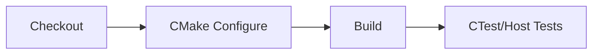

# Build & Testing
last_updated: 2025-08-18
ssot: src/config/ssot.yaml

## Domain
Summary: CMake configuration, host tests, CI workflows, and testing harnesses.

### Pipelines

### Notes
- Reference `CMakePresets.json` and `.github/workflows/*` for CI.
- Validate SSOT with `scripts/validate_ssot.py` before publishing docs.

