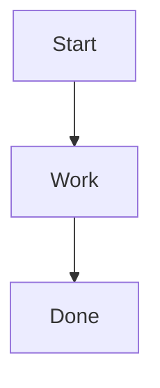

# Build Testing
last_updated: 2025-08-18
ssot: src\config\ssot.yaml

## Domain
Short summary: autogenerated placeholder for build_testing.md

### Subsystems
- TODO: populate subsystem list from source code and SSOT

### AI Handoff
- Include semantic anchors and reference SSOT for canonical parameters.

