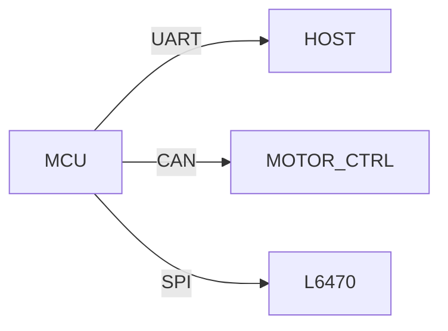

# Communications
last_updated: 2025-08-18
ssot: src/config/ssot.yaml

## Domain
Summary: UART, CAN, SPI/I2C interfaces, protocol framing, and telemetry pipelines.

### Protocols
- UART (bootloader, debug)
- CAN (motor telemetry)
- SPI/I2C (sensors and drivers)

### Topology

### AI Handoff
Include message formats and canonical buffer sizes from SSOT. Link to `docs/documentation_ssot.md` for parameter refs.

