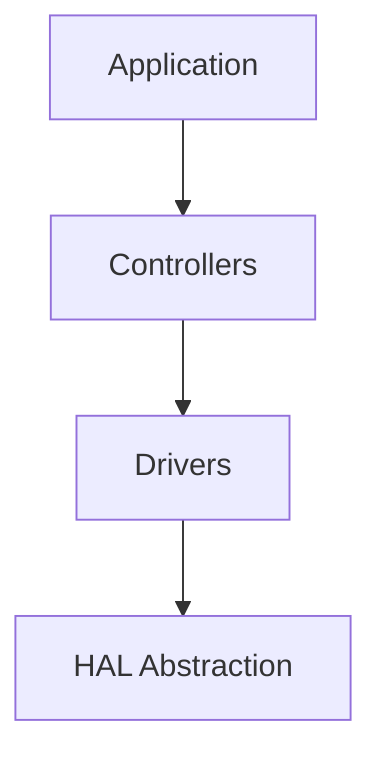

# Core Software
last_updated: 2025-08-18
ssot: src/config/ssot.yaml

## Domain
Short summary: core algorithms, control loops, state machines, and HAL abstraction. This doc is SSOT-driven and intended for both humans and AI agents.

### Subsystems
- Controllers
- Drivers
- HAL Abstraction
- Common Utilities

### Quick architecture

### Notes for AI
- Provide semantic anchors for each subsystem.
- Keep examples short; reference SSOT constants.

