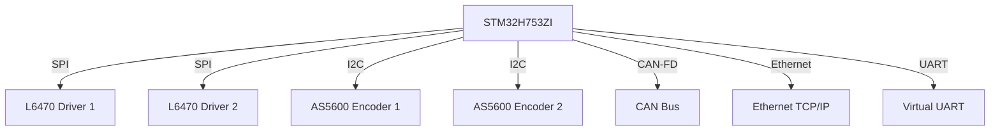

# Architecture

```mermaid
graph TD;
    MCU[STM32H753ZI] -->|SPI| L6470_1[L6470 Driver 1]
    MCU -->|SPI| L6470_2[L6470 Driver 2]
    MCU -->|I2C| AS5600_1[AS5600 Encoder 1]
    MCU -->|I2C| AS5600_2[AS5600 Encoder 2]
    MCU -->|CAN-FD| CAN[CAN Bus]
    MCU -->|Ethernet| ETH[Ethernet TCP/IP]
    MCU -->|UART| STLink[Virtual UART]
```

---
# TODO: See `.instructions/architecture.md` for module-specific details.
