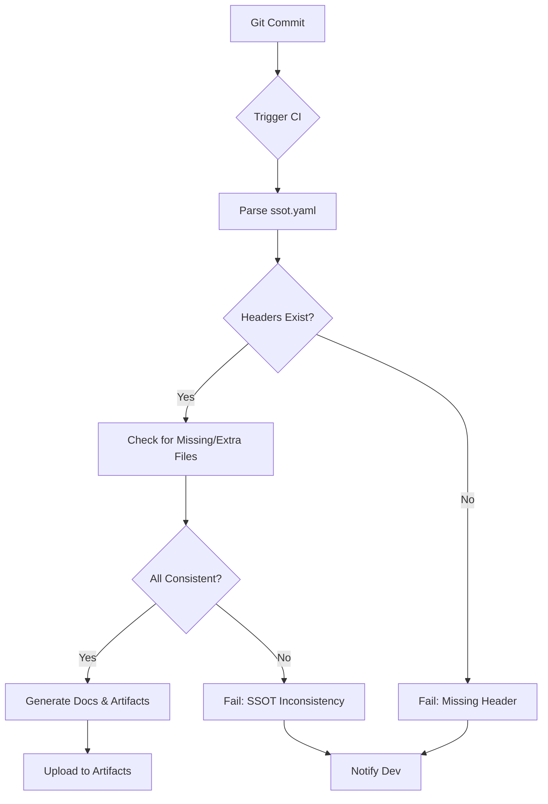

# Documentation SSOT Domain
*(docs/documentation_ssot.md)*

> **Anchors used**  
> - `[SSOT]`: `src/config/ssot.yaml`  
> - `[STATUS]`: `docs/STATUS.md`  
> - `[ARCHIVE]`: `archive/outdated_docs/DOCS_BKUP_08-18-2025`  
> - `[DOMAINS]`: `[core_software.md, communications.md, telemetry.md, motor_control.md, safety.md, build_testing.md, simulation.md, documentation_ssot.md]`

---

## Overview

The **Single Source Of Truth (SSOT)** is the canonical reference for all firmware‑level configuration data, header definitions, and documentation metadata.  
It is expressed as a YAML manifest (`src/config/ssot.yaml`) and is consumed by the build system, documentation generators, and CI pipelines to enforce consistency across the project.  
The SSOT drives:

| Layer | Responsibility |
|-------|----------------|
| Firmware | Header definitions (`build_config.h`, `hardware_config.h`, etc.) |
| Build | CMake toolchain, workspace overrides, and cross‑compile flags |
| Docs | Auto‑generation of Markdown/HTML docs from annotated headers |
| CI | Validation of consistency, version checks, and artifact publishing |

---

## Detailed Description

### SSOT Manifest (`src/config/ssot.yaml`)

```yaml
# SSOT manifest for documentation and tooling
last_updated: 2025-08-20
ssot_sources:
  firmware_headers:
    - build_config.h
    - hardware_config.h
    - motor_config.h
    - safety_config.h
    - telemetry_config.h
    - comm_config.h
    - workspace_config.h
  docs_dir: docs
  reference_dir: 00_reference
notes: |
  This manifest points tooling at the canonical SSOT header files under src/config/.
  It is used by doc-generation and validation scripts when a YAML SSOT manifest is required.
```

* **`last_updated`** – Auto‑updated by CI when the manifest changes.  
* **`ssot_sources.firmware_headers`** – List of header files that are considered canonical.  
* **`docs_dir` / `reference_dir`** – Locations where documentation generators will output content.  

The SSOT is the single source for:

* **Macro definitions** that influence firmware compilation (e.g., `#define BOARD_TYPE STM32H753ZI`).
* **Hardware register mapping** and peripheral configuration.
* **Build constants** (toolchain paths, target MCU, optimization flags).

### Integration Points

| Component | How it uses SSOT | Key script / file |
|-----------|-----------------|-------------------|
| **CMake** | `CMakeLists.txt` reads `src/config/workspace_config.h` to set `CMAKE_CXX_FLAGS` and toolchain paths. | `scripts/Get-WorkflowToolchain.ps1`, `src/config/workspace_config.h` |
| **Documentation** | `scripts/generate_docs.py` parses header comments, generating Markdown in `docs/` and `00_reference/`. | `scripts/generate_docs.py` |
| **CI Validation** | `scripts/run_python_configurable.ps1` loads the YAML, verifies that each listed header exists, and that no extraneous files are present. | `scripts/run_python_configurable.ps1` |
| **Host‑Test Build** | Host‑tests mirror the SSOT for cross‑compatibility. | `build_host_tests/CMakeLists.txt` |

---

## Algorithm Details

### SSOT Validation Workflow



1. **Trigger** – Any commit to `main` triggers the CI pipeline.  
2. **Parse** – The pipeline reads `src/config/ssot.yaml`.  
3. **Header Verification** – Ensures each file listed exists under `src/config/`.  
4. **Consistency Check** – No additional headers should be present unless added to the manifest.  
5. **Doc Generation** – `scripts/generate_docs.py` runs, consuming header comments and emitting docs.  
6. **Artifact Publishing** – Build outputs and generated docs are uploaded.  
7. **Notification** – Failures are reported via Slack/Email; success logs the `last_updated` timestamp.

### Documentation Generation

* Parses `@brief`, `@detail`, and `@param` tags from header comments.  
* Generates Markdown files mirroring the header structure.  
* Links to cross‑referenced SSOT entries using anchors (e.g., `[core_software.md]`).  
* Creates a `summary.md` that aggregates all generated docs.

---

## Best Practices

| Practice | Rationale | Implementation |
|----------|-----------|----------------|
| **Single Entry Point** | Avoid duplicated definitions. | All config constants live in SSOT headers; never re‑define in source files. |
| **Immutable Headers** | Prevent drift. | Mark headers as read‑only in version control; any change requires a merge request. |
| **Automated Updates** | Reduce manual errors. | Use CI to bump `last_updated` and run `scripts/generate_docs.py` automatically. |
| **Version Pinning** | Ensure reproducible builds. | `workspace_config.h` contains toolchain version numbers; CI verifies against `ssot.yaml`. |
| **Minimal Footprint** | Reduce bloat. | Remove legacy headers into `[ARCHIVE]`; reference them only if required by legacy code. |
| **Clear Documentation** | Aid onboarding. | Each SSOT header contains a brief, usage example, and link to relevant docs. |
| **Cross‑Project Consistency** | Maintain uniformity across modules. | The `ssot.yaml` references all headers; any new module must add its headers to the manifest. |
| **CI Guardrails** | Catch regressions early. | `scripts/run_python_configurable.ps1` fails if a header is missing or extraneous. |

---

## Reference Links

* **SSOT Manifest** – [`src/config/ssot.yaml`][SSOT]
* **Project Status** – [`docs/STATUS.md`][STATUS]
* **Archived Documentation** – [`archive/outdated_docs/DOCS_BKUP_08-18-2025`][ARCHIVE]
* **Domain Documents** – [`core_software.md`], [`communications.md`], [`telemetry.md`], [`motor_control.md`], [`safety.md`], [`build_testing.md`], [`simulation.md`], [`documentation_ssot.md`]
* **Build System** – `CMakeLists.txt` and `CMakePresets.json`
* **Documentation Generation Script** – `scripts/generate_docs.py`
* **CI Configuration** – `.github/workflows/ci.yml`

> **Tip:** Use the anchors above for quick navigation in your editor or GitHub search.  
> Example: `[@STATUS]` will jump to the Status page.

---

> **Note**: This document is part of the official domain docs and should be updated in tandem with changes to `src/config/ssot.yaml`.  
> For any questions on SSOT maintenance, reach out to the firmware documentation lead.
