# Quick Start Guide - ARM_CM7 Production System

## Overview
Get started quickly with the STM32H753ZI motor control system. This guide covers the production-ready ARM_CM7 firmware and Phase 2 FreeRTOS integration path.

**System Status**: ✅ **Phase 1 Complete** - 50.5KB ARM_CM7 Firmware Operational  
**Current Capability**: Real-time motor control with safety systems  
**Next Phase**: 🚀 **Phase 2 Implementation** - FreeRTOS task-based architecture

---

## 🎯 **System Capabilities** (Current ARM_CM7 Production)

### **Real-Time Performance Metrics**

```mermaid
graph LR
    subgraph "ARM_CM7 Performance (Validated)"
        CONTROL["Motor Control<br/>🔄 1kHz precise timing<br/>✅ Position feedback<br/>✅ Dual L6470 drivers"]
        SAFETY["Safety Systems<br/>⚡ <1ms emergency stop<br/>✅ Fault detection<br/>✅ Hardware protection"]
        MEMORY["Memory Efficiency<br/>📊 50.5KB / 2MB (2.41%)<br/>✅ DTCM: 65.6KB / 128KB<br/>✅ Optimized for ARM_CM7"]
    end
    
    CONTROL --> SAFETY
    SAFETY --> MEMORY
```


### **Production Features Ready**
- ✅ **Dual Motor Control**: L6470 stepper drivers with SPI communication
- ✅ **Closed-Loop Feedback**: AS5600 magnetic encoders via I2C
- ✅ **Safety Systems**: Hardware emergency stop, fault monitoring
- ✅ **Communication**: CAN bus and UART protocols implemented
- ✅ **HAL Abstraction**: Platform-independent, testable architecture
- ✅ **Build System**: ARM GCC cross-compilation with automated validation

---

## Prerequisites

### Hardware Required
- **STM32H753ZI Nucleo-144** development board (ARM Cortex-M7 @ 480MHz)
- **X-NUCLEO-IHM02A1** stepper motor expansion shield (dual L6470 drivers)
- **2x Stepper motors** (NEMA 17 recommended, 1.8° step angle)
- **2x AS5600 magnetic encoders** (12-bit absolute position)
- **Power supply** (12-24V, 2A minimum for dual motors)
- **ST-LINK programmer** (integrated on Nucleo board)
- **Emergency stop button** (normally closed, safety critical)

### Software Required
- **ARM GCC toolchain** (arm-none-eabi-gcc 10.3.1+)
- **CMake** (3.16 or later) with Ninja build system
- **OpenOCD** (for programming/debugging STM32H753ZI)
- **Git** (for version control and project cloning)
- **VS Code** (recommended IDE with dev container support)

---

## Hardware Setup - Production Configuration

### 1. Assembly (ARM_CM7 Optimized)


```
Assembly Steps:
1. Mount X-NUCLEO-IHM02A1 shield on STM32H753ZI Nucleo board
2. Connect stepper motors to M1 and M2 terminals (verify polarity)
3. Install AS5600 encoders on motor shafts (align magnets properly)
4. Connect power supply to shield power input (check voltage)
5. Connect ST-LINK USB cable to PC for programming
6. Install emergency stop button in accessible location
```

### 2. Connections (ARM_CM7 Pin Configuration)
```c
// From hardware_config.h (SSOT) - ARM_CM7 optimized pin assignments
Emergency Stop Button → PA9  (ESTOP_PIN, highest priority interrupt)
Motor 1 Encoder SDA  → PB7   (I2C1_SDA, 400kHz fast mode)
Motor 1 Encoder SCL  → PB6   (I2C1_SCL, pull-up enabled)
Motor 2 Encoder SDA  → PB11  (I2C2_SDA, 400kHz fast mode)
Motor 2 Encoder SCL  → PB10  (I2C2_SCL, pull-up enabled)
User LED Green       → PB0   (Status indication)
User LED Blue        → PB7   (Communication status)
User LED Red         → PB14  (Error indication)
L6470 #1 CS         → PA4   (SPI1_NSS, motor 1 select)
L6470 #2 CS         → PA11  (SPI1_NSS, motor 2 select)
SPI1 SCK            → PA5   (Clock, 1MHz for L6470)
SPI1 MISO           → PA6   (Data from L6470)
SPI1 MOSI           → PA7   (Data to L6470)
```

### 3. Safety Setup (Production Standards)
- ✅ **Emergency Stop**: Install normally closed button (hardware level protection)
- ✅ **Power Supply**: Verify voltage and current ratings match motor specifications
- ✅ **Motor Wiring**: Check wiring polarity and phase connections
- ✅ **Encoder Alignment**: Verify magnetic encoder alignment and mounting
- ✅ **Grounding**: Ensure proper system grounding for noise immunity
- ✅ **Testing**: Test emergency stop functionality before any motor operation

---

## Software Setup - ARM_CM7 Production Build

### 1. Clone Repository (Complete Production System)
```bash
git clone <repository-url>
cd stm32h753-motor-control
```

### 2. Build Firmware
```bash
# Configure build
cmake -S . -B build

# Compile firmware
cmake --build build

# Verify build output
ls build/stm32h753_ihm02a1.elf
```

### 3. Run Tests
```bash
# Run unit tests (host-based)
cd build && ctest

# Validate SSOT configuration
python3 scripts/validate_ssot.py

# Expected output: All tests pass
```

### 4. Program Device
```bash
# Flash firmware to STM32H753ZI
openocd -f interface/stlink.cfg -f target/stm32h7x.cfg -c "program build/stm32h753_ihm02a1.elf verify reset exit"
```

## Basic Operation

### 1. System Initialization
```c
#include "main.h"
#include "controllers/motor_control.h"
#include "safety/emergency_stop.h"

int main(void) {
    // Initialize HAL
    HAL_Init();
    SystemClock_Config();
    
    // Initialize safety systems FIRST
    emergency_stop_init();
    safety_systems_init();
    
    // Initialize motor control
    motor_control_init();
    
    // Initialize communication
    uart_init();
    can_init();
    
    // Enter main control loop
    while (1) {
        motor_control_task();
        safety_monitor_task();
        communication_task();
        HAL_Delay(1); // 1ms control loop
    }
}
```

### 2. Basic Motor Control
```c
// Move Motor 1 to position 1000 steps
motor_move_to_position(MOTOR_1, 1000);

// Run Motor 2 at constant speed
motor_run(MOTOR_2, DIRECTION_FORWARD, 500); // 500 steps/sec

// Stop motors
motor_soft_stop(MOTOR_1);
motor_soft_stop(MOTOR_2);
```

### 3. Safety Operations
```c
// Check system status
SystemState_t state = system_get_state();

// Trigger emergency stop if needed
if (fault_detected) {
    software_emergency_stop(ESTOP_REASON_FAULT_DETECTED);
}

// Monitor motor faults
MotorStatus_t status;
motor_get_status(MOTOR_1, &status);
if (status.faults.overcurrent) {
    handle_motor_fault(MOTOR_1, FAULT_OVERCURRENT);
}
```

## Configuration

### 1. Motor Parameters (SSOT)
Edit `src/config/motor_config.h`:
```c
// Motor acceleration/deceleration
#define MOTOR_ACCELERATION              0x1000    // Adjust for your motor
#define MOTOR_MAX_SPEED                 0x1000    // Maximum safe speed

// Current settings
#define MOTOR_KVAL_RUN                  0x50      // Running current
#define MOTOR_OCD_THRESHOLD             0x08      // Overcurrent limit
```

### 2. Safety Parameters (SSOT)
Edit `src/config/safety_config.h`:
```c
// Emergency stop timing
#define EMERGENCY_STOP_MAX_RESPONSE_TIME_MS    100

// Fault detection intervals
#define FAULT_DETECTION_INTERVAL_MS            50
#define WATCHDOG_TIMEOUT_MS                    5000
```

### 3. Hardware Configuration (SSOT)
Edit `src/config/hardware_config.h`:
```c
// Emergency stop pin
#define ESTOP_PIN                       GPIO_PIN_9
#define ESTOP_GPIO_PORT                GPIOA

// Motor control pins (verify for your setup)
#define MOTOR1_CS_PIN                   GPIO_PIN_5
#define MOTOR1_CS_PORT                 GPIOA
```

## Testing and Validation

### 1. Safety System Test
```bash
# Run comprehensive safety tests
python3 scripts/run_safety_validation.py

# Expected output: All safety tests pass
```

### 2. Motor Function Test
```c
// Test motor movement
void test_basic_motor_operation(void) {
    // Initialize motors
    TEST_ASSERT_EQUAL(SYSTEM_OK, motor_init(MOTOR_1));
    TEST_ASSERT_EQUAL(SYSTEM_OK, motor_init(MOTOR_2));
    
    // Test position move
    TEST_ASSERT_EQUAL(SYSTEM_OK, motor_move_to_position(MOTOR_1, 100));
    
    // Wait for completion
    while (motor_is_moving(MOTOR_1)) {
        HAL_Delay(10);
    }
    
    // Verify position
    int32_t position = motor_get_position(MOTOR_1);
    TEST_ASSERT_INT32_WITHIN(5, 100, position);
}
```

### 3. Emergency Stop Test
```c
// Test emergency stop response
void test_emergency_stop_basic(void) {
    // Start motor
    motor_run(MOTOR_1, DIRECTION_FORWARD, 500);
    HAL_Delay(100);
    
    // Trigger emergency stop
    uint32_t start_time = HAL_GetTick();
    emergency_stop_trigger();
    
    // Wait for stop
    while (motor_is_moving(MOTOR_1)) {
        // Monitor
    }
    uint32_t stop_time = HAL_GetTick();
    
    // Verify response time
    TEST_ASSERT_LESS_THAN(100, stop_time - start_time);
    TEST_ASSERT_EQUAL(SYSTEM_STATE_EMERGENCY, system_get_state());
}
```

## Common Issues and Solutions

### Build Issues
```bash
# Issue: CMake not found
sudo apt install cmake

# Issue: ARM toolchain not found
sudo apt install gcc-arm-none-eabi

# Issue: Missing dependencies
sudo apt install openocd gdb-multiarch
```

### Hardware Issues
```bash
# Issue: Motors not responding
1. Check power supply connections
2. Verify shield mounting
3. Test with multimeter
4. Check motor wiring

# Issue: Encoder not reading
1. Verify I2C connections
2. Check magnet alignment
3. Test I2C communication
4. Verify pull-up resistors
```

### Programming Issues
```bash
# Issue: ST-LINK not detected
1. Check USB cable connection
2. Install ST-LINK drivers
3. Try different USB port
4. Reset board with RESET button

# Issue: Flash programming failed
openocd -f interface/stlink.cfg -f target/stm32h7x.cfg -c "init; reset halt; flash erase_sector 0 0 last; reset; exit"
```

## Next Steps

### 1. Advanced Features
- Study [Motor Control Guide](motor_control.md) for advanced motion control
- Review [Safety Systems Guide](safety_systems.md) for comprehensive safety
- Explore [Communication Guide](communication.md) for networking

### 2. Customization
- Modify SSOT configuration files for your specific motors
- Implement custom motion profiles
- Add application-specific safety checks

### 3. Integration
- Review [API Documentation](../html/html/index.html) for detailed function reference
- Study [Safety Validation](../validation/safety_validation.md) for testing procedures
- Follow [Development Guidelines](../design/development_guidelines.md)

## Support Resources

### Documentation
- [Complete API Reference](../html/html/index.html)
- [Safety Validation Procedures](../validation/safety_validation.md)
- [Enhanced Documentation Search](../README.md#enhanced-documentation-search)

### Tools
```bash
# Search documentation
python3 scripts/search_enhanced_docs.py function HAL_GPIO_Init --scope STM32H7

# Validate configuration
python3 scripts/validate_ssot.py

# Generate documentation
doxygen docs/Doxyfile
```

### Debugging
```bash
# Start GDB debugging session
arm-none-eabi-gdb build/stm32h753_ihm02a1.elf
(gdb) target extended-remote :3333
(gdb) monitor reset halt
(gdb) load
(gdb) continue
```

Remember: **Always test safety systems before operating motors!**
