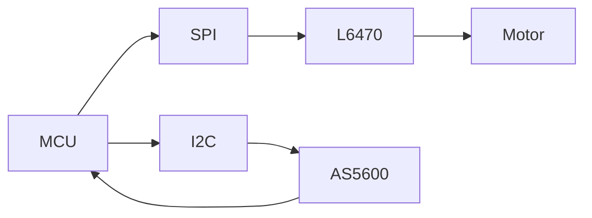

# Motor Control
last_updated: 2025-08-18
ssot: src/config/ssot.yaml

## Domain
Summary: Motion profiles, L6470 configuration, closed-loop encoder feedback and safety interlocks.

### Topology

### Subsystems
- Motion Planner
- Driver Interface (L6470)
- Encoder Processing

