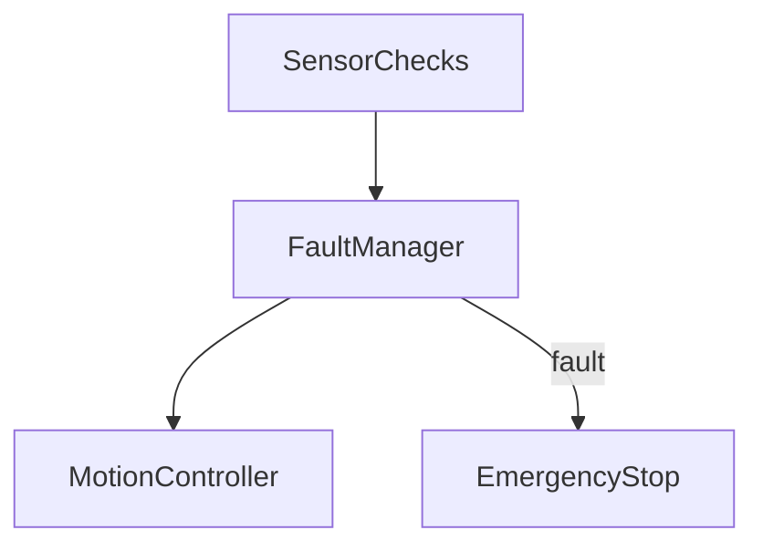

# Safety
last_updated: 2025-08-18
ssot: src/config/ssot.yaml

## Domain
Summary: fault detection, watchdog, emergency stop, and fail-safe motion profiles.

### Layers
- Sensor validation
- Driver fault handling (L6470 fault flags)
- System-level watchdog and recovery

