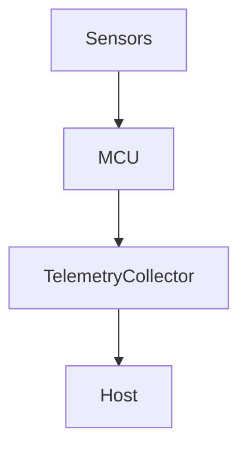

# Telemetry
last_updated: 2025-08-18
ssot: src/config/ssot.yaml

## Domain
Summary: telemetry collection, aggregation, and host-side export formats.

### Data Flows

### Subsystems
- Sampling
- Buffering
- Encoding (JSON/CBOR)

